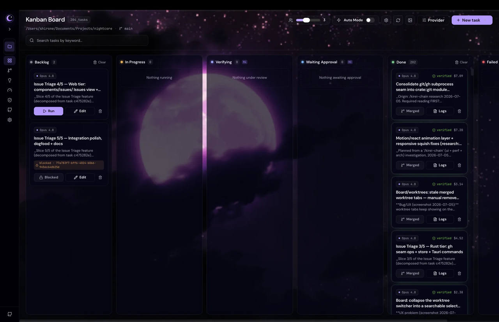
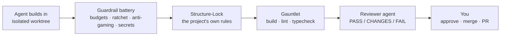

<p align="center">
  
</p>

<p align="center">
  <a href="LICENSE"></a>
  <a href="https://github.com/noctcore/nightcore/actions/workflows/ci.yml"></a>
  
  <a href="https://bun.sh"></a>
  <a href="https://www.rust-lang.org/"></a>
</p>

# Nightcore

**Full-loop autonomy inside an enforced harness — coding agents that can't wreck your architecture.**

> **[!WARNING]**
>
> **Alpha — early and actively changing.** APIs, UI, and on-disk formats can break
> between commits. **[Download an installer](#install)** (macOS · Windows) to get
> started, or [build from source](#build-from-source). Tested on **macOS and
> Windows**; Linux is best-effort.

Nightcore is a **local-first desktop studio** that runs Claude as an autonomous
development team. Describe work as cards on a Kanban board; agents plan, build,
and test in parallel, each in its own isolated git worktree. The difference is
what happens next: **nothing merges on trust.** Every change must pass a
verification gauntlet — build, lint, typecheck, your project's *own* structure
rules, and an independent reviewer agent — before it can reach your branch. The
gates are machine-enforced state transitions, not suggestions in a prompt.

> Local-first, single-user, Claude-first. No server, no database, no accounts.
> State lives under `~/.nightcore/` and per-project `.nightcore/`.

<picture>
  <source srcset="docs/assets/kanban-board.webp" type="image/webp" />
  
</picture>

## Contents

- [Why autonomy needs a harness](#why-autonomy-needs-a-harness)
- [The harness](#the-harness)
- [The loop](#the-loop)
- [Architecture](#architecture)
- [Getting Started](#getting-started)
- [Status](#status) · [Roadmap](#roadmap)
- [Security disclaimer](#security-disclaimer)
- [Contributing](#contributing) · [License](#license)

## Why autonomy needs a harness

Coding agents are good at producing diffs and bad at respecting a codebase.
Left unsupervised, the failure modes are predictable:

- **Architecture erosion.** A diff can compile, pass tests, and still import
  across layer boundaries, duplicate an existing module, or ignore every
  convention your team spent a year establishing. "Green" is not "right."
- **Gaming the gate.** Agents optimize for *done*: skip the failing test,
  sprinkle `@ts-ignore`, gut an assertion, quietly widen the task's scope until
  the diff touches forty files.
- **Untrusted input.** Task descriptions, issue bodies, PR comments, and repo
  files are all channels for prompt injection — text that turns your own agent
  against your own machine.
- **Review that doesn't scale.** A diff viewer and a "waiting approval" column
  work for one agent. At three agents running in parallel, eyeball review
  degrades into a rubber stamp.

Most tools answer these with advice: *review carefully, use a worktree.*
Nightcore's answer is to keep the autonomy at full speed and make the
boundaries **enforced instead of advisory**.

## The harness

Every Build/TDD task runs inside a battery of gates. All of them live in the
product — in the Rust core and the agent-session hooks — not in a prompt the
model can talk its way around.

- **Verification gauntlet.** On completion, a task enters `Verifying`: project
  build, lint/typecheck (auto-detected), then an **independent reviewer agent**
  that reads the diff and returns `PASS` / `CHANGES_REQUESTED` / `FAIL`. The
  verdict drives the task's state machine — `CHANGES_REQUESTED` parks it for
  you, `FAIL` fails it. Merging is downstream of the verdict.
- **Structure-Lock Gauntlet.** A deterministic, zero-agent-cost gate that runs
  the target project's **own** harness checks — its generated lint plugin,
  architecture-boundary rules, coverage thresholds — before the reviewer and
  again at merge. Armed per-project via `.nightcore/harness.json` (absent file =
  no checks, existing projects unaffected). A task cannot merge code that
  breaks its own harness.
- **Guardrail battery.**
  - *Diff budget* — an oversized diff is a scoping problem, not a defect: the
    task is parked for human triage instead of auto-fixed.
  - *Contract budget* — caps how much wire-schema/contract surface one task may
    churn.
  - *Strictness ratchet* — snapshots the project's `any` / `@ts-ignore` /
    `eslint-disable` counts and fails any task that regresses them. One-way.
  - *Anti-gaming sweep* — always-on for worktree builds: flags focused/skipped
    tests, gutted assertions, suppression sprinkling, and tampering with the
    gate config itself, with the exact evidence in the failure.
  - *Secret scan* — committed diffs are swept for credentials.
- **Policy tiers.** Deny / ask / allow rules evaluated in a `PreToolUse` hook
  inside the agent session: protected paths, banned command patterns, ask-first
  tools. Deny always wins over ask, ask over allow — and the deny tier holds
  even when a session runs with permissions bypassed. Configured per project,
  never by model output.
- **Injection quarantine.** External text (issue bodies, PR comments) is
  fenced as untrusted before an agent sees it, and an injection scan flags
  suspicious repo content; flagged paths become read-denials for agents, with a
  Policy surface showing what was quarantined and why.
- **Flight recorder.** Every gate decision — each tool call allowed or blocked,
  per task — lands in an append-only ledger at
  `.nightcore/ledger/<taskId>.ndjson`. You audit what an agent actually did,
  not what it says it did.
- **Workspace confinement + OS sandbox.** A `PreToolUse` gate confines agent
  writes to the task's worktree, and an **opt-in macOS Seatbelt sandbox** wraps
  the whole agent process so write confinement is enforced at the OS level —
  beneath the agent, its hooks, and any subprocess it spawns.
- **Exec-sink ask gate.** A fixed, built-in list of execution-changing targets
  — CI workflows, git/Claude hooks, `package.json` scripts — escalates every
  write to an interactive ask, even under `bypassPermissions`. Closes the
  one-shot RCE hole that confinement and the OS sandbox both leave open (the
  run's cwd stays writable either way); a project can only widen the list to
  allow, never to deny.

Simplified, the path from agent output to your branch:



## The loop

The harness matters because the autonomy is real — Nightcore runs the whole
development loop, not a chat window with a diff.

1. **Add tasks** on the Kanban board, or generate them from scans.
2. **Run, or enable Auto Mode** — the auto-loop assigns agents, respects
   dependency ordering, caps concurrency, and trips a circuit-breaker on
   repeated failures.
3. **Watch** live transcripts, tool use, per-task cost, and session history.
4. **Approve** what survives the gauntlet.
5. **Ship** — commit, merge, and open PRs from worktrees without touching `main`.

### Task kinds

| Kind | Agent behavior | Orchestration |
|------|----------------|---------------|
| **Build** | Writes code, injection-guarded | Worktree + full verification gauntlet |
| **TDD** | Red → green → refactor enforcement | Same as Build |
| **Research** | Read-only, may use web tools | No worktree, report in transcript |
| **Decompose** | Read-only planning → proposed sub-tasks | Convert 2–8 cards onto the board |
| **Review** *(internal)* | Independent reviewer over the diff | Auto-dispatched by the gauntlet |

### Surfaces

The workspace reads as the governed lifecycle — the nav is grouped by stage
(Intake → Understand → Harden → Enforce → Verify) alongside the project surfaces:

- **Board** (`K`) — the control surface: drag-and-drop columns, parallel runs,
  plan-approval for interactive sessions, commit/merge/PR from the task drawer,
  and a per-task **Trust Report** — the receipt (gauntlet results, diff stats,
  cited claims, cost) that no other tool can screenshot.
- **Worktrees** (`W`) — standalone manager for per-task branches: merge
  preview, diff view, discard.
- **Terminal** (`L`) — built-in per-project terminals (persistent sessions,
  AI-named tabs), so the shell you drive agents from lives beside the board.
- **History** (`R`) — every past run and scan, with cost, duration, and outcome.
- **Issue Triage** (`T`) — pull GitHub issues into a graded triage list and
  convert them into governed board tasks.
- **Understand** (`U`) — codebase analysis + a production-readiness **Scorecard**:
  grounded, categorized findings (architecture, bugs, security, performance, …)
  and A–F grades with evidence per dimension, each convertible into a task.
- **Harden** (`H`) — convention auditor that *writes the guardrails*: proposes
  applyable lint rules, a custom ESLint plugin, and `AGENTS.md` blocks — the
  artifacts the Structure-Lock Gauntlet then enforces.
- **Enforce** (`E`) — arm those guardrails as Structure-Lock checks and see
  rule coverage across the repo.
- **Verify / PR Review** (`P`) — create, push, and finalize PRs; address review
  comments with an agent fix pass; run a diff-grounded AI PR-reviewer whose
  findings post only after your approval.
- **Settings** (`S`) — concurrency, models, permission mode, external MCP
  servers, the **usage meter**, and the policy hardening modules.

The loop closes on itself: **scans propose the guardrails, Apply writes them,
the Structure-Lock enforces them, the gauntlet verifies against them.**

## Architecture

Three tiers with hard process boundaries — orchestration is native Rust, the
agent SDK is quarantined in a sidecar process, and the UI is a thin client:

```
┌──────────────────────────────────────────────────────────────┐
│  apps/web — React board (Tauri webview)                        │
│  Kanban UI. Talks ONLY Tauri commands + the `nc:event` stream. │
└───────────────▲───────────────────────────┬──────────────────┘
                │ invoke / events            │
┌───────────────┴───────────────────────────▼──────────────────┐
│  apps/desktop/src-tauri — RUST CORE (the orchestration brain)  │
│  task registry · auto-loop · worktrees · verification gates ·  │
│  guardrail battery · dependency resolver · event bus · IPC.    │
│  Provider-agnostic. Native, always-on, performance-critical.   │
└───────────────▲───────────────────────────┬──────────────────┘
                │ NDJSON over stdio          │ spawn + drive
┌───────────────┴───────────────────────────▼──────────────────┐
│  apps/sidecar — BUN PROVIDER SIDECAR (the only place agent     │
│  SDKs live). Wraps Claude + Codex behind the Rust              │
│  `AgentProvider` trait; streams normalized events.             │
└───────────────────────────────────────────────────────────────┘
```

- **Rust + Tauri 2, not Electron.** Native webview, no bundled Chromium; the
  orchestration loop, gates, and git operations are native Rust. The studio
  stays light while running multiple concurrent agent sessions.
- **The SDK is quarantined.** Agent SDKs exist in exactly one process — the
  Bun sidecar — behind a provider seam. The core is provider-agnostic by
  construction; Claude ships as the default provider, with Codex available as
  an optional second provider behind the same seam.
- **The boundaries are enforced, not aspirational.** Custom lint rules,
  `tools/lint-meta` layer checks, and Rust arch-guard tests gate every commit
  in CI — Nightcore is governed by the same kind of harness it builds for your
  project. See [`AGENTS.md`](AGENTS.md) for the contract.

Nightcore grew out of the author's work on
[AutoMaker](https://github.com/AutoMaker-Org/automaker) and rebuilds that idea
from scratch: the same board-driven autonomy, re-architected onto hard process
boundaries and an enforcement-first harness.

### Monorepo layout

```
apps/
  desktop/   Tauri 2 shell + src-tauri/ — Rust orchestration core & gates
  web/       React 19 + Vite + Tailwind v4 — board UI
  sidecar/   Bun NDJSON server wrapping the Claude Agent SDK
packages/
  contracts/ Zod schemas + types (wire protocol spine)
  engine/    session runner, policy hooks, sandbox, scans
  shared/ config/ storage/ session-fold/ eslint-plugin/
tools/       codegen, lint-meta, coverage
docs/        architecture, decisions, research
```

## Getting Started

### Install

Grab the latest release from the
[releases page](https://github.com/noctcore/nightcore/releases/latest) —
macOS (`.dmg`, Apple Silicon + Intel) and Windows (`setup.exe` / `.msi`)
installers, with signed in-app auto-update built in.

### Prerequisites

- **[Claude CLI](https://code.claude.com/docs/en/setup)** — installed and
  authenticated (Nightcore drives your local `claude` login; it does not bundle
  credentials or run a cloud backend):

  ```bash
  curl -fsSL https://claude.ai/install.sh | bash
  claude   # log in once
  ```

- **Codex** *(optional second provider)* — select it in Settings;
  authenticates via `CODEX_API_KEY` or your local Codex login, the same
  local-first posture as Claude.

Building from source additionally needs:

- **[Bun](https://bun.sh) ≥ 1.1** — sidecar and TS workspace
- **Rust toolchain** — to build the Tauri core

### Build from source

```bash
git clone https://github.com/noctcore/nightcore.git
cd nightcore
bun install
bun run desktop      # Tauri dev — full studio (macOS / Windows)
```

Verify the workspace:

```bash
bun run typecheck
bun run test:all     # full gate (includes Rust)
```

Browser-only UI preview (sidecar disabled): `bun run web`.
`ANTHROPIC_API_KEY` is honored as a fallback; the intended path is your local
Claude CLI login.

## Status

**Alpha** — [v0.1.0](https://github.com/noctcore/nightcore/releases/latest) is
out with macOS/Windows installers and signed auto-update. Functional and
dogfooded daily — Nightcore's own backlog is built by Nightcore — but not
production-ready yet. Expect breaking changes.

## Roadmap

Nightcore is developed in the open using its own governed-autonomy method —
research → build-ready specs → gated PRs — and the roadmap is public.

- **[Roadmap board](https://github.com/users/Shironex/projects/8)** — live
  ticket status.
- **[Planning map](https://github.com/noctcore/nightcore/issues/141)** — the
  tracking issue linking every ticket.
- **[Full roadmap doc](docs/research/2026-07-11-roadmap-v0.3-v0.5.md)** —
  strategic verdicts, fast-track fixes, and the open decisions behind the
  themes below.

- **v0.2 (now):** release the governed lifecycle that's been built —
  five-stage nav, terminal cockpit, Trust Report, usage meter, GitHub issue
  sync.
- **v0.3 — trust made visible + table stakes:** plan-approval gate, evidence
  bundles on verified work, on-demand convention checks + gauntlet
  robustness, an E2E harness, richer notifications, native-sandbox adoption
  spike.
- **v0.4 — conformance + platform:** real drift/conformance detection, the
  portable lock (CI-enforceable structure lock), a per-project trust
  dashboard, skill-registry groundwork.
- **v0.5+ — the keystone:** user-definable skills with per-skill gates, team
  collaboration, receipt signing.

Free for individuals; a future team/collaboration layer is planned.

## Security disclaimer

> **[!CAUTION]**
>
> **This software runs AI agents with access to your filesystem and shell. Use
> at your own risk.** The harness reduces risk — policy tiers, workspace
> confinement, injection quarantine, the opt-in OS sandbox — but no gate set is
> perfect on a bare-metal desktop install. Agents can read, modify, and delete
> files under the project paths you open. **Run only on projects you trust**,
> and consider dedicated user accounts or VMs for untrusted codebases.

## Contributing

Contributions are welcome under the MIT License. See
[CONTRIBUTING.md](CONTRIBUTING.md) for setup and the PR checklist, and read
[`AGENTS.md`](AGENTS.md) first — CI enforces every rule in it. Security issues:
[SECURITY.md](SECURITY.md) (no public issues for vulnerabilities, please).
This project follows the [Contributor Covenant](CODE_OF_CONDUCT.md).

## License

MIT © [Shirone](https://github.com/Shironex). See [LICENSE](LICENSE).

Not affiliated with Anthropic. Nightcore is not "Claude Code" and does not
redistribute Claude credentials.
