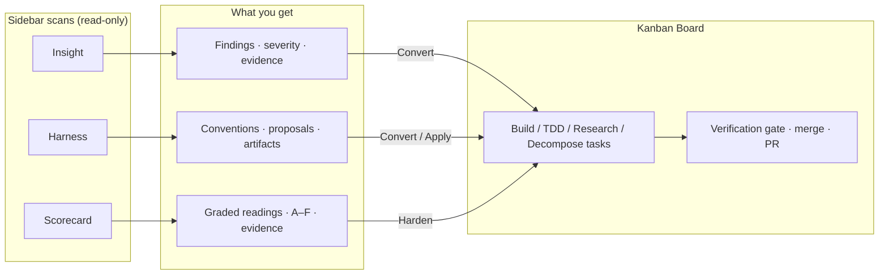
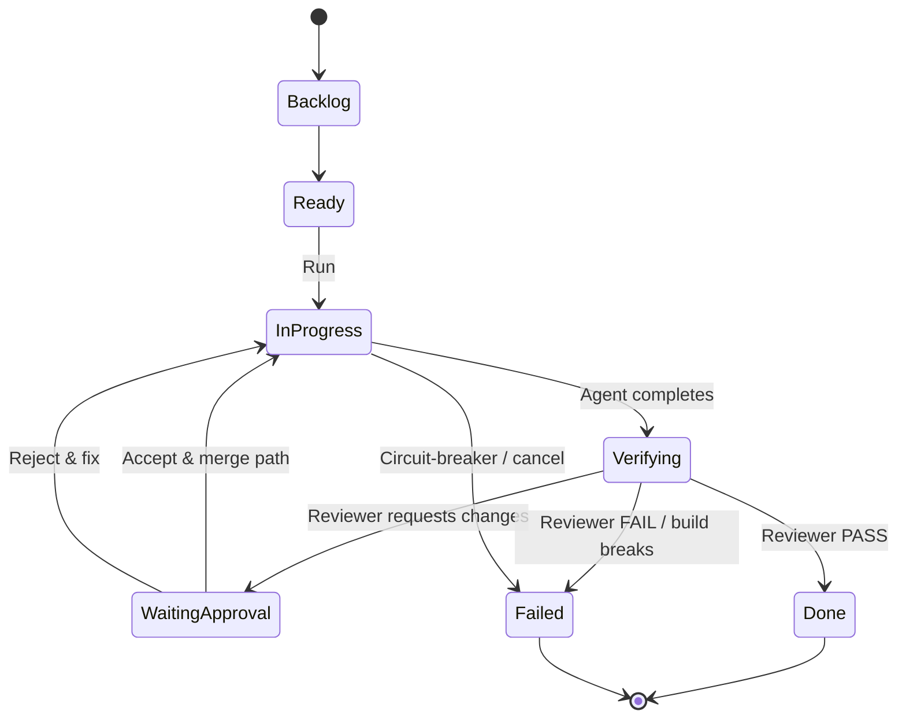

<p align="center">
  
</p>

<p align="center">
  <a href="LICENSE"></a>
  <a href="https://github.com/Shironex/nightcore/actions/workflows/ci.yml"></a>
  
  <a href="https://bun.sh"></a>
  <a href="https://www.rust-lang.org/"></a>
</p>

# Nightcore

**Stop typing code. Start directing AI agents.**

> **[!WARNING]**
>
> **Alpha — early and actively changing.** Nightcore is under heavy development; APIs,
> UI, and on-disk formats can break between commits. There are **no GitHub releases**
> yet — not until the app is stable and ships an auto-update channel. For now you
> **clone and build locally** (see [Quick Start](#quick-start)). Tested on **macOS and
> Windows** only; Linux may work but is not officially supported yet.

<details open>
<summary><h2>Table of Contents</h2></summary>

- [What Makes Nightcore Different?](#what-makes-nightcore-different)
  - [The Workflow](#the-workflow)
  - [Hard Process Boundaries](#hard-process-boundaries)
  - [Powered by Claude Agent SDK](#powered-by-claude-agent-sdk)
- [Getting Started](#getting-started)
  - [Prerequisites](#prerequisites)
  - [Quick Start](#quick-start)
- [Features](#features)
  - [Kanban Board](#kanban-board-k)
  - [Task Kinds](#task-kinds)
  - [Insight, Harness & Scorecard](#insight-i)
  - [Worktrees, PR Review & Settings](#worktrees-w)
- [Architecture](#architecture)
- [Tech Stack](#tech-stack)
- [Development](#development)
- [Security Disclaimer](#security-disclaimer)
- [Contributing](#contributing)
- [Community Standards](#community-standards)
- [Project Status](#project-status)
- [License](#license)

</details>

Nightcore is a **local-first desktop studio** that turns Claude into an autonomous
development teammate. Describe work as cards on a Kanban board; Nightcore plans,
dispatches, and runs agents in parallel — in isolated git worktrees, with
dependency ordering and a failure circuit-breaker — and streams every agent's
progress back to the UI.

It is a from-scratch, better-architected reimagining of
[AutoMaker](https://github.com/AutoMaker-Org/automaker): the same autonomous
orchestration value, rebuilt on hard process boundaries instead of one monolithic
daemon.

> Local-first, single-user, Claude-first. No server, no database, no accounts.
> State lives under `~/.nightcore/` and per-project `.nightcore/`.

<picture>
  <source srcset="docs/assets/kanban-board.webp" type="image/webp" />
  
</picture>

## What Makes Nightcore Different?

Traditional dev tools help you write code. Nightcore helps you **orchestrate AI
agents** to build entire features autonomously — with isolation, verification,
and governance baked in.

### The Workflow

1. **Add tasks** — Describe work on the Kanban board (Build, TDD, Research, or Decompose)
2. **Run or enable Auto Mode** — Nightcore assigns agents, respects dependencies, and caps concurrency
3. **Watch it build** — Live transcripts, tool use, cost/usage, and session history stream to the UI
4. **Verify & approve** — An automated gauntlet (build → lint/typecheck → independent reviewer) gates merge
5. **Ship** — Commit, merge, and open PRs from isolated worktrees without touching `main`

### Hard Process Boundaries

Where AutoMaker runs one Express daemon, Nightcore splits responsibilities across
three tiers with enforced seams:

| Tier | Role |
|------|------|
| **Rust core** (Tauri 2) | Orchestration brain — task registry, auto-loop, worktrees, verification, IPC |
| **Bun sidecar** | The *only* place the Claude Agent SDK lives — dumb NDJSON adapter, swappable later |
| **React board** | Thin client — Tauri commands + `nc:event` stream only |

Lint rules and `tools/lint-meta` enforce these boundaries in CI. See
[`AGENTS.md`](AGENTS.md) for the full contract.

### Powered by Claude Agent SDK

Nightcore uses the
[Claude Agent SDK](https://www.npmjs.com/package/@anthropic-ai/claude-agent-sdk)
through a process-isolated sidecar. Agents read files, write code, run commands,
and make git commits — typically in per-task git worktrees so your main branch
stays safe.

Authentication flows through your **local Claude CLI login** (`~/.claude`).
Nightcore does not bundle credentials, broker tokens, or run a cloud backend.

---

## Getting Started

### Prerequisites

- **[Bun](https://bun.sh) ≥ 1.1** — sidecar and TS workspace (Node 22 also works)
- **Rust toolchain** — to build the Tauri core
- **[Claude CLI](https://code.claude.com/docs/en/setup)** — install and authenticate:
  ```bash
  curl -fsSL https://claude.ai/install.sh | bash
  claude   # log in once
  ```

`@tauri-apps/cli` ships as a workspace dev-dependency — no global Tauri install needed.

### Quick Start

> There is no installable release yet — build from source:

```bash
git clone https://github.com/Shironex/nightcore.git
cd nightcore
bun install
bun run desktop      # Tauri dev — full studio (macOS / Windows)
```

Verify the workspace:

```bash
bun run typecheck
bun run test:all       # full gate (includes Rust)
```

Browser-only UI preview (sidecar disabled):

```bash
bun run web
```

`ANTHROPIC_API_KEY` is honored as an optional fallback, but the intended path is
your local Claude CLI login.

---

## Features

Nightcore's sidebar routes between the surfaces below. Keyboard hints appear next
to each nav item.

### Kanban Board (`K`)

The primary control surface. Drag cards across columns and let the auto-loop run
agents in parallel (up to your concurrency limit).

- Live agent transcripts, per-task cost/usage, dependency ordering
- Failure circuit-breaker, session history with resume, plan-approval for interactive runs
- Commit / merge / PR actions from the task drawer
- Pre-merge **readiness gauntlet** (build → lint/typecheck as detected → Harness structure-lock checks)

**Run modes:** **Main** edits on the current branch; **Worktree** isolates each task on its own branch (recommended for parallel agents).

### Task Kinds

| Kind | Agent behavior | Orchestration | What you get |
|------|----------------|---------------|--------------|
| **Build** | Writes code with injection guard | Worktree + verification gate | Reviewed diff, ready to merge |
| **TDD** | Red → green → refactor enforcement | Same as Build | Test-first changes with verification |
| **Research** | Read-only; may use web tools | No worktree, no verification | Report in transcript |
| **Decompose** | Read-only planning → JSON sub-tasks | No worktree, no verification | 2–8 proposed cards to convert |
| **Review** *(internal)* | Independent reviewer over worktree diff | Auto-dispatched by verification gate | `PASS` / `CHANGES_REQUESTED` / `FAIL` |

### Insight (`I`)

Claude-powered **codebase analysis** — grounded findings you triage and convert to tasks.

**Categories:** Architecture · Bugs · Refactor · Performance · Security · Tests · Docs · UI/UX · Dependencies

**Actions:** Convert to task, Dismiss, Restore, or Convert all open findings.

### Harness (`H`)

**Convention auditor** — discovers project structure, surfaces gaps, and proposes applyable harness artifacts (lint rules, ESLint config, `AGENTS.md` blocks). **Apply** writes to disk; ESLint artifacts can arm Structure-Lock gauntlet checks.

**Lenses:** Architecture · Folder Structure · Naming · Imports & Boundaries · Design Decisions · Tooling & Lint · Testing · Agent Context

### Scorecard (`R`)

**Production-readiness profile** — one graded reading (A–F) per dimension with evidence.

**Dimensions:** Architecture · Tests · Security · Error Handling · Observability · Dependencies · Performance · Type Safety · Accessibility · Docs & CI

**Harden** converts a weak dimension into a Build task pre-filled with remediation context.

### Worktrees (`W`)

Standalone git worktree manager: browse per-task branches, preview merges, view diffs, discard worktrees.

### PR Review (`P`)

Create and track PRs from tasks (`gh pr create`), push updates, finalize, address review comments with an AI-assisted fix pass, and run a diff-grounded PR reviewer scan.

### Settings (`S`)

Project and global configuration: concurrency, auto-loop, model defaults, permission mode, external MCP servers, provider-config inspector, and policy hardening modules.

### How scans and tasks connect



### Build-task lifecycle



---

## Architecture

Three tiers with hard boundaries — orchestration is native Rust, the SDK is
quarantined in a process-isolated sidecar, and the UI is a thin client:

```
┌──────────────────────────────────────────────────────────────┐
│  apps/web — React board (Tauri webview)                        │
│  Kanban UI. Talks ONLY Tauri commands + the `nc:event` stream. │
└───────────────▲───────────────────────────┬──────────────────┘
                │ invoke / events            │
┌───────────────┴───────────────────────────▼──────────────────┐
│  apps/desktop/src-tauri — RUST CORE (the orchestration brain)  │
│  task registry · auto-loop · concurrency/slots · worktrees ·   │
│  dependency resolver · project registry · event bus · IPC.     │
│  Provider-agnostic. Native, always-on, performance-critical.   │
└───────────────▲───────────────────────────┬──────────────────┘
                │ NDJSON over stdio          │ spawn + drive
┌───────────────┴───────────────────────────▼──────────────────┐
│  apps/sidecar — BUN PROVIDER SIDECAR (the only place an SDK    │
│  lives). Wraps the Claude Agent SDK; streams normalized        │
│  events. Swappable: a Codex sidecar later speaks the same      │
│  protocol behind the same Rust `AgentProvider` trait.          │
└───────────────────────────────────────────────────────────────┘
```

The core ↔ sidecar protocol is line-delimited JSON (NDJSON) over the child's
stdio: one `SurfaceCommand` per line in, one `NightcoreEvent` per line out,
human logs on stderr.

**Docs:**

- [`docs/arch/2026-06-21-nightcore-studio-architecture.md`](docs/arch/2026-06-21-nightcore-studio-architecture.md) — full design
- [`docs/architecture.md`](docs/architecture.md) — runtime tiers summary
- [`AGENTS.md`](AGENTS.md) — package layer model and import boundaries

### Monorepo layout

```
apps/
  desktop/   Tauri 2 shell + src-tauri/ — Rust orchestration core
  web/       React 19 + Vite + Tailwind v4 — Kanban board UI
  sidecar/   Bun NDJSON server wrapping the Claude Agent SDK
packages/
  contracts/ Zod schemas + types (wire protocol spine)
  shared/    logger, Result<T,E>, ids, path helpers
  config/    layered config (~/.nightcore → ./.nightcore)
  storage/   local session-metadata store
  engine/    SessionManager, permissions, hooks, scans
  session-fold/  event→state fold logic
  eslint-plugin/ nightcore/* lint rules
tools/       codegen, lint-meta, coverage
docs/        architecture, decisions, research
```

---

## Tech Stack

### Frontend

- **React 19** · **Vite** · **Tailwind CSS v4**
- **Tauri 2** webview shell
- **Vitest** + Storybook for component tests

### Core

- **Rust** — task store, auto-loop, worktrees, verification, event bus
- **Tauri 2** — desktop IPC and lifecycle

### Sidecar & packages

- **Bun** — sidecar runtime and TS workspace
- **Claude Agent SDK** — quarantined in `@nightcore/engine` → `apps/sidecar`
- **Zod 4** — contract source of truth (`@nightcore/contracts`)
- **TypeScript 5.6** — shared packages and web UI

### Quality

- **ESLint 9** + custom `@nightcore/eslint-plugin`
- **`tools/lint-meta`** — layer-rank, package-shape, codegen-drift, agent-contract parity
- **bun:test** (node packages) · **Vitest** (web + eslint-plugin)
- **cargo test / clippy / fmt** — Rust core

---

## Development

| Command | What |
|---------|------|
| `bun run desktop` | Tauri desktop app (`tauri dev`) |
| `bun run web` | Vite dev server (browser preview) |
| `bun run sidecar` | Bun provider sidecar (raw NDJSON) |
| `bun run typecheck` | `tsc -b` across the workspace |
| `bun run lint` | ESLint + lint-meta (always use this, not bare `eslint`) |
| `bun run test:all` | **Full gate** — build + node + web + plugin + Rust |
| `bun run codegen:contracts` | Regenerate zod → Rust contracts |

### Testing

All suites are fast and offline — no live Claude sessions, no token cost:

- **Rust core:** task store, orchestration seams, sidecar serial-guard
- **Sidecar:** NDJSON framing, command dispatch (SDK stubbed)
- **Web:** Vitest + Storybook component tests

**CI** (`.github/workflows/ci.yml`): `lint` → `typecheck` → node coverage floor → web → plugin on Bun; `cargo fmt`, `test:rust`, `clippy` on Rust. Dependency CVE scanning runs separately in `audit.yml`.

Drive the sidecar by hand:

```bash
echo '{"type":"start-session","prompt":"say hello"}' | bun run sidecar
```

The sidecar prints `nightcore-sidecar ready` on stderr, then emits one
`NightcoreEvent` per line on stdout.

---

## Security Disclaimer

> **[!CAUTION]**
>
> **This software runs AI agents with access to your filesystem and shell. Use at your own risk.**
>
> Agents can read, modify, and delete files under the project paths you open.
> Review task descriptions for injection attempts; Nightcore includes guards, but
> no sandbox is perfect on a bare-metal desktop install.
>
> **Run only on projects you trust.** Consider separate git worktrees, dedicated
> user accounts, or VMs for untrusted codebases.

---

## Contributing

Contributions are welcome under the MIT License. See **[CONTRIBUTING.md](CONTRIBUTING.md)**
for setup, the PR checklist, architecture rules, and testing requirements.

Before your first PR, read [`AGENTS.md`](AGENTS.md) — CI enforces every rule there.

Found a security issue? See **[SECURITY.md](SECURITY.md)** — please do not file public issues for vulnerabilities.

---

## Community Standards

This project follows the **[Contributor Covenant](CODE_OF_CONDUCT.md)**. By participating, you agree to uphold a respectful, harassment-free community. Report conduct concerns to [@Shironex](https://github.com/Shironex).

---

## Project Status

**Alpha.** Nightcore is functional and dogfooded daily, but it is not production-ready.
Expect breaking changes, rough edges, and missing polish. **GitHub releases and
installers will come after** the app is stable and auto-update is in place — until
then, [clone and build locally](#quick-start).

Platform support today: **macOS and Windows** (actively tested). Linux is
best-effort only.

Nightcore has shipped through studio milestones **M0–M4** and ongoing post-M4
governance work (Insight, Harness, Scorecard, PR system, hardening gates). See
[`docs/research/`](docs/research/) for detailed specs and open threads.

| Milestone | Status |
|-----------|--------|
| M0 — walking skeleton | Done |
| M1 — task spine + board | Done |
| M2 — autonomy + worktrees | Done |
| M3 — provider trait + plan gate | Done |
| M4 — verification gauntlet | Done |
| Post-M4 — scans, PR, policy | Shipped, ongoing |

---

## Learn More

| Doc | Description |
|-----|-------------|
| [CONTRIBUTING.md](CONTRIBUTING.md) | How to contribute, PR checklist, testing |
| [Issue templates](.github/ISSUE_TEMPLATE/) | Bug reports and feature requests |
| [SECURITY.md](SECURITY.md) | Vulnerability reporting and supported versions |
| [CODE_OF_CONDUCT.md](CODE_OF_CONDUCT.md) | Community standards (Contributor Covenant) |
| [AGENTS.md](AGENTS.md) | Architecture contract enforced by CI |
| [docs/architecture.md](docs/architecture.md) | Runtime tiers and data flow |
| [docs/decisions/INDEX.md](docs/decisions/INDEX.md) | Architectural decision register |

---

## License

MIT © [Shirone](https://github.com/Shironex). See [LICENSE](LICENSE) for the full text.

Not affiliated with Anthropic. Nightcore is not "Claude Code" and does not
redistribute Claude credentials.
