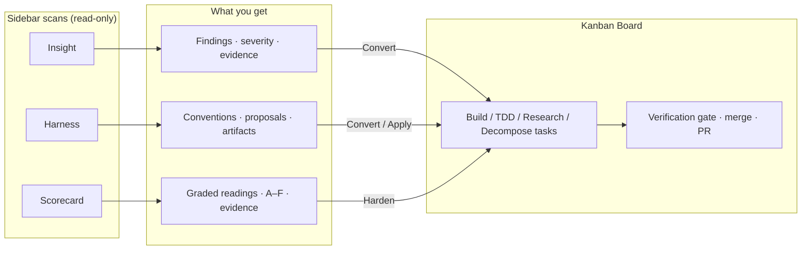
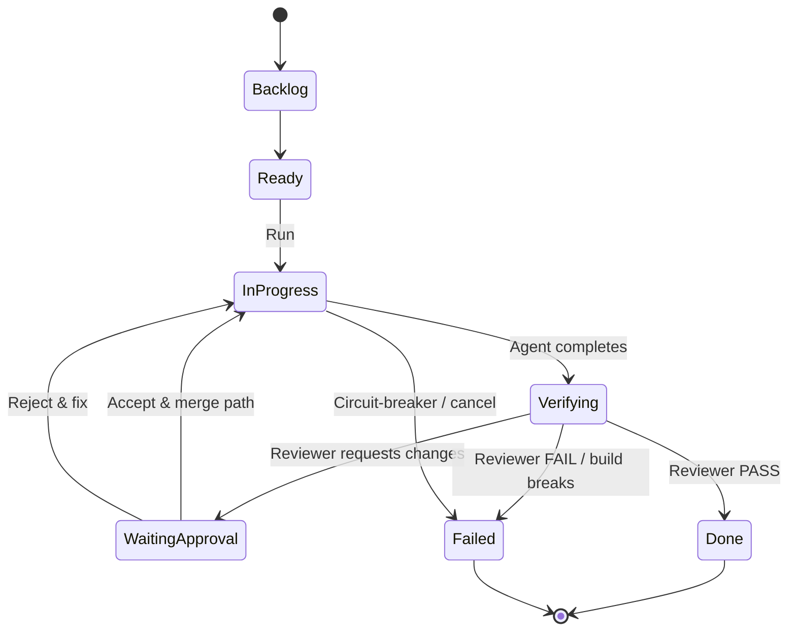
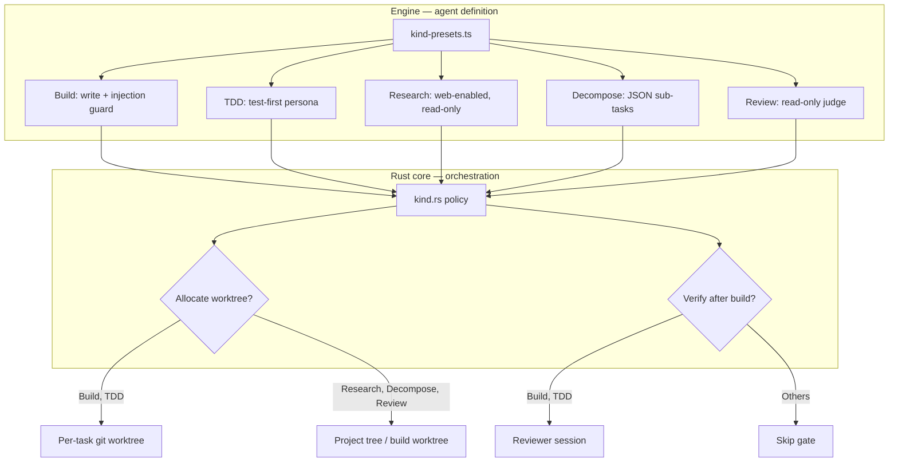

# Nightcore

**An autonomous Claude dev studio — a desktop Kanban board that runs agents for you.**

Nightcore is a local-first desktop app that turns a Claude agent into an
autonomous development teammate. You describe work as cards on a board; Nightcore
plans, dispatches, and runs each one — in parallel, in isolated git worktrees,
with dependency ordering and a failure circuit-breaker — and streams every
agent's progress back to the UI.

It is a from-scratch, better-architected reimagining of
[AutoMaker](https://github.com/AutoMaker-Org/automaker): the same autonomous
orchestration value, rebuilt on hard process boundaries instead of one
monolithic daemon.

> Local-first, single-user, Claude-first. No server, no database, no accounts.
> State lives under `~/.nightcore/` and per-project `.nightcore/`.

## Architecture

Three tiers with hard boundaries — orchestration is native Rust, the SDK is
quarantined in a process-isolated sidecar, and the UI is a thin client:

```
┌──────────────────────────────────────────────────────────────┐
│  apps/web — React board (Tauri webview)                        │
│  Kanban UI. Talks ONLY Tauri commands + the `nc:event` stream. │
└───────────────▲───────────────────────────┬──────────────────┘
                │ invoke / events            │
┌───────────────┴───────────────────────────▼──────────────────┐
│  apps/desktop/src-tauri — RUST CORE (the orchestration brain)  │
│  task registry · auto-loop · concurrency/slots · worktrees ·   │
│  dependency resolver · project registry · event bus · IPC.     │
│  Provider-agnostic. Native, always-on, performance-critical.   │
└───────────────▲───────────────────────────┬──────────────────┘
                │ NDJSON over stdio          │ spawn + drive
┌───────────────┴───────────────────────────▼──────────────────┐
│  apps/sidecar — BUN PROVIDER SIDECAR (the only place an SDK    │
│  lives). Wraps the Claude Agent SDK; streams normalized        │
│  events. Swappable: a Codex sidecar later speaks the same      │
│  protocol behind the same Rust `AgentProvider` trait.          │
└───────────────────────────────────────────────────────────────┘
```

- **Rust core** (Tauri 2) owns everything performance-sensitive and always-on:
  the task/project registries, the autonomous loop, the concurrency/slot
  manager, per-task git worktrees, dependency ordering, and the event bus.
- **Bun sidecar** is the *only* place the [Claude Agent
  SDK](https://www.npmjs.com/package/@anthropic-ai/claude-agent-sdk) lives (there
  is no Rust SDK). It is deliberately dumb: it forwards commands into the engine
  and streams events back. No orchestration logic lives there.
- **React board** (React 19 + Vite + Tailwind v4) is a thin client that speaks
  only Tauri commands and the `nc:event` stream.

The core ↔ sidecar protocol is line-delimited JSON (NDJSON) over the child's
stdio: one `SurfaceCommand` per line in, one `NightcoreEvent` per line out,
human logs on stderr. See
[`docs/arch/2026-06-21-nightcore-studio-architecture.md`](docs/arch/2026-06-21-nightcore-studio-architecture.md)
for the full design, and [`AGENTS.md`](AGENTS.md) (Repository shape + Hard
import boundaries) for the package layer model.

### How scans and tasks connect

Insight, Harness, and Scorecard are read-only Claude analyses. Each produces
actionable output you can turn into board tasks with one click. Converted tasks
carry a `sourceRef` chip so you can jump back to the finding, reading, or
proposal that spawned them.



### Build-task lifecycle

`Build` and `TDD` tasks get an isolated git worktree (when run mode is
**Worktree**), run the agent, then pass through an automated verification gate
before they can land as **Done**.



## Features

Nightcore's workspace sidebar routes between the surfaces below. Keyboard hints
are shown next to each nav item.

### Kanban Board (`K`)

The primary control surface. You describe work as cards, drag them across
columns, and let the auto-loop run agents in parallel (up to your concurrency
limit).

**What you get:** live agent transcripts, per-task cost/usage, dependency
ordering, a failure circuit-breaker, session history with resume, plan-approval
for interactive runs, commit/merge/PR actions from the task drawer, and a
pre-merge **readiness gauntlet** (build → lint/typecheck as detected →
structure-lock checks from Harness).

**Run modes:** **Main** edits the project tree on the current branch; **Worktree**
isolates the task on its own branch in a separate git worktree (recommended for
parallel agents).

### Task kinds

When you create a task you pick a **kind**. The kind controls the agent persona,
tool restrictions, and orchestration policy (worktree allocation, verification).

| Kind | Agent behavior | Orchestration | What you get |
|------|----------------|---------------|--------------|
| **Build** | Writes code with an injection guard against hostile text in task descriptions | Own worktree + verification gate | A reviewed diff in an isolated branch, ready to commit/merge |
| **TDD** | Same as Build, but enforces strict red→green→refactor (failing test first, then minimum implementation) | Same as Build | Test-first changes with the same verification gate |
| **Research** | Read-only investigation; the only kind that may use web tools (`WebFetch` / `WebSearch`) | No worktree, no verification | A report in the transcript — no code mutations |
| **Decompose** | Read-only planning; ends with a JSON array of `{ title, prompt }` sub-tasks | No worktree, no verification | 2–8 proposed sub-tasks you convert into board cards one-by-one or in bulk |
| **Review** *(internal)* | Independent read-only reviewer over a worktree diff; emits `VERDICT: PASS \| CHANGES_REQUESTED \| FAIL` | Runs inside the build's worktree | Not user-selectable — dispatched automatically by the verification gate |



### Insight (`I`)

Claude-powered **codebase analysis** that surfaces grounded, categorized findings
you can triage and turn into work.

**How it runs:** pick analysis scope (**whole repo** or **changes since last
commit**), select one or more categories, optionally choose model and reasoning
effort. The engine fans out one read-only Claude pass per category (bounded
parallel), deduplicates across categories, and streams progress to the UI.

**Categories:** Architecture · Bugs · Refactor · Performance · Security · Tests ·
Docs · UI/UX · Dependencies

**What you get per finding:** title, severity (critical → info), estimated
effort, evidence anchored to repo paths, lifecycle status (open / dismissed /
converted). Actions: **Convert to task** (creates a Build task with injection
fencing), **Dismiss**, **Restore**, or **Convert all** open findings in one
shot. Run history lets you revisit past analyses.

### Harness (`H`)

A **codebase-convention auditor** that discovers how your project is structured,
surfaces convention gaps, and proposes an applyable harness so agents cannot
quietly degrade project structure.

**How it runs:** select convention **lenses** (multi-select), optionally model
and effort. A deterministic repo-profile pass runs first (monorepo detection,
package map, languages). Then one read-only pass per lens runs in parallel, followed
by a synthesis pass that proposes enforceable artifacts.

**Convention lenses:** Architecture · Folder Structure · Naming · Imports &
Boundaries · Design Decisions · Tooling & Lint · Testing · Agent Context

**What you get — three result layers:**

1. **Convention findings** — existing conventions to codify, or gaps against best
   practice (severity-ranked). Convert any finding into a board task.
2. **Task-shaped proposals** — bundled work the agent should do (`agent-task` →
   Build task) or safe file bundles to write (`apply-artifacts` → confirm and
   write to disk).
3. **Harness artifacts** — generated files such as lint-meta rules, ESLint plugin
   rules/config, and `AGENTS.md` / `CLAUDE.md` contract blocks. **Apply** writes
   them to disk (create-only or merge-section modes). ESLint-class artifacts can
   be **armed** as Structure-Lock gauntlet checks in `.nightcore/harness.json`
   so every future task runs `npx eslint .` (or your confirmed command) before
   merge.

A **Policy** section in Harness also surfaces runtime hardening controls
(permission tiers, injection scan, diff budget, etc.).

### Scorecard (`R`)

A **production-readiness profile** of your codebase. Unlike Insight's many
findings per category, Scorecard emits **one graded reading per dimension** with
supporting evidence.

**How it runs:** select dimensions (multi-select), optionally model and effort.
One read-only Claude pass per dimension grades the repo on an A–F scale.

**Dimensions:** Architecture · Tests · Security · Error Handling · Observability
· Dependencies · Performance · Type Safety · Accessibility · Docs & CI

**What you get per reading:** letter grade, summary, grounded evidence list.
**Harden** converts a weak dimension into a Build task pre-filled with the
reading's remediation context. The results grid sorts worst grades first so you
see the biggest gaps immediately.

### Worktrees (`W`)

Standalone git worktree manager: browse per-task branches, preview merges, view
diffs, discard worktrees. Integrates with the board's worktree tab filter.

### PR Review (`P`)

Create and track pull requests from tasks (`gh pr create`), push updates, finalize,
pull base, address review comments with an AI-assisted fix pass, and run a
diff-grounded PR reviewer scan that posts a human-gated review via `gh`.

### Settings (`S`)

Project and global configuration: concurrency, auto-loop, model defaults,
permission mode, external MCP servers, provider-config inspector, and policy
hardening modules.

## Requirements

- **[Bun](https://bun.sh) ≥ 1.1** — runtime for the sidecar and the TS
  workspace. Node 22 also works for the libraries.
- **A Rust toolchain** — to build the Tauri core (`cargo`, stable Rust).
- **The Claude CLI, installed and logged in.** Nightcore does **not** bundle the
  Claude CLI — install it yourself with
  `curl -fsSL https://claude.ai/install.sh | bash`
  (see the [setup docs](https://code.claude.com/docs/en/setup)), then run `claude`
  once to log in. Nightcore does not handle credentials; the Agent SDK inherits
  your local Claude login from `~/.claude`.

`@tauri-apps/cli` ships as a workspace dev-dependency, so no global Tauri install
is needed.

## Setup

```bash
# 1. Install the Claude CLI and authenticate (one-time, your responsibility):
#    curl -fsSL https://claude.ai/install.sh | bash   # see https://code.claude.com/docs/en/setup
#    then run `claude` once to log in.

# 2. Install workspace dependencies:
bun install

# 3. Typecheck the workspace:
bun run typecheck
```

`ANTHROPIC_API_KEY` is honored as an optional fallback if present in your
environment, but the intended path is your local Claude CLI login. Nightcore
never passes an API key itself and never brokers or persists tokens.

## Usage

Run the full desktop studio (builds the web UI, opens the window, spawns the
sidecar on demand):

```bash
bun run desktop      # tauri dev
```

Or run pieces individually:

```bash
bun run web          # Vite dev server only (browser preview; sidecar disabled)

# Drive the sidecar protocol by hand (raw NDJSON):
echo '{"type":"start-session","prompt":"say hello"}' | bun run sidecar
```

The sidecar prints `nightcore-sidecar ready` on stderr, then emits one
`NightcoreEvent` per line on stdout for the session lifecycle, assistant deltas,
tool use, permission requests, and completion (with cost + usage).

## Workspace layout

```
apps/
  desktop/   Tauri 2 shell + src-tauri/ — the Rust orchestration core
  web/       React 19 + Vite + Tailwind v4 — the Kanban board UI
  sidecar/   Bun NDJSON server wrapping the Claude Agent SDK
packages/    shared TS packages used by the sidecar and the core
  contracts/ the spine — Zod schemas + types (the wire protocol + shared types)
  shared/    logger, Result<T,E>, monotonic ids, path helpers
  config/    layered config resolver (defaults → ~/.nightcore → ./.nightcore)
  storage/   local session-metadata store (JSONL; transcripts stay with the SDK)
  engine/    SessionManager, SessionRunner, ToolRegistry, PermissionLayer, HookBus
  session-fold/ event→state fold logic for session lifecycle
  eslint-plugin/ the nightcore/* lint rules and validator
tools/codegen/   TS→Rust contract generator (`bun run codegen:contracts`)
tools/lint-meta/ meta-lint engine (`bun run lint:meta`) — layer-rank, package-shape, codegen-drift, …
tools/coverage/  node test coverage floor (`test:node:coverage`)
docs/        architecture summary + design/research docs
```

See [`AGENTS.md`](AGENTS.md) (Repository shape + Hard import boundaries) for the
package layer model and dependency rules, and
[`docs/architecture.md`](docs/architecture.md) for the runtime tiers.

## Scripts

| Command | What |
|---------|------|
| `bun run desktop` | run the Tauri desktop app (`tauri dev`) |
| `bun run web` | run the React board in a browser (Vite dev server) |
| `bun run web:build` | build the web UI |
| `bun run sidecar` | run the Bun provider sidecar (raw NDJSON over stdio) |
| `bun run typecheck` | `tsc -b` across the workspace |
| `bun run test` | the TS/Bun tiers (node → web → plugin; Rust skipped — use `test:all`) |
| `bun run test:rust` | Rust core unit tests (`cargo test` in `apps/desktop/src-tauri`) |
| `bun run test:all` | builds the workspace (`tsc -b`) then every tier: node → web → plugin → Rust |
| `bun run lint` | eslint (flat config) + `lint:meta` (codegen-drift + agent-contract gate) |

### Testing

The suites are fast and offline (no live Claude session, no token use, no cost):

- **Rust core** (`apps/desktop/src-tauri`): `bun run test:rust` (or `cargo test`
  there). Covers `TaskStatus` serde, `TaskStore` JSON round-trips on a temp dir,
  `TaskPatch` application, the sidecar serial-guard, and the orchestration seams
  (`src/orchestration/`).
  Any `cargo build` needs the compiled sidecar binary (Tauri `externalBin`); build
  it first with `bun run --filter @nightcore/sidecar compile`. `bun run test:rust`
  and `bun run test:all` run this compile step for you, so they work on a fresh
  checkout where `binaries/` is still empty. `test:all` also runs `bun run build`
  (`tsc -b`) up front so the `@nightcore/*` workspace deps — which the node and web
  tiers import through their package.json `exports` (`./dist/index.js`) — are built
  before those tiers run, the same build-before-test ordering CI does via
  `bun run typecheck`.
- **Sidecar** (`apps/sidecar`): `bun test apps/sidecar` — NDJSON framing, command
  dispatch, event-per-line serialization, and permission relay. The
  `SessionManager` is stubbed, so the suite never spawns a model. (The engine's
  `session-manager.test.ts` stubs the SDK's `query()` the same way.)
- **Web** (`apps/web`): `bun run test:web` — Vitest + Storybook component tests.

**CI** (`.github/workflows/ci.yml`): every push to `main` and every PR runs two
jobs. **bun-checks** runs `bun run lint`, `bun run typecheck`, then
`bun run test:node:coverage` (node tier under a src-level coverage floor),
`bun run test:web`, and `bun run test:plugin`. **rust-checks** runs
`cargo fmt --check`, `bun run test:rust`, and `cargo clippy --all-targets -D warnings`,
then asserts the ts-rs bindings (`apps/web/src/lib/generated`) have no `git diff`
drift after `cargo test` regenerates them. Dependency CVE scanning runs
separately in `audit.yml` (with `dependabot.yml` for bumps).

## What it does today

See **[Features](#features)** above for a user-facing guide to task kinds, Insight,
Harness, Scorecard, and the rest of the sidebar. Shipped capabilities in brief:

- **Verification gauntlet** — build → commit → independent reviewer before merging
- **Session history and resume** — rehydrate prior runs from the SDK session store
- **Provider-config inspector** — resolved, scope-aware SDK config for a project
- **UI-configurable external MCP servers** — injected via `Options.mcpServers`
- **Insight / Harness / Scorecard** — Claude scans with convert-to-task workflows
- **PR system** — create, track, finalize, address comments, AI PR-reviewer scan
- **Worktree manager** — branch picker + standalone merge-preview/diff/discard view
- **Hardening & scan gates** — diff-budget, anti-gaming, ratchet, permission tiers,
  injection quarantine, write sandbox (Policy tab)
- **Task kinds** — Build · Research · TDD · Decompose (+ internal Review gate)

Detailed build specs live under `docs/research/` and `docs/arch/`.

## Status & roadmap

Following the studio milestones (see the architecture doc):

- **M0 — walking skeleton** *(done)*. Tauri + React → spawn Bun sidecar → run one
  prompt in cwd → stream deltas to a panel. Proves core ↔ sidecar ↔ SDK ↔ local
  auth end-to-end.
- **M1 — task spine + board** *(done)*. `Task` domain model + JSONL store (Rust),
  Kanban board UI with the status lifecycle, run a task via the sidecar.
- **M2 — autonomy + isolation** *(done)*. Auto-loop coordinator,
  concurrency/slot manager, per-task git **worktree** isolation, dependency
  ordering, failure circuit-breaker.
- **M3 — provider trait + quality gates** *(done)*. `AgentProvider` trait,
  plan-approval gate, event hooks/notifications.
- **M4 — verification + quality gates** *(done)*. Verification gauntlet
  (build → commit → independent review → done / auto-fix / park); pre-merge
  gauntlet detects real tooling (Bun/npm scripts or Cargo) and stops at first
  failure.
- **Post-M4 — studio + governance** *(shipped, ongoing)*. Session resume, the
  provider-config inspector, UI-configurable MCP, Insight, Harness, the Readiness
  Scorecard, the full PR system, the worktree manager, task kinds, and the
  hardening/scan gates behind a Policy tab (see **What it does today** above and
  the dated specs under `docs/research/`).

Open threads: see `docs/` for current work in progress.

## License

MIT © Shirone. Not affiliated with Anthropic. "Powered by Claude" — Nightcore is
not "Claude Code" and does not redistribute Claude credentials.
