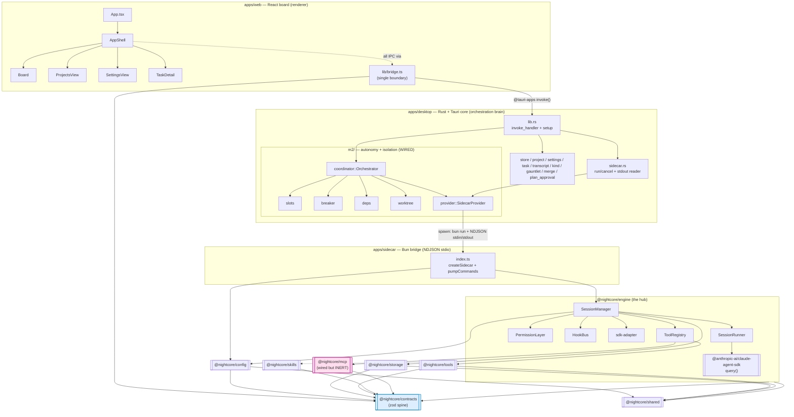

# Architectural Analysis — Wiring Map (what is wired)

**Date:** 2026-06-22
**Agent:** kirei-arch
**Scope:** `packages/*` (config, contracts, engine, eslint-plugin, mcp, shared, skills, storage, tools), `apps/desktop` (Rust+Tauri core incl. `m2/`), `apps/web` (React board), `apps/sidecar` (bridge tier only). **Explicitly excluded:** `apps/cli`, `apps/tui`.
**Lens:** module boundaries, dependency direction, wiring completeness, coupling, architectural islands. File-level dead-code/unused-exports are the sibling kirei-refactor agent's lens (see Cross-Lens at the end).

---

## TL;DR

The 3-tier architecture (memory's claim) is **real and fully wired end-to-end**: React board → Tauri `invoke` → Rust core → NDJSON stdio → Bun sidecar → `@nightcore/engine` → Claude Agent SDK, and back via events. Every TS package in scope has a live consumer; **no package is a build-only island**. The `m2/` orchestrator — the "is it wired or a parallel subsystem" question — is **fully integrated** into the live runtime (managed state, command surface, the sidecar reader, and startup reconciliation all route through it). The web command/event surface is **symmetric and complete** (every registered Tauri command has a bridge wrapper; every emitted event has a listener).

The structural risks are **not** islands — they are **drift seams** and a **packaging gap**:
1. **Two hand-mirrored contract boundaries with no codegen** (TS↔Rust at the Tauri boundary; TS-contract↔Rust-raw-JSON at the sidecar boundary). `tools/codegen` is a tool scaffolder, not a contract generator.
2. The sidecar is launched as **`bun run apps/sidecar/src/index.ts`** (a workspace-relative dev path), never the compiled binary — a `tauri build` artifact would not find its sidecar.
3. **`@nightcore/mcp` is wired but inert** (external-MCP transports are deferred; the registry is empty) — a structural placeholder, not a functional island.

---

## Current Architecture

### Module Diagram



**Legend:** solid arrow = real import/IPC edge verified in source; dotted = behavioral/IPC seam; pink = wired-but-functionally-inert; blue = the shared schema spine.

### The two hand-mirrored contract boundaries (drift seams)

```mermaid
flowchart LR
    Z[zod schemas<br/>packages/contracts/src] -->|"validated at runtime"| SC[sidecar index.ts]
    Z -->|"validated at runtime"| WB[web bridge.ts]
    SC -. "raw serde_json::json!(...)<br/>NO shared type" .-> PR[provider.rs / sidecar.rs<br/>Rust reads .get(\"camelCase\")]
    WB -. "hand-mirrored interface Task{}<br/>NO shared type" .-> RS[task.rs / settings.rs<br/>#[derive(Serialize)]]
    PR -. drift risk .-> Z
    RS -. drift risk .-> Z
    classDef risk fill:#fee,stroke:#e44;
    class PR,RS risk;
```

### Tier / module map

| Tier | Unit | Role | Wired? |
|------|------|------|--------|
| Renderer | `apps/web` | React board; **all** IPC funnels through `lib/bridge.ts` | Yes |
| Core | `apps/desktop` (Rust) | Orchestration brain: task registry, auto-loop, worktrees, breaker, verification gate | Yes |
| Bridge | `apps/sidecar` | Thin NDJSON stdio adapter over `SessionManager` | Yes |
| Engine | `@nightcore/engine` | The hub; owns the SDK `query()` loop; the *only* surface the sidecar drives | Yes |
| Spine | `@nightcore/contracts` | Zod schemas + inferred types for every cross-boundary shape | Yes (leaf) |
| Lib | `@nightcore/shared` | logger/result/ids/paths/which; node builtins only | Yes (leaf) |
| Cap | `@nightcore/config`, `storage`, `tools`, `skills`, `mcp` | Capability packages consumed by engine/sidecar | Yes (see §5) |

### Dependency summary (verified edges)

| Module | Depends On (used, not just declared) | Depended On By |
|--------|--------------------------------------|----------------|
| `@nightcore/contracts` | `zod` | engine, config, storage, tools, skills, mcp, sidecar, **web** |
| `@nightcore/shared` | (node builtins) | engine, config, storage, tools |
| `@nightcore/config` | contracts, shared | engine (`session-manager.ts:63` region), sidecar (`index.ts:26,153`) |
| `@nightcore/storage` | contracts, shared | engine (`session-manager.ts:10,56,63`) |
| `@nightcore/tools` | contracts, shared, claude-agent-sdk | engine (`tool-registry.ts`) |
| `@nightcore/skills` | contracts | engine (`agent-presets.ts:9,24` → `session-runner.ts:23`) |
| `@nightcore/mcp` | contracts | engine (`tool-registry.ts:10`, `session-runner.ts`) — **descriptor only, transport deferred** |
| `@nightcore/engine` | contracts, config, storage, shared, tools, skills, mcp, claude-agent-sdk | sidecar (`index.ts:27`) |
| `apps/sidecar` | contracts, engine, config, shared | desktop (spawned as a child process) |
| `apps/web` | contracts, @tauri-apps/* | (renderer; talks to desktop over IPC) |
| `apps/desktop` (Rust) | tauri, tokio, serde, async-trait, which… | (top of the stack) |

`madge --circular` over `packages/` (105 files) reports **zero circular dependencies**. The package graph is a clean DAG with `contracts`/`shared` as leaves and `engine` as the single hub.

---

## End-to-End Trace (the central wiring question)

### One command: "run a task" (web → SDK)

1. **Web** — user clicks Run → `runTask(id)` → `invoke('run_task', { id })` — `apps/web/src/lib/bridge.ts:370-372`.
2. **Tauri boundary** — `run_task` is registered at `apps/desktop/src-tauri/src/lib.rs:98` and implemented at `sidecar.rs:887`. It leases a slot (`orch.slots.try_lease`, `sidecar.rs:898`), resolves a worktree (`coordinator::resolve_worktree`, `sidecar.rs:904`), marks in-progress, ensures the sidecar reader (`ensure_reader`, `sidecar.rs:923`).
3. **Spawn the bridge** — `ensure_reader` → `orch.provider.spawn()` (`sidecar.rs:60`) → `SidecarProvider::spawn` spawns **`bun run <entry>`** (`provider.rs:184-192`) with piped stdin/stdout/stderr.
4. **Wire write** — `orch.provider.start_session(...)` (`sidecar.rs:935`) constructs a raw `start-session` JSON object with `serde_json::json!` (`provider.rs:387-398`) and writes one NDJSON line to the child's stdin (`provider.rs:347-355`). A **pending-launch FIFO** entry is pushed under the same lock (`provider.rs:404`) for later correlation.
5. **Sidecar** — `pumpCommands` frames the line (`apps/sidecar/src/index.ts:127`), `handleLine` validates it against `SurfaceCommandSchema` (`index.ts:112`) and calls `manager.dispatch(command)` (`index.ts:117`).
6. **Engine** — `SessionManager.dispatch` (`packages/engine/src/session-manager.ts:83`) branches on `start-session` (line 84) and launches a `SessionRunner`, whose `query({ prompt, options })` (`session-runner.ts:201`) is the live Claude Agent SDK loop. The in-process tools come from `ToolRegistry` → `createSdkMcpServer` (`tool-registry.ts:46`).

### One event back: "session completed" (SDK → web)

1. **Engine** — the SDK result message is translated to a `NightcoreEvent` by `sdk-adapter.ts` (`translateMessage`), emitted from `SessionManager`.
2. **Sidecar** — every emitted event is `encodeEvent`'d to one NDJSON line and written to **stdout** (`apps/sidecar/src/index.ts:100-102, 160-162`). stdout is the *pure* protocol; stderr is logs only.
3. **Rust reader** — the long-lived reader loop (`sidecar.rs:70-93`) `parse_line`'s each stdout line (`provider.rs:475`) and calls `handle_event` (`sidecar.rs:185`). It **correlates** `sessionId` → `taskId` via the FIFO (`provider.correlate`, `provider.rs:235`), forwards the raw event to the webview as `nc:session` (`sidecar.rs:200-203`), persists it to the task transcript (`transcript::append_event`, `sidecar.rs:208`), and applies terminal transitions (`session-completed` → `handle_build_completed` → verification gate or `Done`, `sidecar.rs:250-270`).
4. **Web** — `onSessionEvent` listens on `nc:session` (`bridge.ts:671-679`), validates the inner event against `NightcoreEventSchema` (`bridge.ts:655`), and folds it into the board's session stream.

The `NightcoreEvent` union has 10 variants (`packages/contracts/src/events.ts:167`): `session-started`, `session-ready`, `task-updated`, `assistant-delta`, `tool-use-requested`, `tool-result`, `permission-required`, `session-completed`, `session-failed`, `session-status`.

---

## Answers to the Key Wiring Questions

**1. Contract spine → Rust. Is there codegen?**
**No codegen.** `tools/codegen/new-tool.ts` is a *tool scaffolder* (creates a new `@nightcore/tools` file), not a TS→Rust contract generator. The contract crosses to Rust **twice, both hand-mirrored**:
- *Sidecar boundary:* Rust never imports a generated type. It **constructs** `start-session`/`approve-permission`/`interrupt` payloads with raw `serde_json::json!` (`provider.rs:387, 419, 428, 459`) and **reads** events with string keys `event.get("camelCase")` (`sidecar.rs:189-285, 733-758`). The keys read (`type, sessionId, requestId, toolName, sdkSessionId, result, costUsd, reason, message, input, plan, suggestions`) match `events.ts` exactly — but **by convention only**. Rename a contract field and the Rust `.get()` silently returns `None`; the event is dropped or mis-handled with no compile error. This is the single highest-leverage drift surface.
- *Tauri boundary:* the web `Task`/`Settings`/`Project`/`WorktreeInfo`/`LoopEnvelope` interfaces are **hand-mirrored** from the Rust serde structs ("Mirrors the Rust serde struct (camelCase) exactly", `bridge.ts:56-57, 235, 211, 141`). The Rust side `#[derive(Serialize)]`s the structs in `task.rs`/`settings.rs`/`project.rs`. Same drift class, opposite direction. (Mitigation already in place on the *event* path: web re-validates `nc:session`/`read_transcript` against `NightcoreEventSchema`, `bridge.ts:387-397, 655` — so event drift fails closed at the web, but command-arg/struct drift does not.)

**2. desktop → sidecar (`sidecar.rs`/`provider.rs`).**
stdio, **line-delimited JSON (NDJSON)**: WRITE one `SurfaceCommand` per line to stdin, READ one `NightcoreEvent` per line from stdout, stderr = human logs drained into the Rust `tracing` sink (`sidecar.rs:1-18, 98-106`). It is **`bun run` of the TypeScript entry**, NOT the compiled binary: `Command::new(bun).arg("run").arg(&self.entry)` where `entry = workspace_root().join("apps/sidecar/src/index.ts")` (`provider.rs:184-192`, `lib.rs:71`). One **persistent** sidecar multiplexes N sessions; correlation is the pending-launch FIFO (`provider.rs:14-21, 223-251`).

**3. web → desktop: registered vs invoked commands.**
**Perfectly symmetric — no orphans either direction.** All 30 commands registered in `lib.rs:91-127` invoke_handler have a matching wrapper in `bridge.ts`, and every wrapper targets a registered command. Verified each of the 16 commands my first grep "missed" (they were wrapped in named helpers, not inline `invoke('literal')`): `list_tasks, move_task, blocked_task_ids, respond_permission, read_transcript, list_projects, active_project, is_git_repo, get_settings, app_info, run_gauntlet, start_auto_loop, stop_auto_loop, resume_auto_loop, set_max_concurrency_cmd, list_worktrees` — **all present in `bridge.ts`** (lines 305, 366, 359, 405, 386, 533, 538, 564, 604, 617, 481, 500, 505, 510, 516, 492). No registered-but-never-called command; no web-invoked-but-not-registered command. Both directions of the event channel are also complete: the 5 emitted events (`nc:task`, `nc:session`, `nc:project`, `nc:loop`, `nc:permission`) each have a `bridge.ts` listener (`onTaskEvent`/`onSessionEvent`/`onProjectEvent`/`onLoopEvent`/`onPermissionEvent`).

**4. The `m2/` submodule — wired or island? → FULLY WIRED.**
This is **not** a parallel/unintegrated subsystem. `m2::coordinator::Orchestrator` is constructed in `lib.rs:70` and `app.manage()`'d as shared state (`lib.rs:79`); the 5 M2 commands are registered (`lib.rs:122-126`: `start_auto_loop`, `stop_auto_loop`, `resume_auto_loop`, `set_max_concurrency_cmd`, `list_worktrees`); startup runs `reconcile_worktrees` + `reconcile_tasks` (`lib.rs:84, 88`). Every m2 submodule is referenced from the live path:
- `coordinator` ← lib.rs, sidecar.rs, project.rs, settings.rs, merge.rs, plan_approval.rs
- `provider` ← sidecar.rs, plan_approval.rs, coordinator.rs
- `slots` ← sidecar.rs, coordinator.rs
- `worktree` ← gauntlet.rs, task.rs, sidecar.rs, merge.rs, coordinator.rs
- `breaker` ← coordinator.rs
- `deps` ← task.rs, coordinator.rs

The `Orchestrator` is the single managed-state hub the manual `run_task` path AND the auto-loop both route through (`sidecar.rs:887` and `coordinator.rs` `launch`/`tick`). Confirmed wired.

**5. Per-package: live consumer or island? → every package has a real consumer.**
- `config` → engine `session-manager.ts` + sidecar `index.ts:153` (live `resolveConfig()`). **Wired.**
- `storage` → engine `session-manager.ts:10,56,63` (`new SessionStore(...)`). **Wired.**
- `skills` → engine `agent-presets.ts:9,24` (`nightcoreSkills.map(toAgentDefinition)`) → consumed by `session-runner.ts:23`. **Wired.**
- `mcp` → engine `tool-registry.ts:10` (`externalMcpServers`). **Wired structurally, but functionally INERT:** the registry is empty (`mcp/src/index.ts`: `externalMcpServers: ExternalMcpServer[] = []`) and `tool-registry.ts:39-40` documents that wiring live external-MCP transports into SDK `mcpServers` is **deferred**. So it is imported and rendered as descriptors, but no external server actually reaches the SDK. Call it a *placeholder seam*, not an island.
- `tools` → engine `tool-registry.ts` (the in-process SDK MCP server). **Wired.**
- `eslint-plugin` → root `eslint.config.mjs` (build/lint tooling, outside the runtime path — correctly so). **Wired as tooling.**

No package "builds but nothing imports."

**6. web internal reachability. → everything is reachable.**
`App.tsx` → `ErrorBoundary` → `ToastProvider` → `AppShell`. `AppShell` renders `Sidebar`, `Board`, `NewTaskForm`, `NewProjectDialog` eagerly and lazy-loads `TaskDetail`, `ProjectsView`, `SettingsView` behind Suspense (`AppShell.tsx:2-3, 22-28, 108, 142, 179, 197, 209, 213`). All 3 nav views (projects/board/settings) are routed. Every component folder under `components/{app,board,projects,settings,new-project,ui}` has ≥2 non-self, non-test references — **no unrendered component-folder island**. (`_fixtures.ts` / `session-stream.ts` / `status.ts` are board support modules, used.)

---

## Issues Found (structural / wiring lens)

### Wrong-direction / leaky dependencies
- **None of concern.** The package DAG flows correctly toward the `contracts`/`shared` leaves; capability packages (`tools`, `skills`, `mcp`) import `contracts` only and never the engine (dependency inversion is explicit and respected — `mcp/src/index.ts`, `skills/src/index.ts` both call this out). Rust core → sidecar → engine is one-directional; the engine never knows about the orchestrator.

### Drift seams (the real structural risk — coupling without a shared type)
1. **Sidecar wire contract is duplicated in Rust by hand, untyped.** `provider.rs` builds and `sidecar.rs` reads the NDJSON payloads with raw `serde_json::json!` / `.get("key")`. The authoritative shape lives in `packages/contracts/src/{commands,events}.ts`. There is no generated Rust mirror and no schema check on the Rust side of *outbound commands*. Drift fails **silently** (a dropped event, a `null` field). Evidence: `provider.rs:387-398` vs `commands.ts:20-49` (start-session fields); `sidecar.rs:189-285` vs `events.ts`.
2. **Tauri struct contract is duplicated in the web by hand.** `bridge.ts` `Task`/`Settings`/`Project`/`WorktreeInfo`/`LoopEnvelope`/`GauntletResult` are hand-kept mirrors of the Rust serde structs. Event payloads are re-validated against zod at the web (`bridge.ts:655, 387`) — good — but **command arguments and the returned structs are not**, so a field rename in `task.rs` surfaces as a runtime `undefined`, not a type error.

### Packaging gap (wiring that only works in dev)
3. **The sidecar is launched as a workspace-relative `bun run` path.** `lib.rs:71` hardcodes `workspace_root().join("apps/sidecar/src/index.ts")` and `provider.rs:184` runs `bun run` on it. `apps/sidecar/package.json` *has* a `compile` script targeting `apps/desktop/src-tauri/binaries/nightcore-sidecar`, but **no `binaries/` dir exists** and **`tauri.conf.json` declares no `externalBin`**. So a `tauri build` would ship an app whose orchestrator points at a source path that won't exist on an end-user machine, and `bun` must be on PATH. The compiled-binary path is **defined but unwired** — the one genuine "exists but not connected" artifact in scope (a build-config island, not a code island).

### Wired-but-inert
4. **`@nightcore/mcp` external-server transports are deferred.** Imported and surfaced as descriptors, but the registry is empty and live transports are explicitly not yet merged into SDK `mcpServers` (`tool-registry.ts:39-40`). Not a defect — a foundation placeholder — but worth flagging so it isn't mistaken for live capability.

### Coupling notes (acceptable, but worth naming)
- `sidecar.rs` is a **god file** (~1180 lines) carrying the stdout reader, event correlation, the entire M4 verification state machine (build→review→fix→park), permission relay, plan gate, crash recovery, AND the `run_task`/`cancel_task`/`respond_permission` commands. It is correctly wired but concentrates a lot of orchestration policy that arguably belongs split across `coordinator.rs` / a dedicated `verification.rs`. (Refactor-lens adjacent; noted, not worked.)

---

## What to Keep (well-structured, do not change)

- **The single-bridge boundary on the web** (`lib/bridge.ts`): every `invoke` and every `listen` goes through one module that also owns the `isTauri()` mock-fallback. This is exactly the right shape and is the reason the command surface is perfectly symmetric.
- **The provider trait seam** (`m2/provider.rs`): the `Provider` trait + pending-launch FIFO correlation keeps provider selection behind the existing sidecar/engine factory (D-009), not a Rust `match` branch. Clean abstraction, zero sidecar changes needed for N-concurrency.
- **Dependency inversion in capability packages**: `tools`/`skills`/`mcp` depend on `contracts` only and re-declare SDK-shaped types structurally to stay SDK-free. Keep this.
- **The clean DAG**: no circular deps, `contracts`/`shared` as leaves, `engine` as the sole hub. Don't let the core start importing engine internals — the sidecar boundary is what keeps that honest.
- **Event-path runtime validation** at the web (`NightcoreEventSchema.safeParse`): this is the mitigation that makes the *event* half of the drift seam fail closed. Extend the same idea to commands/structs (see below) rather than removing it.

## Recommended Target (advisory — for the team, not this pass)

The architecture is sound; the work is **closing the two drift seams**, not restructuring:
1. **Generate the Rust contract mirror from the zod spine** (e.g. zod→JSON-Schema→`typify`/`schemars`, or a small `tools/codegen` emitter) so `SurfaceCommand`/`NightcoreEvent`/`Task`/`Settings` exist as real `#[derive(Deserialize/Serialize)]` structs and the Rust side stops hand-reading `.get("camelCase")`. Single source of truth = `packages/contracts`. This is the highest-value structural change.
2. **Wire the compiled sidecar for release**: add `externalBin` to `tauri.conf.json`, run `bun run compile` in the build, and have the provider prefer the sidecar binary (falling back to `bun run` only in dev). Closes the packaging island.
3. Optionally split `sidecar.rs` — extract the verification state machine into its own module — to reduce the god-file concentration once #1 lands.

---

## Cross-Lens (for kirei-refactor — noted, not worked)
- `sidecar.rs` god-file (~1180 lines) — file-level cohesion candidate.
- `Outcome::NeedsApproval` is `#[allow(dead_code)]` (`sidecar.rs:778`) — a defined-but-unconstructed variant.
- Several `#[allow(dead_code)]` provider methods (`is_running`, `task_for`, `ensure_started`, `live_sessions` partially) are diagnostic/seam-pinning accessors — confirm whether each has a caller before removal.
- `apps/sidecar/package.json` `compile` script + `bin` entry are defined but unused by the live path (tie-in to packaging gap #3).
