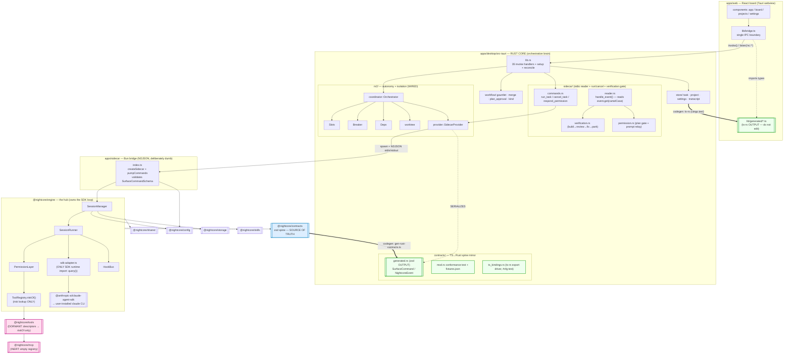
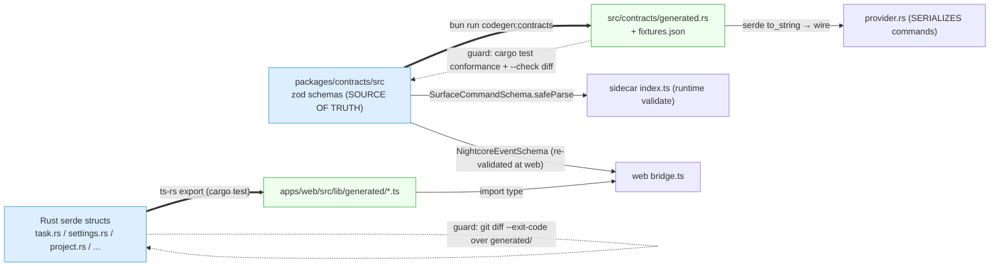

# Architectural Analysis — As-Built 3-Tier Integration Map

**Date:** 2026-06-24
**Agent:** kirei-arch (architecture & integration-wiring lens)
**Scope:** the live desktop runtime end-to-end — `apps/web` (React board) ↔ `apps/desktop/src-tauri` (Rust core) ↔ `apps/sidecar` (Bun bridge) ↔ `@nightcore/engine` ↔ Claude Agent SDK; the codegen contract boundaries (`packages/contracts` → `src-tauri/src/contracts`, and Rust serde → `apps/web/src/lib/generated`); per-package wiring state. **Lens:** module boundaries, IPC/wire-protocol surfaces, source-of-truth contracts, coupling, wired-vs-dormant. File-level dead-code/unused-exports are the sibling **kirei-refactor** lens (see Cross-Lens).
**Baseline:** updates the prior `docs/arch/2026-06-22-wiring-map.md` against current `main` (`33c35fb`); the three structural risks it flagged are now **all closed**, and one new dormant seam has appeared.

---

## TL;DR

The 3-tier architecture is **real and fully wired end-to-end** and is now **materially healthier** than the 2026-06-22 snapshot. All three structural risks from that map are closed:

1. **Both contract boundaries are now codegen'd, not hand-mirrored.** zod → Rust serde (`tools/codegen/gen-rust-contracts.ts` → `src/contracts/generated.rs` + `fixtures.json`) and Rust serde → web TS (`ts-rs` → `apps/web/src/lib/generated/`). Both have regenerate-and-diff CI guards plus a `cargo test` conformance suite. The drift seams are **closed**.
2. **The compiled sidecar is bundled.** `tauri.conf.json` declares `externalBin: ["binaries/nightcore-sidecar"]`; `beforeBuildCommand`/`beforeDevCommand` run `compile`; the 65 MB `nightcore-sidecar-aarch64-apple-darwin` binary exists; `provider.rs` resolves the bundled binary in release and falls back to `bun run` only in dev. The packaging island is **closed**.
3. **The Claude CLI fail-fast guard is live** (`session-runner.ts:164` + `resolve-claude-binary.ts`), surfaced through the normal `session-failed` channel.

The IPC command surface is **perfectly symmetric**: **35 `#[tauri::command]` fns = 35 registered = 35 invoked from the web bridge**, zero orphans either direction. The 5 `nc:*` event channels each have exactly one Rust emitter and one bridge listener.

**The one new gap (lens-relevant, not a defect):** the in-process custom-tool MCP path is now **dormant**. As of M4.7 §A2 the agent runs on **native SDK tools** (Read/Write/Edit/Bash/Grep/Glob); `ToolRegistry.mcpServers()`/`nightcoreServer()` have **zero live callers**, so `@nightcore/tools` and `@nightcore/mcp` no longer reach the SDK `query()`. `ToolRegistry` survives only as a **risk-classification lookup** (`riskOf`) feeding the permission gate. This is documented in-code as intentional ("stay in the tree for a later removal pass", `session-runner.ts:181-182`) and matches MEMORY's "parked roadmap seam" note — flagged here so it isn't mistaken for live capability.

---

## Current Architecture

### As-built data-flow / dependency diagram

**Legend:** solid = verified import/IPC edge; dotted = behavioral/IPC seam; `==>` = codegen edge (source → generated output); pink = dormant/inert; blue = the zod source-of-truth spine; green = generated artifacts (never hand-edited).

### The two codegen contract boundaries (both now closed)

### Tier / module map

| Tier | Unit | Role | Wired? |
|------|------|------|--------|
| Renderer | `apps/web` | React board; **all** IPC funnels through `lib/bridge.ts`; imports generated TS types | Yes |
| Core | `apps/desktop/src-tauri` (Rust) | Orchestration brain: task registry, auto-loop, slots, worktrees, breaker, verification gate, IPC | Yes |
| Bridge | `apps/sidecar` | Thin NDJSON stdio adapter over `SessionManager`; validates `SurfaceCommandSchema`; zero orchestration logic | Yes |
| Engine | `@nightcore/engine` | The hub; owns the SDK `query()` loop; the only surface the sidecar drives | Yes |
| Spine | `@nightcore/contracts` | zod schemas — **source of truth** for BOTH codegen directions at the sidecar boundary | Yes (leaf) |
| Lib | `@nightcore/shared` | logger / result / ids / paths | Yes (leaf) |
| Cap | `config`, `storage`, `skills` | live capability packages | Yes |
| Cap (dormant) | `tools`, `mcp` | retained but no longer reach the SDK (see Issues §1) | Dormant |
| Alt surfaces | `apps/cli`, `apps/tui` | import `@nightcore/engine` **directly**, bypass the sidecar + Rust core entirely | Out of 3-tier path |

### Dependency summary (verified edges)

| Module | Depends On (used) | Depended On By |
|--------|-------------------|----------------|
| `@nightcore/contracts` | `zod` | engine, config, storage, tools, skills, mcp, sidecar, **web** (generated), **codegen** (source), **generated.rs** (target) |
| `@nightcore/shared` | (node builtins) | engine, config, storage, tools |
| `@nightcore/config` | contracts, shared | engine, sidecar (`index.ts:153` `resolveConfig()`) |
| `@nightcore/storage` | contracts, shared | engine (`session-manager.ts`) |
| `@nightcore/skills` | contracts | engine (`agent-presets.ts` → `session-runner.ts`) |
| `@nightcore/tools` | contracts, shared, claude-agent-sdk | engine — **`riskOf` descriptor lookup ONLY** (`tool-registry.ts:7,49`) |
| `@nightcore/mcp` | contracts | engine (`tool-registry.ts:10`) — descriptor only, **empty registry** |
| `@nightcore/engine` | contracts, config, storage, shared, tools, skills, mcp, claude-agent-sdk | sidecar (`index.ts:27`), **cli**, **tui** |
| `apps/sidecar` | contracts, engine, config, shared | desktop (spawned child) |
| `apps/web` | contracts, generated bindings, @tauri-apps/* | (renderer; IPC to core) |
| `apps/desktop` (Rust) | tauri, tokio, serde, ts-rs (test), … | (top of the stack) |

`madge --circular` over `packages/` (35 files) reports **zero circular dependencies**. The package graph is a clean DAG: `contracts`/`shared` are leaves, `engine` is the single hub.

---

## End-to-End Trace (file:line evidence)

### "Run a task" — web → SDK (WIRED)

1. **Web** — `runTask(id)` → `invoke('run_task', { id })` — `apps/web/src/lib/bridge.ts:190`.
2. **Tauri boundary** — `run_task` registered `lib.rs:99`, implemented in `sidecar/commands.rs`. Leases a slot, resolves a worktree, ensures the reader (`sidecar/mod.rs:59 ensure_reader`).
3. **Spawn bridge** — `ensure_reader` → `provider.spawn()` → `provider.rs:219 spawn_command()`: release → bundled binary; dev → `bun run <entry>` where `entry = workspace_root().join("apps/sidecar/src/index.ts")` (`lib.rs:72`).
4. **Wire write** — `provider.rs:469` builds the **generated** `SurfaceCommand::StartSession {…}` and `serde_json::to_string(command)` (`provider.rs:424`) writes one NDJSON line to stdin. A pending-launch FIFO entry is pushed for `sessionId → taskId` correlation.
5. **Sidecar** — `pumpCommands` frames the line; `handleLine` validates against `SurfaceCommandSchema` (`apps/sidecar/src/index.ts:112`) and calls `manager.dispatch()` (`:117`).
6. **Engine** — `SessionManager.dispatch` branches on `start-session` and launches a `SessionRunner`; `SessionRunner.run()` preflights `resolveClaudeBinary()` (`session-runner.ts:164`), then enters the live SDK `query()` loop via `sdk-adapter.ts` (the only SDK runtime import).

### "Session completed" — SDK → web (WIRED)

1. **Engine** — SDK result → `NightcoreEvent` via `sdk-adapter.translateMessage`, emitted by `SessionManager`.
2. **Sidecar** — every event `encodeEvent`'d to one stdout NDJSON line (`index.ts:100-102, 161`); stdout is the pure protocol, stderr is logs.
3. **Rust reader** — the long-lived reader (`sidecar/mod.rs:72-97`) `parse_line`s each stdout line and calls `reader.rs:20 handle_event`. It correlates `sessionId → taskId` (`reader.rs:30`), forwards the raw event to the webview as `nc:session` (`reader.rs:35-38`), persists to the transcript (`reader.rs:43`), and routes terminal events through the verification gate (`reader.rs:101-105`).
4. **Web** — `onSessionEvent` listens on `nc:session`, re-validates the inner event against `NightcoreEventSchema`, folds it into the board stream.

---

## Answers to the Key Wiring Questions

**1. Contract spine → Rust. Codegen now? → YES, both directions.**
- *Sidecar boundary (commands, Rust SERIALIZES):* `provider.rs` no longer hand-builds `json!`. It constructs the **generated** `SurfaceCommand` enum and `serde_json::to_string`s it (`provider.rs:424, 469, 507, 517, 563`). The types come from `generated.rs`, emitted by `tools/codegen/gen-rust-contracts.ts` from the zod source. **Drift guard:** `--check` regenerate-and-diff + the `cargo test` conformance suite in `contracts/mod.rs` (6 command + 10 event fixtures round-trip through the generated types).
- *Sidecar boundary (events, Rust DESERIALIZES/forwards):* **still hand-read** via `event.get("camelCase")` in `reader.rs` (`:24,25,51,73,93,97,112,119`) — *by design*: the reader forwards the raw `Value` for forward-compat (the `unknown_event_variant_is_not_strictly_deserializable` test, `mod.rs:237`, documents why it does NOT deserialize into `NightcoreEvent`). The field names are still pinned by the conformance test, so a rename fails `cargo test` — but the **live read path itself is untyped**. This is the single remaining hand-mirror inside the boundary; it is guarded at test time, not at the call site.
- *Tauri struct boundary (Rust → web):* the web `Task`/`Settings`/`Project`/`WorktreeInfo`/`GauntletResult`/`LoopEnvelope`/etc. types are now **generated by ts-rs** into `apps/web/src/lib/generated/` (16 files) and `bridge.ts` `import type`s them (`bridge.ts:17-57`). **Drift guard:** `cargo test` re-exports; CI asserts `git diff --exit-code` over `generated/`.

**2. desktop → sidecar protocol.**
stdio NDJSON: WRITE one `SurfaceCommand` per line to stdin, READ one `NightcoreEvent` per line from stdout, stderr = human logs drained into the Rust `tracing` sink (`sidecar/mod.rs:99-110`). One **persistent** sidecar multiplexes N sessions; correlation is the pending-launch FIFO. Launch is now **dev: `bun run <entry>`; release: the bundled `externalBin` binary** (`provider.rs:219-240`).

**3. web → desktop command surface. → PERFECTLY SYMMETRIC.**
**35 `#[tauri::command]` fns defined = 35 registered in `lib.rs:92-128` invoke_handler = 35 invoked from `bridge.ts`.** Verified by set-diff: zero registered-but-uncalled, zero invoked-but-unregistered. (`respond_permission` is invoked via the multiline `tauriInvoke` at `bridge.ts:230-240`.) Event channels also symmetric: 5 emitted (`nc:task`, `nc:session`, `nc:project`, `nc:loop`, `nc:permission`) each have exactly one bridge listener.

**4. `m2/` orchestrator — wired or island? → FULLY WIRED.** `Orchestrator` is constructed in `lib.rs:71` and `app.manage()`'d (`:80`); the 5 M2 commands are registered (`lib.rs:123-127`); startup runs `reconcile_worktrees` + `reconcile_tasks` (`:85, :89`). Every m2 submodule (`coordinator`, `provider`, `slots`, `worktree`, `breaker`, `deps`) is referenced from the live path. The manual `run_task` and the auto-loop both route through it.

**5. Per-package: live consumer or dormant?**
- `config` → engine + sidecar (`index.ts:153`). **Wired.**
- `storage` → engine. **Wired.**
- `skills` → engine agent presets. **Wired.**
- `tools` → engine — **DORMANT.** The in-process MCP server (`ToolRegistry.mcpServers()`/`nightcoreServer()`) has **zero live callers**; the only live edge is `riskOf()` (`session-runner.ts:148` → `permission-layer.ts:74`), a risk-class lookup over the descriptors. The agent now uses native SDK tools (`session-runner.ts:177-182`).
- `mcp` → engine — **INERT.** Empty registry (`mcp/src/index.ts`: `externalMcpServers = []`), surfaced only as descriptors into the same `riskOf` table; never reaches the SDK.
- `eslint-plugin` → root `eslint.config.mjs` (tooling). **Wired.**

**6. Surfaces.** The webview is fully reachable through `bridge.ts`. `apps/cli` + `apps/tui` import `@nightcore/engine` **directly** and touch neither the sidecar nor the Rust core — they are **parallel in-process surfaces**, not part of the desktop 3-tier path (kept from the v0 harness; see Cross-Lens).

---

## Issues Found (architecture / wiring lens)

### 1. Custom-tool MCP path is dormant — the agent runs on native SDK tools (NEW since 2026-06-22)
`session-runner.ts:171-221` builds the SDK `options` with **no `mcpServers` key**. `session-runner.ts:177-182` documents the switch (M4.7 §A2) to native Read/Write/Edit/Bash/Grep/Glob; `ToolRegistry` is "kept solely for risk metadata via `riskOf`." `ToolRegistry.mcpServers()`/`nightcoreServer()` have **no live caller** anywhere in `packages/` or `apps/`. Net: `@nightcore/tools` + `@nightcore/mcp` are retained-but-dormant — the dependency `engine → tools → SDK` is **severed at the session boundary**, leaving only `engine → tools.riskOf` (a lookup table). Per MEMORY this is the intentional "parked roadmap seam" (future custom tools / MCP), not a defect — but the prior wiring map labeled `tools` "Wired," so the status has changed and should be recorded as **dormant, intentional**. *(Removal-vs-revival decision belongs to the team / kirei-refactor.)*

### 2. Inbound event decode is the one remaining untyped hand-mirror inside the boundary
`reader.rs` reads every event field with `event.get("camelCase")` and forwards the raw `Value`, deliberately (forward-compat). It is **guarded at test time** (the `cargo test` conformance suite pins the field names against `generated.rs`) but **not at the call site** — a contract field the reader reads by string key that gets renamed will compile, and only fails if a fixture exercises it. This is a much smaller seam than the pre-codegen world (the *outbound* command side and the Tauri struct side are now fully typed), but it is the last place the contract crosses into Rust without a compile-time type. Low risk, named for completeness.

### 3. Coupling: `coordinator.rs` and the store files are large
`m2/coordinator.rs` (937 lines), `store/task.rs` (51 KB), `store/settings.rs` (36 KB), `m2/worktree.rs` (776 lines). The old monolithic `sidecar.rs` god-file has been **split** (into `sidecar/{commands,reader,verification,permission}.rs` — a real improvement over the 2026-06-22 state). Remaining concentration is in the coordinator + stores; correctly wired, but file-level cohesion candidates. *(Refactor-lens adjacent; noted, not worked.)*

---

## What to Keep (well-structured — do not change)

- **The dual codegen spine.** zod is the single source of truth at the sidecar boundary; Rust serde is the source of truth at the Tauri boundary; both directions are generated with regenerate-and-diff guards + a conformance test. This is exactly the fix the prior map recommended, fully landed. Do not reintroduce hand-mirrored types.
- **The single-bridge web boundary** (`lib/bridge.ts`): every `invoke`/`listen` plus the `isTauri()` mock fallback funnels through one module — the reason the command surface is perfectly symmetric.
- **The SDK quarantine:** only `sdk-adapter.ts` imports the SDK runtime (`query`); `permission-layer.ts` imports SDK *types* only. The "one place the SDK lives" rule holds.
- **The provider trait + pending-launch FIFO** (`m2/provider.rs`): a future Codex sidecar is an additive binary speaking the same NDJSON protocol, not a `match` branch.
- **The dev/release sidecar split** (`provider.rs:219-240`): bundled binary in release, `bun run` in dev, graceful fallback with a warning. Closes the old packaging island cleanly.
- **The clean DAG:** zero circular deps, `contracts`/`shared` as leaves, `engine` as sole hub.

## Recommended Target (advisory — for the team, not this pass)

The architecture is sound; the remaining work is **decisions, not restructuring**:
1. **Decide tools/mcp: revive or remove.** If custom in-process MCP tools are coming back, re-wire `ToolRegistry.mcpServers()` into the SDK `options` and re-enable an integration test that asserts a custom tool reaches the agent. If not, plan the "later removal pass" the code references so `riskOf` is the only thing retained (or fold the risk table into `permission-layer`). Either way, update the architecture docs — the agent-tool story changed at M4.7 and the top-level `docs/architecture.md` still describes "10 in-process MCP tools" as the live model.
2. **Optionally type the inbound event read.** A `try_into::<NightcoreEvent>()` with a raw-`Value` fallback would give the reader compile-time field names for known variants while preserving forward-compat for unknown ones — closing issue §2 without losing the property the `unknown_event_variant` test protects.
3. **Refresh `docs/architecture.md` + `docs/diagrams.md`.** They still describe the v0 CLI/TUI-centric layering ("apps/{cli,tui} surfaces", "10 in-process MCP tools") as the current model; the live system is desktop-centric (Rust core ↔ sidecar) with native SDK tools. The newer `docs/arch/` contract docs are accurate; the two top-level summaries are stale.

---

## Cross-Lens notes (for the parallel kirei chain)

- **kirei-refactor (structural debt / dead code):**
  - `@nightcore/tools` + `@nightcore/mcp` are dormant (no SDK edge; `riskOf`-only). `ToolRegistry.mcpServers()`/`nightcoreServer()` have no live caller — candidate unused-export cluster *if* the team chooses "remove" over "revive."
  - `Outcome::NeedsApproval` carries `#[allow(dead_code)]` (`sidecar/mod.rs:201`) — a defined-but-unconstructed variant.
  - Several `#[allow(dead_code)]` provider accessors (`is_running` at `provider.rs:186`, etc.) — confirm callers before removal.
  - Large files: `m2/coordinator.rs` (937 LOC), `store/task.rs` / `store/settings.rs` — cohesion candidates.
- **kirei (feature-completeness / SDK eval):**
  - The agent-tool model changed at M4.7 (native SDK tools, not custom MCP) — relevant to any SDK-capability inventory; `docs/architecture.md` is stale on this point.
  - `apps/cli` + `apps/tui` are retained v0 surfaces that drive the engine in-process (no sidecar/Rust) — relevant to a "what surfaces exist / are maintained" inventory.
- **Docs drift:** top-level `docs/architecture.md` and `docs/diagrams.md` describe the pre-pivot CLI/TUI layering and "10 in-process MCP tools"; the `docs/arch/` series is current. Not my lens to rewrite, but flagged.
