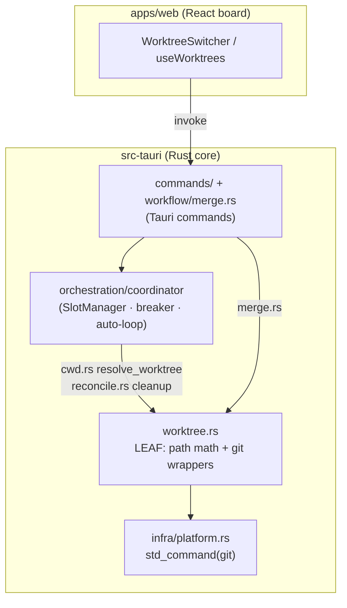
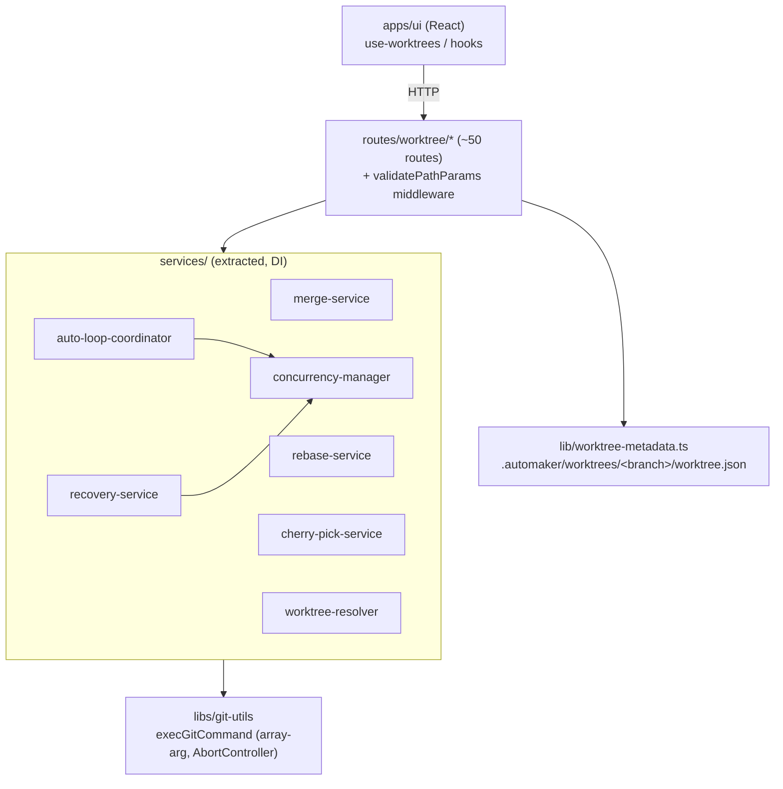
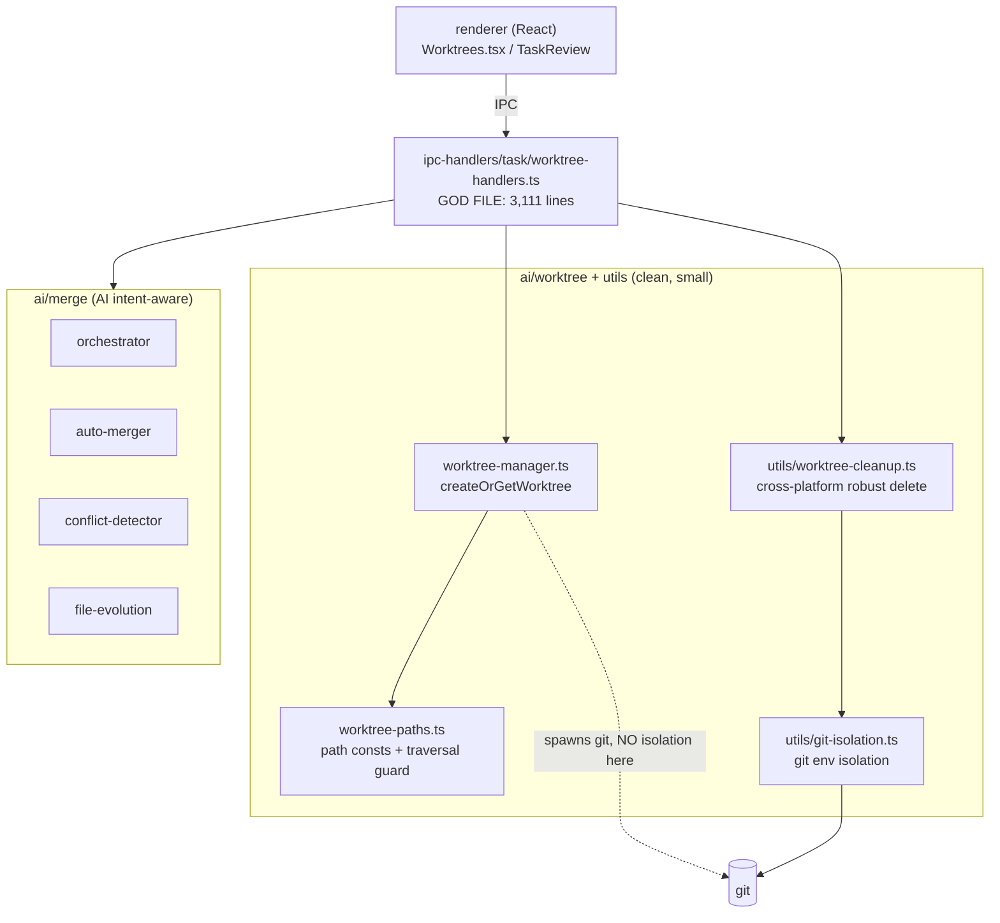
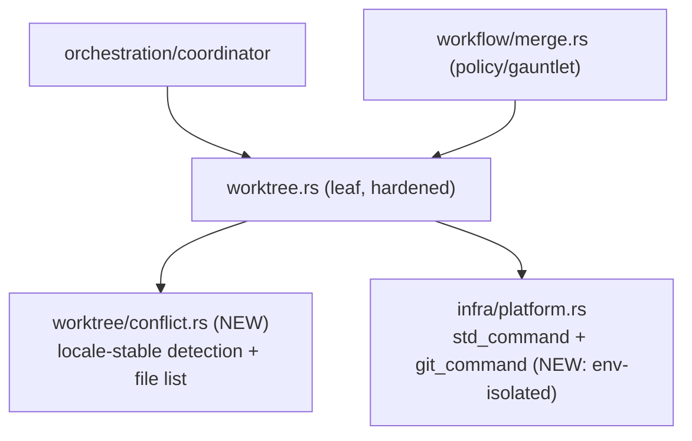

# Architectural Analysis — Git Worktree Integration: nightcore vs automaker vs Aperant

**Date:** 2026-06-30
**Agent:** kirei-arch
**Scope:** Worktree lifecycle (create / list / status / merge / cleanup / prune), module
boundaries, coupling, concurrency/locking, error handling, path validation, and merge
strategy across the three sibling projects. Goal: identify which has the best-factored,
most-capable worktree integration and which patterns nightcore should adopt.
Lens: ARCHITECTURE only (UI/UX surface is owned by the parallel kirei-ui pass).

---

## TL;DR Verdict

- **Best factored / safest for its scope:** **nightcore**. A single pure-ish leaf module
  (`worktree.rs`) with unit-tested path math, hard safety invariants, lease-based
  concurrency, panic-tolerant status reads, and boot reconciliation. It is also the
  *least capable* (no rebase/cherry-pick/stash/PR) — by deliberate M2/M3 scope.
- **Most capable + best reusable git foundation:** **automaker**. An injection-safe
  `git-utils` exec layer, locale-stable multi-layer conflict detection, base-branch sync
  before create, metadata sidecar, per-worktree auto-loops, DI-testable services, and a
  path-validation middleware — but spread across ~50 HTTP routes and several large files.
- **Best isolated safety primitives + most powerful merge:** **Aperant**. Git-env
  isolation, exact-match branch detection before destructive ops, cross-platform robust
  cleanup, and an AI intent-aware multi-worktree merge engine — but its IPC layer is a
  3,111-line god file (`worktree-handlers.ts`), the worst-factored artifact in the set.

**Recommendation:** nightcore should keep its architecture and *selectively adopt
capability/robustness patterns* — primarily from automaker (git foundation, conflict
detection, base sync) plus a few hardening patterns from Aperant (git-env isolation,
robust cleanup). Do **not** adopt either project's structure (route sprawl / god file).

---

## Current Architecture (per project)

### nightcore (Rust + Tauri)

- **Create:** `worktree.rs:83 allocate()` — branch `nc/<taskId>` (`:33`), dir
  `<project>/.nightcore/worktrees/<taskId>` (`:38-45`, gitignored). Idempotent (reuses an
  existing dir for crash recovery, `:85-87`), reuses an existing branch if present
  (`:96-102`), and retries `git worktree add` on transient `.git/worktrees` lock
  contention with backoff (`git_worktree_add_retrying`, `:117-138`). Branches only off a
  **clean** base (`is_worktree_clean`, `:75-78`; enforced in `cwd.rs:44`).
- **Status:** `list_worktree_statuses` (`:359-405`) reads each worktree on a **scoped
  thread** (`std::thread::scope`) and is **panic-tolerant per entry** — a panicked or
  locked worktree degrades to safe defaults (`dirty=false, aheadOfBase=0`) instead of
  breaking the whole list. Read shape is `WorktreeStatus { branch, path, taskIds, dirty,
  aheadOfBase }` (`:316-331`).
- **Merge:** `worktree.rs:224 merge()` — plain `git merge --no-edit`, **aborts on any
  failure and never forces** (`:237-242`), refuses a dirty base (`:232`). Gated by two
  gauntlets pre-merge (readiness + structure-lock, `merge.rs:220-240`) and a `!verified`
  refusal (`merge.rs:214`).
- **Cleanup / prune:** boot `reconcile()` removes worktrees whose task id is no longer
  live then `git worktree prune` (`:411-426`, wired in `lib.rs:135`); per-task
  `cleanup_worktree` removes on success per `cleanupWorktrees` and **retains
  failed/cancelled worktrees for inspection** (`reconcile.rs:64-82`).
- **Crash recovery:** `reconcile_tasks` requeues `InProgress`/`Verifying` tasks stranded
  by a crash back to `Ready`, clearing the dead session id (`reconcile.rs:124-179`,
  `lib.rs:139`).
- **Concurrency:** `SlotManager` (bounded lease pool, live-resizable, abort handles,
  `slots.rs`), `CircuitBreaker`, and per-task single-flight `TaskLease` for commit/merge
  (`merge.rs:111-133`). Long git ops run on `spawn_blocking` so the WKWebView never
  freezes (`merge.rs:85,186`).
- **Boundaries:** `worktree.rs` is a clean leaf — it depends only on `crate::platform`
  and is consumed by `orchestration` and `workflow`, never the reverse. No cycles.

### automaker (TypeScript / Node Express server + Electron UI)

- **Foundation:** `libs/git-utils/src/exec.ts:45 execGitCommand` — **array-arg,
  injection-safe**, supports `AbortController` timeout and env injection (e.g.
  `LC_ALL=C`). Reusable across packages — the single best foundational decision.
- **Create:** `routes/worktree/routes/create.ts` — idempotent existing-worktree return
  (`:46-92`), `isValidBranchName` guard (`:114`), `git fetch --all` (`:187-199`), then
  **base-branch fast-forward sync before creating** (`:201-245`), dir
  `<project>/.worktrees/<sanitized-branch>` (`:174-177`), copies configured files
  (`:296`), runs init script async (`:330`).
- **Resolver:** `worktree-resolver.ts` normalizes branch names (strips
  `refs/heads`,`refs/remotes`,`origin/`) (`:42-52`) and **always resolves to absolute
  paths** (`:180-184`, Windows-critical).
- **Merge:** `merge-service.ts` — **3-layer, locale-stable conflict detection**
  (`LC_ALL=C` + text markers + `diff --diff-filter=U` + porcelain unmerged codes,
  `:136-226`), distinguishes conflict from error, reports `conflictFiles`, supports
  squash (`:129-131`) and post-merge worktree+branch delete (`:256-284`). Separate
  rebase / cherry-pick / stash / sync / pull / push / PR / abort / continue services.
- **Concurrency:** `concurrency-manager.ts` — lease-**counted** Map keyed by featureId
  (ref-counting for nested calls, `:81-129`), per-worktree/per-project counts
  (`:180-212`). `auto-loop-coordinator.ts` runs **one auto-loop per worktree**
  (`getWorktreeAutoLoopKey = projectPath::branch`, `:48-51`) with a failure-window
  breaker (3-in-60s, `:336-371`).
- **Crash recovery:** `recovery-service.ts` persists `ExecutionState` JSON
  (`runningFeatureIds`, `:92-158`) and resumes interrupted features from saved
  `agent-output.md` context at boot with `readJsonWithRecovery` backups (`:250-332`).
- **Security:** `middleware/validate-paths.ts:38` — declarative `validatePathParams`
  against an allowed root (`PathNotAllowedError → 403`), with `?`-optional and
  `[]`-array param syntax.
- **Boundaries:** services cleanly extracted from routes and dependency-injected
  (RecoveryService takes 9 injected fns), so they're testable in isolation — but the
  surface is huge (~50 routes, `index.ts:76-341`) and several handlers are large.

### Aperant (Electron / TypeScript, main process)

- **Create:** `ai/worktree/worktree-manager.ts:84 createOrGetWorktree` — prunes stale
  refs first (`:99`), idempotent registered-check (`:104-112`), removes stale untracked
  dirs (`:117-135`), fetches remote, creates `auto-claude/<specId>` with
  `--no-track` off `origin/<base>` or local (`:170-202`), best-effort push+upstream
  (`:210-237`), copies the gitignored spec dir into the worktree (`:240-269`). Dir
  `<project>/.auto-claude/worktrees/tasks/<specId>`; terminal worktrees are a separate
  tree (`worktree-paths.ts:12-13`).
- **Git-env isolation (standout):** `utils/git-isolation.ts:30-80` clears
  `GIT_DIR`/`GIT_WORK_TREE`/`GIT_INDEX_FILE`/`GIT_OBJECT_DIRECTORY`/`GIT_AUTHOR_*`/
  `GIT_COMMITTER_*` (and sets `HUSKY=0`) before spawning git in a worktree, preventing
  cross-worktree contamination. `detectWorktreeBranch` (`:148-183`) uses **strict
  exact-match** validation before destructive branch ops (refuses to delete the wrong
  task's branch — explicit data-safety guard). `refreshGitIndex` (`:207-218`) avoids
  stale-stat dirty false-positives.
- **Cleanup (standout):** `utils/worktree-cleanup.ts` — path-validated (`:195-205`),
  manual dir delete with **retry + linear backoff for Windows file locks and a
  `/bin/rm -rf` Unix fallback** (`:106-145`), then prune, then optional branch delete;
  classifies fatal (dir delete) vs non-fatal (prune/branch) failures.
- **Merge (most capable, riskiest):** `ai/merge/orchestrator.ts` — an **intent-aware
  engine** that merges *multiple* parallel task worktrees: load file evolution, analyze
  semantic changes, detect conflicts, deterministic auto-merge, then an **AI resolver**
  for ambiguous regions, emitting per-file stats (`filesAutoMerged/filesAiMerged/
  filesNeedReview`). Wired in `worktree-handlers.ts:1970 TASK_WORKTREE_MERGE`.
- **Concurrency:** queue-based (`AgentQueueManager`) oriented at ideation/roadmap; there
  is **no clean bounded slot manager** equivalent to nightcore's `SlotManager`.
- **Boundaries:** the small core modules (`worktree-manager`, `worktree-paths`,
  `git-isolation`, `worktree-cleanup`) are well-factored leaves — but
  `worktree-handlers.ts` (3,111 lines) mixes IPC handlers, IDE/terminal app detection,
  PR creation, bare-repo fixing, and branch validation. High coupling, low cohesion.

---

## Dependency / Capability Summary

| Concern | nightcore | automaker | Aperant |
|---|---|---|---|
| Core LOC (worktree logic) | ~430 (1 leaf) | ~3,500 (foundation + ~50 routes/services) | ~6,000 (clean leaves + 1 god file) |
| Path layout | `.nightcore/worktrees/<taskId>` | `.worktrees/<sanitized-branch>` | `.auto-claude/worktrees/tasks/<specId>` |
| Branch naming | `nc/<taskId>` (deterministic) | arbitrary, normalized + sanitized | `auto-claude/<specId>` |
| Path-traversal guard | `is_under` (`worktree.rs:50`) | `validatePathParams` middleware | `isPathWithinBase` (`worktree-paths.ts:51`) |
| Injection-safe git | array args via `std_command` | `execGitCommand` array args + AbortController | `execFile`/`execFileSync` array args |
| Git-env isolation | ❌ (`std_command` only edits PATH) | ❌ (sets identity env on create) | ✅ `getIsolatedGitEnv` |
| Base-branch sync pre-create | ❌ (local HEAD only) | ✅ fetch + FF sync | ⚠️ fetch only |
| Conflict detection | binary (any failure ⇒ Conflict) | ✅ 3-layer, locale-stable, file list | AI semantic + region detection |
| Merge strategy | merge-only, abort-not-force | merge/squash + rebase/cherry-pick/stash | AI intent-aware multi-worktree |
| Status concurrency | ✅ thread::scope, panic-tolerant | per-route, sequential | per-handler |
| Slot/concurrency model | ✅ `SlotManager` + `TaskLease` | lease-counted Map + per-worktree loops | queue (no bounded slots) |
| Crash recovery | requeue stranded tasks at boot | persisted ExecutionState + resume w/ context | ad hoc |
| Cross-platform robust cleanup | `worktree remove --force` only | `remove --force` then `prune` fallback | ✅ retry + `/bin/rm` fallback |
| Worst factoring | — | route sprawl | 3,111-line god file |

---

## Issues Found (in nightcore, relative to the best patterns observed)

### Tight coupling / leaky abstraction
- None severe. `worktree.rs` is a clean leaf. The only notable coupling is the gauntlet
  calls inside `merge_task_blocking` (`merge.rs:222-239`) — acceptable (merge is the
  policy gate), but it means merge policy lives in `workflow/`, not `worktree.rs`.

### Capability gaps (vs automaker)
- **Binary conflict detection.** `worktree.rs:237-242` treats *any* `git merge` failure
  as `Conflict` and aborts. A non-conflict failure (e.g. a hook error, an unrelated git
  error) is mis-reported as a merge conflict, and no `conflictFiles` are surfaced.
  automaker's `merge-service.ts:136-226` distinguishes the two and lists files.
- **No base-branch sync before create.** `allocate` branches off whatever local `HEAD`
  is (`worktree.rs:96-109`); a stale local base silently produces a stale worktree.
  automaker fetches + fast-forwards the base first (`create.ts:201-245`).

### Robustness gaps (vs Aperant)
- **No git-env isolation.** Confirmed: `infra/platform.rs:78-113 std_command` inherits
  the full process env and only edits `PATH`. If nightcore is ever launched from a
  context where `GIT_DIR`/`GIT_WORK_TREE`/`GIT_INDEX_FILE` are set (CI, a parent git
  hook, a nested tool), worktree git ops can target the wrong repo. Aperant's
  `git-isolation.ts:30-80` is the fix.
- **Fragile cleanup.** `remove` relies solely on `git worktree remove --force`
  (`worktree.rs:158`), which can fail on locked/untracked files (notably on Windows).
  Aperant's `worktree-cleanup.ts:106-145` adds retry + `/bin/rm` fallback + prune.
- **Possible stale-stat dirty false-positives.** `worktree_status` reads `git status
  --porcelain` directly (`worktree.rs:338`); Aperant runs `update-index --refresh`
  first (`git-isolation.ts:207-218`) to avoid false "dirty".

### Anti-patterns to AVOID (do not import)
- Aperant `worktree-handlers.ts` (3,111 lines) — god file; keep nightcore's leaf split.
- automaker's ~50-route surface (`routes/worktree/index.ts:76-341`) — over-fragmented
  for nightcore's scope.
- Aperant's AI intent-aware merge — powerful but heavy + risky; nightcore's
  abort-not-force default is safer. If ever wanted, gate it as an opt-in Tier-3 path,
  never the default.

---

## Recommended Target Architecture for nightcore

Keep the single-leaf `worktree.rs` boundary. Harden it in place and split out a small
`conflict` helper. No structural overhaul.

### Migration path (incremental, typecheck after each)
1. Add `git_command()` to `infra/platform.rs` that builds on `std_command` and clears the
   git-contamination env vars + sets `HUSKY=0`; route `worktree.rs`'s `git()` through it.
2. Add `worktree/conflict.rs` with locale-stable detection (`LC_ALL=C`, `diff
   --diff-filter=U`, porcelain unmerged codes); change `MergeOutcome::Conflict` to carry
   `Vec<String>` conflict files; map true non-conflict failures to `Err`.
3. Add an optional base-branch fetch + fast-forward sync before `allocate`'s
   `worktree add` (feature-flagged so offline still works).
4. Make `remove` robust: on `git worktree remove --force` failure, fall back to a
   guarded recursive dir delete (still behind `is_under`) + `worktree prune`.
5. (Optional) `update-index --refresh` before status reads.

---

## What to Keep (nightcore already does best — do not change)
- Single pure-ish **leaf module** with unit-tested path/branch math (`worktree.rs` tests).
- Hard safety invariants: `is_under` removal guard (`:50-54`), dirty-base refusal
  (`:75-78`, `cwd.rs:44`), **abort-not-force** merge (`:237-242`).
- **Panic-tolerant concurrent status** via `thread::scope` (`:359-405`).
- `SlotManager` bounded lease pool + per-task single-flight `TaskLease` (`merge.rs:111`).
- Boot **reconcile** of orphaned worktrees + **requeue** of crash-stranded tasks
  (`reconcile.rs`, `lib.rs:135,139`).
- Transient `.git/worktrees` lock **retry** on allocate (`:117-138`).
- `spawn_blocking` for long git ops to keep the UI thread free (`merge.rs:85,186`).

---

## Ranked Patterns nightcore Should ADOPT (best-source + evidence)

| # | Pattern | Best source (file:line) | Effort | Risk | Why |
|---|---|---|---|---|---|
| 1 | **Git-env isolation** before spawning git in a worktree | Aperant `utils/git-isolation.ts:30-80` | S | Low | Confirmed gap (`platform.rs:78-113` only edits PATH); prevents wrong-repo writes |
| 2 | **Locale-stable, multi-layer conflict detection** + `conflictFiles` | automaker `services/merge-service.ts:136-226` | M | Low | nightcore conflates conflict with any failure (`worktree.rs:237-242`) |
| 3 | **Base-branch fetch + fast-forward sync before create** | automaker `routes/worktree/routes/create.ts:201-245` | M | Med | nightcore branches off stale local HEAD (`worktree.rs:96-109`) |
| 4 | **Cross-platform robust cleanup** (retry + fallback delete) | Aperant `utils/worktree-cleanup.ts:106-145` | S–M | Low | `remove --force` (`worktree.rs:158`) can fail on locked/untracked files |
| 5 | **Exact-match verify before destructive branch ops** | Aperant `utils/git-isolation.ts:148-183` | S | Low | Defense-in-depth on `delete_branch` (`worktree.rs:266-272`) |
| 6 | **`update-index --refresh` before status reads** | Aperant `utils/git-isolation.ts:207-218` | XS | Low | Avoids stale-stat dirty false-positives (`worktree.rs:338`) |
| 7 | **Worktree metadata sidecar** (PR/init/createdAt JSON) | automaker `lib/worktree-metadata.ts:58-103` | M | Low | Only if/when nightcore adds a PR flow; keep outside the worktree |
| 8 | **Injection-safe git exec as a shared seam** (already mostly true) | automaker `libs/git-utils/src/exec.ts:45-70` | — | — | Confirms nightcore's array-arg `std_command` choice; add AbortController-style timeout |

Patterns **1, 2, 4** are the high-value trio: small, safe, and they close nightcore's only
real worktree gaps while preserving its clean architecture.
