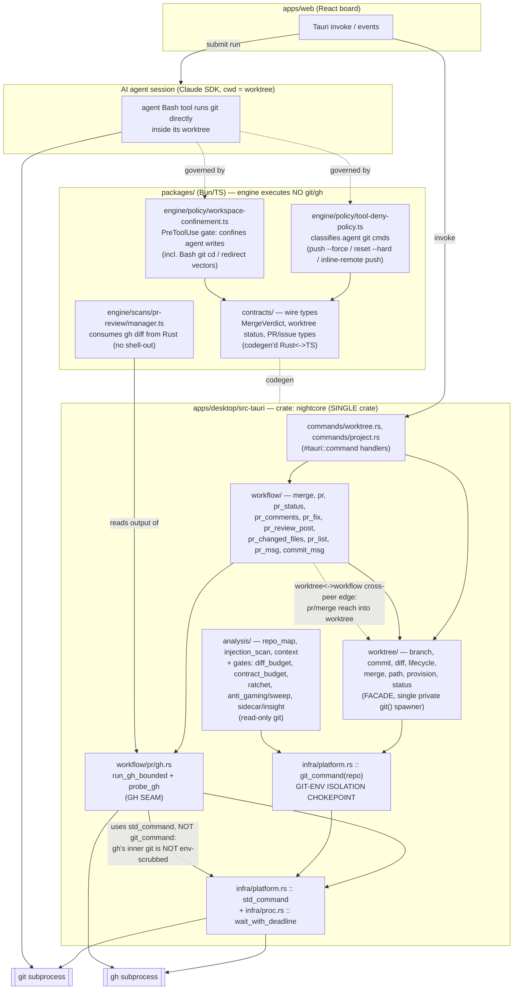
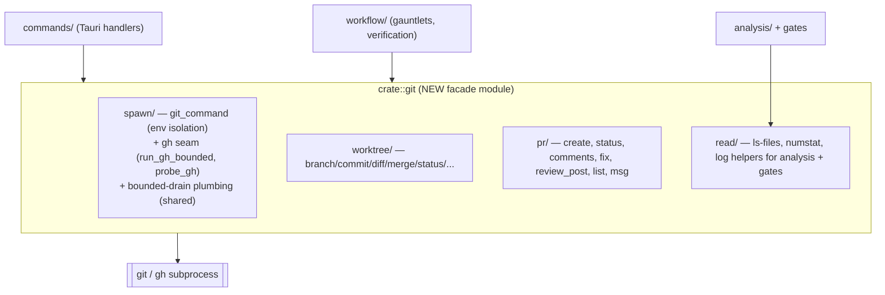

# Architectural Analysis — Git Command Consolidation & Placement

**Date:** 2026-07-05
**Agent:** kirei-arch
**Scope:** Where git/gh command usage lives across the Nightcore monorepo (Rust core + TS sidecar/engine + web), and whether "abstract git into a `packages/` package" is the right structural move.
**Companion:** kirei-refactor (file-by-file inventory + duplication clusters + migration plan for the same target). This doc is the boundary/placement lens only.

---

## TL;DR (the placement decision)

**The premise "extract git command usages into one `packages/` TS package" does not fit the actual topology.**

Git/gh **subprocess execution is ~all in the Rust core** (23 production `git_command` spawn sites across 14 files; the `gh` seam in `workflow/pr/gh.rs`). The **TS engine executes zero git/gh in production** — its only relationship to git is (a) *classifying* the AI agent's own `git` Bash commands (`tool-deny-policy.ts`) and (b) *consuming* git/gh output the Rust core already produced (`pr-review/manager.ts`: "No session, no shell-out: the Rust core already ran `gh pr diff`"). A `packages/*` entry is a Bun/TS workspace package — it **cannot host the Rust git logic**, which is the 95%.

**Recommendation: a two-home consolidation aligned to the tiers, not one `packages/` package.**
1. **Rust:** promote the already-implicit git layer into an explicit `git` module (facade) that *owns* the two spawn chokepoints (`git_command` + `run_gh_bounded`) and the worktree/PR git logic. This is where the real consolidation win is.
2. **TS:** there is nothing to *execute* to extract. Only the pure git-command *string classifiers* are candidates, and only if you want them shared/independently tested — but they are git **governance**, not git **execution**, and belong with the session policy engine.

Do **not** create a `packages/git` TS package expecting it to house git logic. It would be near-empty, or — worse — force a cross-tier IPC round-trip for every git op and duplicate the hardened env-isolation chokepoint in a second language (a security regression).

---

## Current Architecture

### Surface → subprocess-boundary map

**Reading the map.** There are **three** distinct git surfaces, on **two** axes:
- **App-driven git (Rust):** every studio-initiated git op (branch/commit/merge/diff/status/PR) flows `web → Tauri command → workflow/worktree → git_command / gh seam → subprocess`.
- **Agent-driven git (TS-governed):** the AI agent runs `git` itself via its Bash tool inside a worktree. Rust does not execute this; the **TS engine policy** governs it (deny destructive ops; confine writes).
- **Read-only git consumers (Rust):** analysis + verification gates read `git ls-files` / `git diff` through the same `git_command` chokepoint.

### Module map — where git logic actually lives

| Tier | Location | Role | git/gh execution? |
|------|----------|------|-------------------|
| Rust | `infra/platform.rs::git_command` | **git-env isolation chokepoint** (scrubs 11 `GIT_*` vars + exec vectors, neutralizes repo-local exec config, `HUSKY=0`, `LC_ALL=C`, `GIT_TERMINAL_PROMPT=0`) | builds the git `Command` |
| Rust | `infra/platform.rs::std_command`, `infra/proc.rs::wait_with_deadline` | base command builder + network-bounded reaper | primitives |
| Rust | `worktree/` (9 files) | **facade** over a single private `git()` / `git_with_deadline()` spawner; every submodule routes through it | yes (via chokepoint) |
| Rust | `workflow/pr/gh.rs` | **gh seam** (`run_gh_bounded`, `probe_gh`, `GH_BINARY`) | yes (gh) |
| Rust | `workflow/{merge, pr, pr_status, pr_comments, pr_fix, pr_review_post, pr_changed_files, pr_list, pr_msg, commit_msg}` | PR arc + merge orchestration; mixes git (`git_command`) + gh (`gh` seam) | yes (both) |
| Rust | `analysis/{repo_map, injection_scan, context}`, `workflow/{diff_budget, contract_budget, ratchet, anti_gaming/sweep}`, `sidecar/insight.rs` | read-only git consumers (via `git_command`) | yes (read-only) |
| Rust | `commands/{worktree, project}` | Tauri handlers (`is_git_repo`, `git_init`, `merge_preview`, `worktree_diff`, `discard_worktree`) | delegates |
| Rust | `workflow/gauntlet_project/` | clones/runs target projects | yes |
| TS | `engine/policy/tool-deny-policy.ts` | classifies the **agent's** git Bash cmds | **no** — parses strings |
| TS | `engine/policy/workspace-confinement.ts` | PreToolUse gate confining agent writes (incl. git `cd`/redirect) | **no** — governs |
| TS | `engine/scans/pr-review/manager.ts` | consumes gh diff produced by Rust | **no** — reads output |
| TS | `contracts/{pr-review, issue-triage, commands, events}.ts` | wire types (MergeVerdict, PR/issue, worktree status) | **no** — types |

### Dependency summary (relevant slices)

**TS packages (Bun workspace) — clean layering, `contracts` is the leaf:**

| Package | Depends On | Depended On By |
|---------|-----------|----------------|
| `@nightcore/contracts` | (none) | shared, config, storage, session-fold, engine, sidecar, web |
| `@nightcore/shared` | contracts | config, storage, engine, sidecar |
| `@nightcore/storage` | contracts, shared | engine |
| `@nightcore/engine` | contracts, storage, shared, claude-agent-sdk | sidecar |
| `@nightcore/sidecar` (app) | contracts, engine, config, shared | — |
| `@nightcore/web` (app) | contracts, session-fold, … | — |

**Rust crate `nightcore` (single crate, not a cargo workspace):** peer modules `infra`, `worktree`, `workflow`, `analysis`, `commands`, `sidecar`, `store`, `orchestration`, `provider`, `engine_api`. Git logic is split across `infra` (chokepoints) + `worktree` (facade) + `workflow` (orchestration) + `analysis` (readers).

---

## Issues Found

### 1. Git logic is split across two Rust peer modules + infra (no single "git" home)
The low-level **spawn** is well-consolidated (`git_command` is the sole production git builder; `run_gh_bounded` the sole gh builder). But the **git logic** — arg building, porcelain parsing, workflow — is spread across `worktree/` **and** `workflow/pr*` **and** `analysis/`, with a cross-peer edge (`workflow/pr` + `workflow/merge` reach into `worktree`). There is no module you can point at and say "git lives here." This is the real navigability problem the user is feeling — and it is a **Rust** problem, not a `packages/` one.

### 2. Two spawn seams with different hardening (`git_command` vs `std_command`)
`worktree::git()` builds via the env-scrubbed `git_command`. The gh seam `run_gh_bounded` builds via **`std_command` (NOT `git_command`)** — `apps/desktop/src-tauri/src/workflow/pr/gh.rs:63`. Since `gh` shells out to `git` internally, gh-driven git inherits an **un-scrubbed** environment. This may be intentional (gh needs the osxkeychain credential path), but it means the "single git-env chokepoint" story has a **second, softer door**. Consolidation is the moment to decide this deliberately, not by accident. *(Flag, not a claim — verify intent with the security owner.)*

### 3. `worktree` ↔ `workflow` cross-peer coupling
`workflow/merge` and `workflow/pr*` depend on `worktree` (branch/commit/merge primitives). If a future `git` crate/module is carved out, it must pull `worktree` + `pr/gh` **together**, or you create a `git-crate ↔ workflow` edge that oscillates. Placement must respect that `worktree` is the low-level git and `workflow/pr*` is git *orchestration* on top of it.

### 4. Test-fixture git spawns bypass the chokepoint (30 direct `Command::new("git")`)
All 30 direct `std::process::Command::new("git")` sites are in `#[cfg(test)]` modules (fixture setup + adversarial neutralizer tests that *assert* `git_command` scrubs a hostile `core.fsmonitor`). Production is clean. This is a **kirei-refactor** concern (a shared test git-helper would dedupe them), noted here only so the placement decision does not mistake them for scattered production execution.

### No true cycles found
The TS package graph is acyclic (`contracts` leaf). The Rust crate is single, so "cycles" are inter-module; the only notable one is the intended `worktree ↔ workflow` layering (orchestration-over-primitive, not a true cycle).

---

## Recommended Target Architecture

### Option A — Two-home consolidation aligned to tiers (RECOMMENDED)

**Rust (the 95%):** carve an explicit `git` module in the `nightcore` crate that OWNS the git surface behind a facade:

- Move `infra/platform.rs::git_command` **into** `crate::git::spawn` so the isolation chokepoint physically lives with the git module.
- Absorb `worktree/` and `workflow/pr*` under `crate::git::{worktree, pr}`; expose a narrow facade (`pub use`), keep the spawner private (as `worktree/mod.rs` already does).
- Point `analysis/` + verification gates at a `crate::git::read` facade instead of re-implementing `git_command(...).args(["ls-files", ...])` inline.
- (Bigger, optional) convert `src-tauri` to a **cargo workspace** and lift `git` into an internal `nightcore-git` crate — only worth it if you want a *compiler-enforced* boundary (crate privacy) rather than module discipline.

**TS (the 5%):** keep git **governance** where it is. `tool-deny-policy.ts` + `workspace-confinement.ts` are SDK-session policy, not git ops — they belong in `engine/policy`. Extract to a small `packages/git-policy` **only** if you specifically want the pure command-string classifiers shared and independently tested; it must depend on `contracts`/`shared` only (never `engine`).

**Trade-offs:** highest navigability win for the least cross-tier risk; keeps both security chokepoints single; honors the tier split. Cost: it is two migrations (Rust module carve + optional TS util), not one package.

### Option B — One `packages/` TS git package (the literal ask) — NOT RECOMMENDED
A `packages/git` could only hold TS, and TS executes no git today. To make it "the home" you would either (i) leave it near-empty (just the classifiers) — no consolidation of the real logic, or (ii) move git execution into TS and have Rust call it over IPC — which **duplicates the hardened env-isolation chokepoint in a second language** and adds a round-trip to every commit/merge. Rejected on both security and complexity grounds.

### Option C — Status quo + tighter boundaries — VIABLE FALLBACK
Lowest risk. Add a lint/test that forbids `Command::new("git")` outside the chokepoint module (precedent: the adversarial neutralizer tests already assert this), document the `worktree` vs `workflow/pr` layering, and decide the `std_command`-vs-`git_command` gh question. Gets ~60% of the navigability benefit with near-zero migration. Good if the team is not ready for a module carve.

### Migration path (if Option A is approved)
1. **Rust, incremental, one boundary at a time** (typecheck/`cargo test` after each):
   a. Introduce `crate::git` re-exporting today's `worktree` + `pr` (no moves yet) — establishes the facade name.
   b. Move `git_command` into `crate::git::spawn`; leave a `pub use` in `infra` so call sites resolve unchanged.
   c. Relocate `worktree/` under `crate::git::worktree`; keep facade re-exports (the module already does this).
   d. Relocate `workflow/pr*` under `crate::git::pr`; fix the `worktree` edge to be intra-`git`.
   e. Add the `crate::git::read` facade; migrate `analysis/` + gates off inline `git_command` arg-building.
   f. Add the forbid-`Command::new("git")`-outside-`git::spawn` guard.
2. **TS (optional, independent):** only if the classifiers are wanted shared — extract `packages/git-policy` (deps: contracts, shared), repoint `engine/policy` imports. Leave `workspace-confinement` in engine (it is a hook, not a classifier).

---

## Where the security chokepoints MUST stay single

| Chokepoint | Today | Constraint under any refactor |
|-----------|-------|-------------------------------|
| **git-env isolation** | `infra/platform.rs::git_command` (23 prod sites route through it) | Must remain the **only** production builder of a git `Command`. Move it *with* the git module; add a lint/test forbidding `Command::new("git")` elsewhere. Do **not** replicate it in TS. |
| **gh seam** | `workflow/pr/gh.rs::run_gh_bounded` + `probe_gh` | Keep as the single gh door. Decide deliberately whether it should route env-scrubbed (issue #2). |
| **workspace confinement** | `engine/policy/workspace-confinement.ts` (PreToolUse hook, fires under `bypassPermissions`) | Governs the **agent's** git. Must stay single-instance in the engine hook-bus. Must **not** migrate into any git-execution package — different axis. |
| **destructive-git deny** | `engine/policy/tool-deny-policy.ts` | Same axis as confinement. Extractable to `packages/git-policy` but must remain the single classifier the hook-bus consults. |

The abstraction must **not** scatter these. Note the symmetry: **Rust owns the two *execution* chokepoints; TS owns the two *governance* chokepoints.** That split is correct and should be preserved, not merged.

---

## What to Keep

- `git_command`'s env-isolation design (the whole point of the module) — port it verbatim, do not "simplify."
- `worktree/mod.rs`'s existing facade discipline (single private `git()` spawner, clean `pub use` surface) — it is the template for the whole `crate::git` carve.
- The gh seam's bounded-drain/deadline pattern (network ops can't pin a blocking thread + task lease).
- The TS package layering (`contracts` leaf, acyclic) — a `git-policy` package, if added, must not break it.
- The read-only-via-`git_command` discipline in analysis/gates — just route it through a named facade instead of inline.

---

## KIREI-ARCH HANDOFF

**Report:** `/Users/shirone/Documents/Projects/nightcore/docs/arch/2026-07-05-git-consolidation-placement.md`

**This is an advisory report.** The headline finding reframes the user's request: git *execution* is a Rust concern (~all of it), so a single `packages/` TS package is the wrong home for the bulk of the logic. Discuss the tier-split before implementing.

**If restructuring is approved, the changes are:**
1. Rust: carve `crate::git` facade (own `git_command` + gh seam + worktree + pr) — Effort: **XL** — Risk: **High** (touches the security chokepoint + PR arc). Do it in the 6 incremental sub-steps above; `cargo test` between each.
2. Rust: add forbid-`Command::new("git")`-outside-chokepoint guard — Effort: **S** — Risk: **Low**.
3. Rust: decide gh seam env-scrubbing (`std_command` vs `git_command`) — Effort: **S** (decision) — Risk: **Med** (security). Needs security-owner sign-off.
4. TS (optional): extract `packages/git-policy` for the command-string classifiers only — Effort: **M** — Risk: **Low**. Deps: contracts, shared. Leave `workspace-confinement` in engine.

**Execute complexity:** ALL → kirei-forge (architectural changes are never simple).

**Constraint:** one module boundary at a time; keep the git-env isolation + workspace-confinement chokepoints single at every step; verify typechecks (`cargo test`, `bun run --filter @nightcore/web typecheck`) after each.

**Cross-lens notes for kirei-refactor (their inventory, not mine):**
- 30 direct `Command::new("git")` sites are all test fixtures — a shared test git-helper is a dedup cluster.
- `worktree::git_with_deadline` and `pr::gh::run_gh_bounded` duplicate the drained-pipe + `wait_with_deadline` plumbing — a merge candidate for `crate::git::spawn`.
- `analysis/{repo_map,injection_scan,context}` + `workflow/{diff_budget,contract_budget,ratchet}` each hand-build `git_command(...).args(["ls-files"/"diff", ...])` — a read-facade dedup cluster.
