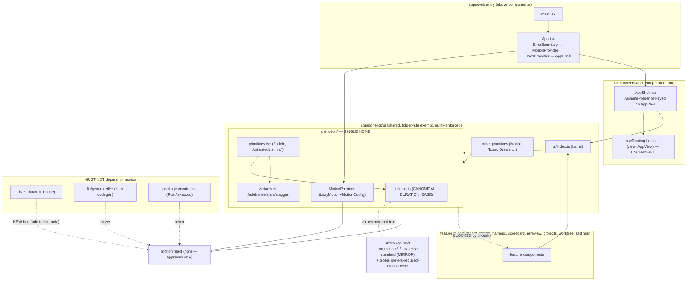

# Architectural Analysis — Motion Layer Integration (`motion/react`)

**Date:** 2026-07-05
**Agent:** kirei-arch (parallel kirei-chain: kirei-ui + kirei-perf)
**Scope:** How to physically place, wire, and bound an animation layer (candidate `motion/react`, framer-motion successor — NOT installed) in `apps/web` without violating the strict component conventions. Advisory / research-only.

## Current Architecture (as it bears on motion)

### Component boundary system
- **Layout:** `apps/web/src/components/<feature>/<Name>/<Name>.tsx` with a required sibling set (`.hooks.ts`, `.types.ts`, `.stories.tsx`, `.test.tsx`, `index.ts`) — enforced by `@nightcore/eslint-plugin` `component-folder-structure`.
- **`components/ui/**` is EXEMPT** from folder-per-component (`DEFAULT_IGNORE_PATHS = ['**/components/ui/**']`) — the lighter "shadcn" convention. Flat files (`Button.tsx`) and folders (`Modal/`, `Toast/`) coexist there today.
- **`no-cross-feature-imports`** (scoped to `components/**`, `sharedFeatures: ['ui']`): a file in feature A may not import runtime code from feature B. Only `ui/` is the shared escape hatch. Type-only imports allowed.
- **`app` is a composition root** (`COMPOSITION_ROOT_FEATURES = ['app']`) — exempt from `no-cross-feature-imports`, so `AppShell` may wire features + the view-switch seam.
- **`uiPurityBlock`** (`tools/lint-meta/index.mjs`): `components/ui/**` must NOT import any feature, Tauri, or the SDK. Primitives are graph leaves.
- **Tauri seam:** only `lib/bridge/**` may import `@tauri-apps/*`.
- **`no-deep-package-imports`:** workspace packages consumed via their `@nightcore/*` barrel only.

### Providers & entry
- `apps/web/src/main.tsx` → `<StrictMode><App/></StrictMode>`.
- `apps/web/src/App.tsx` → `<ErrorBoundary><ToastProvider><AppShell/></ToastProvider></ErrorBoundary>`. `App.tsx` lives ABOVE `components/`, outside the component rules — the natural provider host.

### View routing (the transition seam)
- `AppView = 'board'|'worktrees'|'insight'|'scorecard'|'harness'|'prreview'|'projects'|'settings'` (`AppShell.types.ts`).
- `useRouting.hooks.ts` owns `view` (+ `goto`, `scanTarget`, overlay flags). Pure `useState`.
- `AppShell.tsx`: top-level ternary `showProjects ? <full-screen Projects> : <sidebar + <main>>`. Inside `<main>` a mutually-exclusive chain: `{view === 'board' && …}` … `{view === 'settings' && …}`. Every non-board view is wrapped in its own `<Suspense fallback={<RouteFallback/>}>`; **board is eager** (entry bundle), the rest are `lazy()`.

### Existing motion surface (already present — do not double-build)
- `styles.css` has a full CSS motion layer: keyframes `nc-rise/nc-slide/nc-spin/nc-pulse/nc-bar/nc-glow/nc-skeleton/nc-sheet-in`; utilities `.nc-drawer-enter` (`nc-slide .26s cubic-bezier(.22,1,.36,1)`), `.nc-skeleton`; Toast uses inline `animation: nc-rise .18s cubic-bezier(.22,1,.36,1)`.
- A **global `@media (prefers-reduced-motion: reduce)` reset** zeroes all animation/transition durations.
- Token system: raw values as `:root` custom props, bound into Tailwind via `@theme`. **No motion-duration/easing tokens exist yet** — the easing `cubic-bezier(.22,1,.36,1)` and durations `.18s/.26s` are inline literals repeated across files.
- **62 component `.tsx`** files use `animate-*`/`transition-*`/keyframes (incl. 20 ui primitives). Most are hover/focus micro-interactions (Tailwind `transition-*`) that should STAY as CSS — motion/react targets presence/orchestration only.

## Recommendations

### 1. Where the motion layer physically lives
Create **`apps/web/src/components/ui/motion/`**, re-exported through `apps/web/src/components/ui/index.ts`:

```
components/ui/motion/
  index.ts        # barrel (folded into ui/index.ts)
  tokens.ts       # DURATION + EASE constants (canonical; JS values for motion/react)
  variants.ts     # shared variants: fadeIn, riseIn, slideIn, listItem/stagger
  primitives.tsx  # FadeIn, RiseIn, SlideIn, AnimatedList (thin m.* wrappers)
  presence.tsx    # re-export AnimatePresence + ViewTransition wrapper for the shell
  MotionProvider.tsx   # thin LazyMotion + MotionConfig wrapper (optional; see §2)
```

**Justification against the lint rules:**
- `no-cross-feature-imports` (`sharedFeatures:['ui']`): every feature imports motion from `@/components/ui`. A per-feature copy of variants violates DRY; importing another feature's animation is **lint-blocked**. `ui/motion/` is the only conforming home.
- `ui/` is exempt from folder-per-component, so `motion/` may hold plain `tokens.ts`/`variants.ts` + light primitive files without the full sibling set. (Keep a story + test per primitive anyway — the codebase ships them for ui primitives like Modal/Toast, and the `test:web`/Storybook gates expect coverage.)
- `uiPurityBlock` already forbids `ui/**` from importing features — this keeps motion primitives generic. **Feature-specific choreography stays in the feature**, composed from `ui/motion` primitives; never push board/insight-specific variants down into `ui/motion`.

### 2. Global providers
Mount in `App.tsx`, wrapping `<AppShell/>` (identical pattern to `ToastProvider`):

```
<ErrorBoundary>
  <LazyMotion features={domAnimation} strict>   // strict → forbids heavy motion.*, forces m.*
    <MotionConfig reducedMotion="user">          // OS reduced-motion → auto-disable transforms
      <ToastProvider>
        <AppShell/>
      </ToastProvider>
    </MotionConfig>
  </LazyMotion>
</ErrorBoundary>
```

- Wrap both provider calls in a `ui/motion/MotionProvider` component (exported via the ui barrel) so `App.tsx` imports one symbol and the feature-detection choice stays owned by `ui/motion`.
- `LazyMotion + domAnimation (strict)` keeps the entry chunk lean and matches the existing aggressive `lazy()` splitting (cross-lens → kirei-perf). `strict` mode is an architectural constraint: all animated components must use `m.*`, never `motion.*`.
- Add a **Storybook decorator** (`.storybook/preview.ts`) and a **vitest setup** (`vitest.setup.ts`) `MotionConfig` so primitives render in isolation and animations are deterministic (`transition={{duration:0}}`) under the `test:web` gate.

### 3. Motion token strategy — RECOMMENDATION: TS-canonical, CSS-mirrored ("both")
- **Canonical source = TS constants in `ui/motion/tokens.ts`** — e.g. `DURATION = { fast: 0.18, base: 0.26, slow: 0.4 }` (seconds) and `EASE = { standard: [0.22, 1, 0.36, 1] }` (cubic-bezier array). motion/react's `transition` prop consumes JS numbers/arrays natively.
- **Mirror the same values** as CSS custom properties in `styles.css :root` (`--nc-motion-fast/base/slow`, `--nc-ease-standard: cubic-bezier(.22,1,.36,1)`) and refactor the existing keyframe utilities (`.nc-drawer-enter`, Toast `nc-rise`) to consume them. This folds the today-inline literals into the existing token architecture (raw values on `:root`, à la the color tokens).
- **Reject "CSS vars consumed by motion":** reading a CSS custom prop into a JS `transition` requires `getComputedStyle` (a layout read) — wrong for the hot path. Keep the two expressions in sync by a colocated comment ("mirror of ui/motion/tokens.ts").
- **Do NOT remove the global `prefers-reduced-motion` CSS reset** — it still governs the 62 Tailwind/CSS usages. `MotionConfig reducedMotion="user"` governs motion/react. Two non-overlapping owners.

### 4. View-transition seam
In `AppShell.tsx`, wrap the in-`<main>` view chain (only) with `AnimatePresence`, keyed on `view`:

```
<main …>
  {browserPreviewBanner}
  <AnimatePresence mode="wait" initial={false}>
    <m.div key={view} variants={viewTransition} initial="enter" animate="center" exit="exit" className="flex min-h-0 flex-1 flex-col">
      {view === 'board' && ( … )}
      {view === 'worktrees' && ( … )}
      … each existing branch verbatim …
    </m.div>
  </AnimatePresence>
</main>
```

- **Key = the `view: AppView` string** — no change to `useRouting`; `goto()` already flips `view` and the presence swap follows for free.
- Safe because within the `<main>` branch `showProjects` is already `false`, so `view` is never `'projects'` here.
- Keep the board branch's internal structure (Board + TaskDetail drawer siblings) intact inside the keyed wrapper.
- **Defer** the projects↔board full-screen swap (the outer ternary): it adds/removes the sidebar and changes layout structure — a bigger, higher-risk transition. Ship the in-`<main>` seam first.

### 5. Coupling & risk

| # | Risk | Why it matters | Mitigation |
|---|------|----------------|-----------|
| 1 | motion imported into `lib/**` | `lib/` is the framework-neutral data/util leaf BELOW ui; motion is a rendering concern → layer inversion. No rule blocks it today. | Add `no-restricted-imports` ban on `motion`/`motion/react` for `apps/web/src/lib/**` in `tools/lint-meta/index.mjs` (mirror ui-purity/tauri-seam blocks). |
| 2 | motion in `lib/generated/**` | ts-rs/zod codegen; hand-edits break `cargo test` regeneration. | Ban + codegen check; generated is types-only so low likelihood, still fence it. |
| 3 | motion added to `packages/*` / `packages/contracts` | motion is a single-app concern; a contracts dep is an arch violation and pollutes the Rust/ts-rs tiers. | `motion` in `apps/web/package.json` ONLY. Rust/ts-rs boundary untouched (JS-only lib). |
| 4 | Feature-specific variants pushed into `ui/motion` | breaks ui-purity intent; `ui/**` must stay generic. | Keep choreography in features, composed from generic `ui/motion` primitives. |
| 5 | `AnimatePresence mode="wait"` + lazy `<Suspense>` views | exit → `RouteFallback` flash → enter; board eager vs others lazy → asymmetric timing. | fallback-inside-animated-container, or preload chunk on nav intent (cross-lens: kirei-ui + kirei-perf). |
| 6 | `StrictMode` double-invoke (main.tsx) | motion effects double-run in dev (cosmetic). | none needed; be aware of dev-only layout warnings. |
| 7 | vitest browser timing flake | animations red the `test:web` gate. | `MotionConfig transition={{duration:0}}` in `vitest.setup.ts`. |
| 8 | `simple-import-sort` | new third-party import must sit in the third-party group. | autofix `eslint . --fix`; note in the task. |
| 9 | LazyMotion `strict` violated (`motion.*` used) | pulls the heavy bundle. | convention now; consider a future custom lint ban on the `motion` export of `motion/react`. |
| 10 | Double reduced-motion handling | CSS reset + MotionConfig overlapping. | keep them as separate owners (CSS→CSS anims, MotionConfig→motion/react); do not delete the CSS reset. |

### Proposed module layout (Mermaid)



## Dependency-ordered phase list (sliceable)

- **Phase 0 — Foundation (1 slice):** install `motion` in `apps/web/package.json` only; verify it lands in no `packages/*`. Add `ui/motion/tokens.ts` (TS canonical) + mirror `--nc-motion-*`/`--nc-ease-standard` into `styles.css :root`; refactor `.nc-drawer-enter`/Toast to consume them.
- **Phase 1 — Providers (1 slice):** `ui/motion/MotionProvider` (`LazyMotion domAnimation strict` + `MotionConfig reducedMotion="user"`); mount in `App.tsx`. Add Storybook decorator + vitest `MotionConfig` (duration 0).
- **Phase 2 — Primitives (1–2 slices):** build `variants.ts` + `FadeIn`/`RiseIn`/`SlideIn`/`AnimatedList` + `AnimatePresence`/`ViewTransition` re-exports; export via `ui/index.ts`; ship story + test each.
- **Phase 3 — View-transition seam (1 slice):** wrap `<main>` chain in `AppShell` with `AnimatePresence mode="wait"` keyed on `view`; resolve the Suspense/exit interaction. No `useRouting` change.
- **Phase 4 — Adopt in shared `ui/` (1–2 slices):** migrate enter/exit primitives that already CSS-animate — Modal, Toast (`nc-rise`), Drawer/`DetailPanelShell` (`nc-slide`/`.nc-drawer-enter`), ConfirmDialog — to motion. One ui change benefits all features. Keep Tailwind `transition-*` for hover/focus.
- **Phase 5 — Per-feature adoption (N slices, one feature each):** board (card add/remove, column, drawer) → run-screen features (insight/harness/scorecard/prreview list stagger) → projects grid → worktree dialogs. `bun run lint` + web typecheck after each.
- **Guardrail slice (any time after Phase 0):** add the `lib/**` motion ban to `tools/lint-meta/index.mjs`; optionally a `strict`-enforcing ban on the `motion/react` heavy export.

## What to keep
- The global `prefers-reduced-motion` CSS reset and the existing CSS keyframes/`.nc-skeleton`/spinner — motion/react does not replace them.
- Tailwind `transition-*` for hover/focus/active micro-interactions (do not migrate the ~62 files wholesale).
- `useRouting` as the single `view` source of truth — the seam keys off it, never forks it.
- `App.tsx` as the provider host, mirroring `ToastProvider`.
