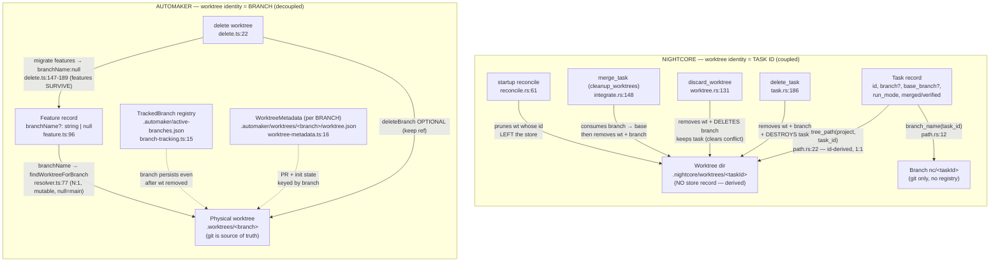
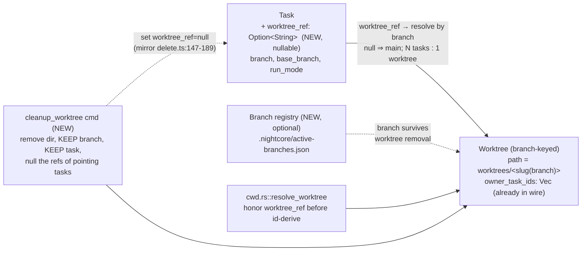

# Architectural Analysis — Worktree/Branch Subsystem: Nightcore vs Automaker

**Date:** 2026-07-05
**Agent:** kirei-arch (lens: architecture / domain model / lifecycle coupling / data flow)
**Scope:** Nightcore `apps/desktop/src-tauri/src/worktree/**` + `orchestration/coordinator/**` + `store/task/**` + `commands/{task,worktree}.rs` + `workflow/merge/**`, compared against Automaker `apps/server/src/routes/worktree/**` + `apps/server/src/services/{worktree-resolver,worktree-service}.ts` + `apps/server/src/lib/worktree-metadata.ts` + `libs/types/src/{feature,session,worktree}.ts`.

> Sibling agents: **kirei-ui** owns the dropdown/menu UX comparison; **kirei** owns the general feature-gap synthesis. This report stays in the architecture lens. Where I touched UI-shaped facts (the rich `WorktreeInfo` payload) I flag them as kirei-ui territory and only map the *domain model* behind them.

---

## TL;DR — The one root cause

**Nightcore keys a worktree by TASK ID; Automaker keys a worktree by BRANCH.**

- Nightcore: `worktree_path(project, task_id) = <project>/.nightcore/worktrees/<task_id>` and `branch = nc/<task_id>` (`worktree/path.rs:12,22`). The worktree has **no store record of its own** — its identity *is* the task id, computed by a pure function. There is no `worktree_path`/`worktree_ref` field on `Task` (`store/task/model.rs:218-386`).
- Automaker: a `Feature` (its task) carries `branchName?: string | null`, and "worktree path is derived at runtime from branchName" (`libs/types/src/feature.ts:95-96`). The worktree, the branch, and the feature are **three independent, separately-persisted entities**.

Every one of the three requested gaps is a downstream symptom of that single modelling decision.

---

## Current Architecture — Nightcore

### Module map (worktree subsystem)

`worktree/mod.rs` is a facade over cohesive submodules, with `git()` as the single spawn chokepoint (`worktree/mod.rs:87`, per the module doc `worktree/mod.rs:78-84`):

| Submodule | Responsibility | Key symbols |
|-----------|----------------|-------------|
| `worktree/path.rs` | Pure path/branch naming + escape guard | `branch_name` (:12), `worktree_path` (:22), `is_under` (:29), `validate_ref` (:50) |
| `worktree/lifecycle.rs` | allocate / remove / reconcile | `allocate` (:17), `allocate_branch` (:63), `remove` (:141), `list_worktree_task_ids` (:199), `reconcile` (:218) |
| `worktree/branch.rs` | base resolution, delete, picker list | `base_branch`, `delete_branch_named` (:146), `list_branches` |
| `worktree/merge.rs` | integrate + read-only preview | `merge_branch`, `merge_preview` |
| `worktree/diff.rs` | numstat parsing, changed-file list | `worktree_diff`, `base_diff` |
| `worktree/status.rs` | main-tree clean check + per-worktree monitor | `is_worktree_clean` (:19), `list_worktree_statuses` (:114), `WorktreeStatus` (:36) |
| `worktree/commit.rs` | stage/commit inside a worktree | `commit`, `stage_all` |
| `worktree/provision.rs` | install deps into a worktree | `provision_deps` |

Consumers: `orchestration/coordinator/cwd.rs` (allocation at run submit), `orchestration/coordinator/reconcile.rs` (startup prune), `commands/worktree.rs` (read-only queries + discard), `commands/task.rs` (delete cleanup), `workflow/merge/integrate.rs` (merge cleanup), `workflow/pr_status/finalize.rs` (PR-merge cleanup).

### The Task ⇄ worktree binding (data model)

`Task` (`store/task/model.rs:218`) holds these worktree-relevant fields, but **not a worktree pointer**:

- `branch: Option<String>` (:244) — the checked-out branch name (`nc/<id>` or a picker value)
- `base_branch: Option<String>` (:250) — merge/branch-off target
- `run_mode: RunMode` (:287) — `Main` (project root) or `Worktree` (`store/task/model.rs:156-168`)
- `committed` / `merged` / `conflict` / `verified` (:269,:273,:277,:291) — lifecycle flags

The physical worktree directory is **always** `worktree_path(project, task_id)` — derived from the task id, *not* from `task.branch`. Even a custom picker branch lands in a task-id-named directory (`orchestration/coordinator/cwd.rs:60-80`: `allocate_branch(project, task_id, branch, base)` still resolves the dir via `worktree_path(project, task_id)` inside `lifecycle.rs:69`). Two tasks therefore **cannot** share a directory, and because git refuses to check the same branch into two worktrees, they cannot share a branch concurrently either.

### Run-submission → worktree allocation flow

```
run_task / auto-loop launch
  └─ coordinator::cwd::resolve_worktree(app, task_id)   (cwd.rs:21)
       ├─ run_mode == Main  → ResolvedCwd::root(project_root)         (no worktree, no branch chip)
       └─ run_mode == Worktree, clean base:
            ├─ custom branch/base picked → worktree::allocate_branch(project, task_id, branch, base)  (cwd.rs:72)
            └─ else                       → worktree::allocate(project, task_id)                        (cwd.rs:77)
                                             → dir = <project>/.nightcore/worktrees/<task_id>            (lifecycle.rs:17-24)
  └─ reconcile::mark_task_in_progress(app, task_id, branch)  records task.branch chip (reconcile.rs:23-39)
```

The cwd resolver reads **only** `run_mode`, `branch`, `base_branch` off the task record. There is no input for "run this task in *that* existing worktree". A repo-wide grep for `target_worktree|shared_worktree|worktree_ref|assign.*worktree` returns **nothing**.

### Worktree cleanup triggers (the lifecycle coupling)

There are **four** places a worktree gets torn down. Three are entangled with task or merge state; only one is a standalone worktree op, and it destroys the branch:

1. **Delete the task** — `commands/task.rs:186 delete_task` → `cleanup_task_worktree` (`commands/task.rs:300-323`): removes the worktree (`worktree::remove`, :311) **and** deletes the branch (`delete_branch_named`, :320). The task record is gone.
2. **Startup reconcile** — `orchestration/coordinator/reconcile.rs:61 reconcile_worktrees` → `worktree::reconcile(project, live_task_ids)` (`lifecycle.rs:218`): prunes **any worktree whose task id is no longer in the live task-store set** (`lifecycle.rs:221`). This is why "delete the task" is the effective GC handle — the worktree is orphaned the instant its owning id leaves the store.
3. **Merge** — `workflow/merge/integrate.rs:148-156`: on a clean merge, if `settings.cleanup_worktrees` is on (`store/settings/model.rs:34`, default `true` at :307), removes the worktree **and** deletes the branch. (Same tail on PR-merge: `workflow/pr_status/finalize.rs:185`.)
4. **Discard** — `commands/worktree.rs:131 discard_worktree`: removes the worktree (`:156`) **and** deletes the branch (`:157`), clears `conflict`/`error`, preserves the task record and emits `nc:task` (`:158-162`). Refuses while the task holds a slot lease (`:146-151`).

**What is missing (gap #1):** every cleanup path that keeps the task (`discard_worktree`, `merge` cleanup) also **deletes the branch** — i.e. throws away or consumes the work. There is **no operation** that (a) reclaims the heavy worktree *checkout directory* while (b) keeping the lightweight *branch ref* for a later PR/merge/inspection and (c) leaving the task parked in Verified/Done. The three things — checkout dir, branch ref, task record — are welded into two coarse verbs: "merge-and-consume" or "discard-and-destroy". The prior-session claim that *"the ONLY way to clean up a finished worktree is to delete the task"* is **slightly out of date** — `discard_worktree` exists and preserves the task — but the *spirit* holds: you cannot free the worktree checkout without either merging or destroying the branch.

**A second, quieter leak:** flipping a task from `Worktree` back to `Main` (editable pre-run) clears the `branch` chip (`reconcile.rs:35`) but does **not** remove the physical `<...>/worktrees/<task_id>` directory. Because reconcile only prunes ids that have *left the store*, that directory persists forever until an explicit discard/merge/delete. So "move a task back to main board mode" (gap #2's second half) currently orphans disk.

### Data flow — where each fact lives

| Fact | Nightcore location | Persisted? |
|------|--------------------|-----------|
| Worktree exists | `<project>/.nightcore/worktrees/<task_id>/` on disk (+ git admin) | Filesystem only; enumerated by `list_worktree_task_ids` (`lifecycle.rs:199`) |
| Worktree ↔ task link | **Implicit**: dir name == task id | Not a record — derived |
| Branch name | `task.branch` (`model.rs:244`) + git HEAD | Task JSON |
| Branch registry (independent of worktrees) | **none** — `list_branches` reads git live each call (`commands/worktree.rs:34`) | Not persisted |
| Merge/PR state | `task.merged`/`conflict`/`pr_url` (`model.rs:273,277,379`) | Task JSON |
| Worktree live status | `WorktreeStatus` computed on demand (`status.rs:114`) | Ephemeral |

Note `WorktreeStatus.task_ids` is already a `Vec<String>` with the comment *"v1 is one-per-task … a Vec so a later shared-board model fits without a contract change"* (`status.rs:41-44`). **The wire contract already anticipates the shared-worktree model; only the id-derived path blocks it.**

---

## Current Architecture — Automaker (the reference model)

### Three decoupled entities

Automaker splits the concern Nightcore fuses into **three independently-persisted records plus git as source-of-truth**:

1. **Feature** (task equivalent) — `libs/types/src/feature.ts:81`. Carries `branchName?: string | null` (:96); "worktree path is derived at runtime from branchName" (:95); `null`/undefined = "use current worktree" (= main checkout / project root). This is the routing pointer.
2. **TrackedBranch registry** — `.automaker/active-branches.json`, `{name, createdAt, lastActivatedAt}` (`routes/worktree/routes/branch-tracking.ts:15-24`). Purpose (verbatim): *"so users can switch between branches even after worktrees are removed"* (:3-4). A branch can outlive its worktree. `trackBranch`/`untrackBranch`/`updateBranchActivation` are standalone ops (:56,:77,:90).
3. **WorktreeMetadata** — `.automaker/worktrees/<sanitized-branch>/worktree.json`, `{branch, createdAt, pr?, initScriptRan?…}` (`lib/worktree-metadata.ts:16-26,58-68`). **Keyed by branch**, not by feature. Holds PR linkage + init-script state.

The **physical worktree** is never a stored record: it is enumerated live from `git worktree list --porcelain` (`services/worktree-resolver.ts:125 listWorktrees`, `routes/worktree/routes/list.ts:549`) and resolved on demand by branch (`worktree-resolver.ts:77 findWorktreeForBranch`). Git is the source of truth; the JSON files are a thin persistent overlay.

### Routing — how a feature reaches a working directory

```
Feature.branchName ──┐
                     ├─ null  → run in project root (main checkout)
                     └─ "feat/x" → findWorktreeForBranch(project, "feat/x")   (worktree-resolver.ts:77)
                                     ├─ found  → reuse that worktree dir  (SHARED across features!)
                                     └─ none   → POST /create {branchName, baseBranch}  (create.ts:99)
                                                  → idempotent: returns existing if branch already has one (create.ts:46,152-172)
                                                  → else `.worktrees/<sanitized-branch>` + trackBranch (create.ts:176-274)
   agent-executor receives resolved workDir → cwd (agent-executor.ts:81,123)
```

Because resolution is by branch, **N features can point at one branch → one worktree** (sequential shared session), and setting `branchName = null` re-routes a feature to main with a single field write. That single mutable pointer *is* the "target worktree/branch selector" Nightcore lacks.

### Lifecycle — worktree delete is decoupled from the feature

`routes/worktree/routes/delete.ts` is the reference for gap #1:

- Keyed by `worktreePath`, not a feature id (`delete.ts:22`).
- `deleteBranch` is an **optional flag** (default: keep the branch) (`delete.ts:22,116-137`) — the exact "reclaim the checkout, keep the branch ref" verb Nightcore is missing.
- On delete it **migrates affected features to `branchName: null`** rather than deleting them (`delete.ts:147-189`): finds every feature with `branchName === branch`, sets it to `null` (back to main), emits `feature:migrated`. Features survive their worktree.
- Emits `worktree:deleted` for the UI (`delete.ts:140`).

### Operation surface (49 routes) — for gap #3's "what does it expose"

`apps/server/src/routes/worktree/routes/` exposes (grouped):

- **Lifecycle:** create, delete, migrate, info, list, status, check-changes
- **Branch:** list-branches, checkout-branch, switch-branch, branch-tracking, branch-commit-log, set-tracking, branch-tracking
- **Integration:** merge, rebase, cherry-pick, pull, push, sync, abort-operation, continue-operation
- **Working tree:** commit, stage-files, discard-changes, stash-{list,push,apply,drop}, generate-commit-message
- **Diff:** diffs, file-diff (+ `routes/git/routes/{diffs,file-diff,enhanced-status,details}`)
- **Remotes/PR:** add-remote, list-remotes, create-pr, pr-info, update-pr-number, generate-pr-description
- **Dev loop:** init-git, init-script, start-dev, stop-dev, list-dev-servers, dev-server-logs, start-tests, stop-tests, test-logs
- **Editor:** open-in-editor, open-in-terminal

The rich per-worktree payload that powers the dropdown (`WorktreeInfo`: `hasChanges`, `changedFilesCount`, `pr`, `hasConflicts`, `conflictType` merge/rebase/cherry-pick, `conflictFiles`, `conflictSourceBranch`, `isMain`, `isCurrent`) is assembled in `list.ts:75-92,648-732`. **Menu/UX = kirei-ui's lens; the domain model behind it is: git-live enumeration ⋈ per-branch metadata ⋈ live `gh pr list` join.**

---

## The two lifecycle models



---

## Issues Found

### Gap #1 — Task ⇄ worktree lifecycle is coupled through the task id

- **Where the coupling lives:** the derivation functions `worktree_path`/`branch_name` (`worktree/path.rs:12,22`) plus the store-set-difference prune in `worktree::reconcile` (`lifecycle.rs:218-233`, driven by `reconcile.rs:67-68`). Because the worktree has no record and is addressed by id, removing the id (delete_task) is the only *automatic* GC.
- **What's coupled that shouldn't be:** the worktree *checkout directory*, the *branch ref*, and the *task record* are three lifetimes fused into two verbs. `discard_worktree` (`commands/worktree.rs:131`) and `merge` cleanup (`integrate.rs:153-155`) both delete the branch when reclaiming the dir.
- **Impact:** no "park the task as Verified, free the disk, keep the branch for a later PR/manual merge" operation. Also the flip-to-Main disk orphan (`reconcile.rs:35` clears the chip; the dir stays).

### Gap #2 — No task → worktree routing

- **Where the binding is fixed:** `orchestration/coordinator/cwd.rs:21-82` resolves cwd purely from `run_mode`/`branch`/`base_branch`, and `lifecycle.rs:69` hard-codes the dir to `worktree_path(project, task_id)`. There is no `target_worktree` input anywhere (grep-confirmed empty).
- **Why sharing is impossible today:** the per-task dir plus git's "a branch can only be checked out in one worktree" rule (`allocate_branch` would fail the second `git worktree add` for a shared branch).
- **Impact:** cannot run sequential tasks against one long-lived worktree/branch; cannot re-home a task onto an existing branch's worktree; "back to main" leaves an orphan.

### Gap #3 — Domain-model gaps vs Automaker

| Concept | Automaker | Nightcore | Gap |
|---------|-----------|-----------|-----|
| Worktree key | branch (`resolver.ts:77`) | task id (`path.rs:22`) | **structural** |
| Feature→worktree link | mutable `branchName`, null=main (`feature.ts:96`) | id-derived, immutable | routing |
| Persistent branch registry | `active-branches.json` (`branch-tracking.ts`) | none (git live) | branches can't outlive worktrees |
| Per-worktree metadata | `worktree.json` per branch (`worktree-metadata.ts`) | flags on task | PR/init state has no home off the task |
| Worktree delete | path-keyed, `deleteBranch` optional, migrates features (`delete.ts`) | task-keyed or discard(destroys branch) | soft-cleanup verb missing |
| Enumeration | git-live ⋈ metadata ⋈ `gh pr list` (`list.ts`) | dir-scan ⋈ task join (`status.rs:114`) | thinner (kirei-ui lens) |
| Ops surface | 49 routes incl. rebase/cherry-pick/stash/sync/switch | ~7 (list/preview/diff/discard/merge/commit) | breadth (kirei-ui/kirei lens) |

---

## Recommended Target Architecture (Nightcore)

Adopt Automaker's **branch-keyed, decoupled** model without importing its ~49-route surface. Three incremental moves:



1. **Decouple identity → branch.** Change `worktree_path` to hash/slug the *branch* (`worktree_path(project, slug(branch))`) instead of the task id, or add an explicit `Task.worktree_ref: Option<String>` that `cwd.rs:resolve_worktree` honors before falling back to the id-derived default. Keep the `nc/<id>` branch as the *default* name, but let the resolver reuse an existing worktree when `worktree_ref`/`branch` already maps to one (mirror `findWorktreeForBranch`, `resolver.ts:77`). The `WorktreeStatus.task_ids: Vec` contract (`status.rs:41-44`) already supports N:1 — no wire break.
2. **Add a `cleanup_worktree` command** that removes only the checkout dir (`worktree::remove`) and **does not** call `delete_branch_named` — the soft-cleanup verb (`deleteBranch=false` in `delete.ts`). Have it null the `worktree_ref` of any task pointing at that worktree (mirror `delete.ts:147-189`) instead of touching the task's status, so a Verified task stays in the Verified column. Distinguish it from `discard_worktree` (which keeps its "destroy the branch too" semantics).
3. **Persist a branch registry** (optional, phase 3): a `.nightcore/active-branches.json` mirroring `branch-tracking.ts` so a branch (and its Verified task) survives worktree removal and can be re-materialised into a fresh worktree on the next run — closing the "flip to main then back" orphan and enabling the shared-worktree flow end-to-end.

### Migration path (incremental, typecheck-gated per step)

1. Add `Task.worktree_ref: Option<String>` (serde-additive, `skip_serializing_if`, legacy ⇒ `None`) — pure additive, mirrors every other field's test in `model.rs`.
2. Teach `cwd.rs::resolve_worktree` to honor `worktree_ref` (reuse existing dir) before the id-derived allocate. Guard with `validate_ref`. Ship behind the existing worktree run mode; default behavior unchanged when `worktree_ref` is `None`.
3. Add `commands::worktree::cleanup_worktree` (remove dir, keep branch, null pointing `worktree_ref`s, keep task/status). Wire in `lib.rs` next to `discard_worktree` (`lib.rs:266`).
4. (Optional) Add the branch registry + reconcile awareness (reconcile must stop pruning a dir that a tracked branch still claims).

Each step is behind a nullable field / new command, so nothing regresses for existing id-scoped worktrees.

---

## What to Keep (already well-structured)

- **The `git()` chokepoint** (`worktree/mod.rs:87`) + `git_with_deadline` + `git_status_success` — the isolation seam is exactly right; a branch-keyed model routes through it unchanged.
- **`validate_ref` / `is_under`** (`path.rs:29,50`) — the option-injection + escape guards are stronger than Automaker's `isValidBranchName` and must be kept on any new branch-keyed path.
- **`WorktreeStatus.task_ids: Vec`** (`status.rs:41-44`) — the wire contract already fits N:1; no change needed.
- **The pure `plan_worktree` decision + `*_inner` testability** (`cwd.rs:108`, `reconcile.rs:134`) — extend the same pattern for the `worktree_ref` branch.
- **Merge = abort-not-force, read-only preview** (`integrate.rs:165`, `commands/worktree.rs:47`) — safer than Automaker's richer-but-heavier merge/rebase/cherry-pick surface; keep the conservative posture.
- **`run_mode` Main/Worktree opt-in** (`model.rs:156`) — the right axis; `worktree_ref` is orthogonal and composes with it.

---

## Notes for sibling agents

- **kirei-ui:** the dropdown richness is powered by `list.ts:75-92,648-732` (`hasChanges`, `pr`, `conflictType` = merge/rebase/cherry-pick, `conflictSourceBranch`, `isMain`, `isCurrent`) and `worktree-metadata.ts` (per-branch PR store) joined with live `gh pr list`. Nightcore's equivalent payload is `WorktreeStatus` (`status.rs:36`) — thinner (no PR/conflict-type/isCurrent).
- **kirei (feature-gap):** the breadth gap (49 vs ~7 routes: rebase, cherry-pick, stash, sync, switch-branch, pull/push, dev-server, tests) is a feature-catalog question, not an architecture one — flagged here only so it isn't double-counted.
