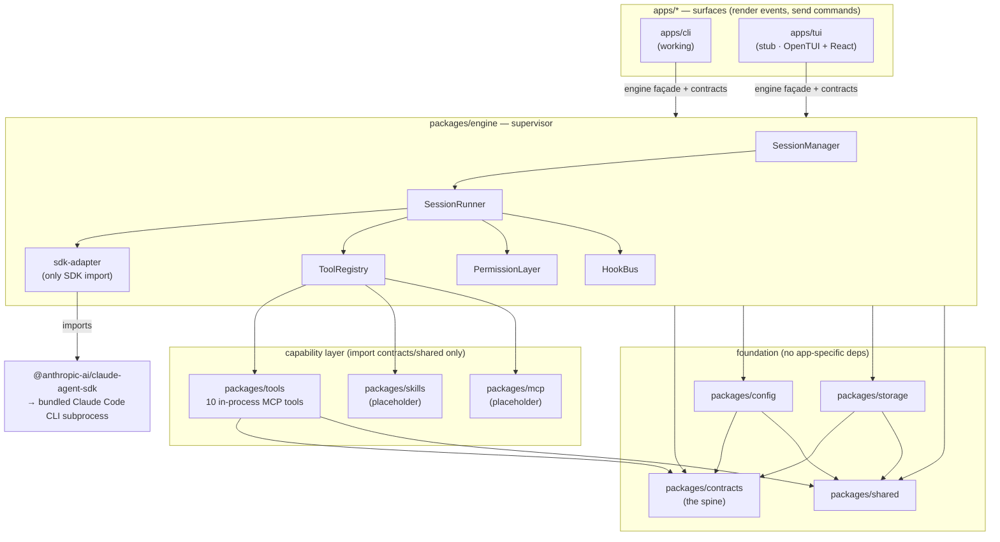
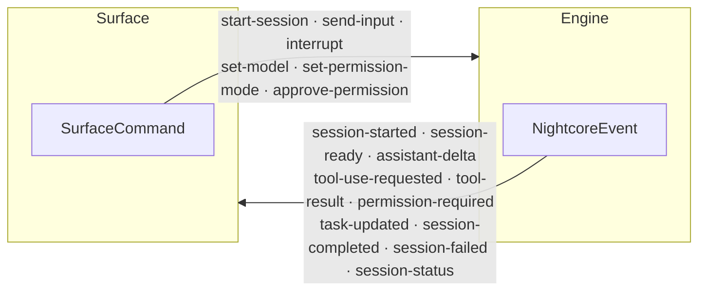
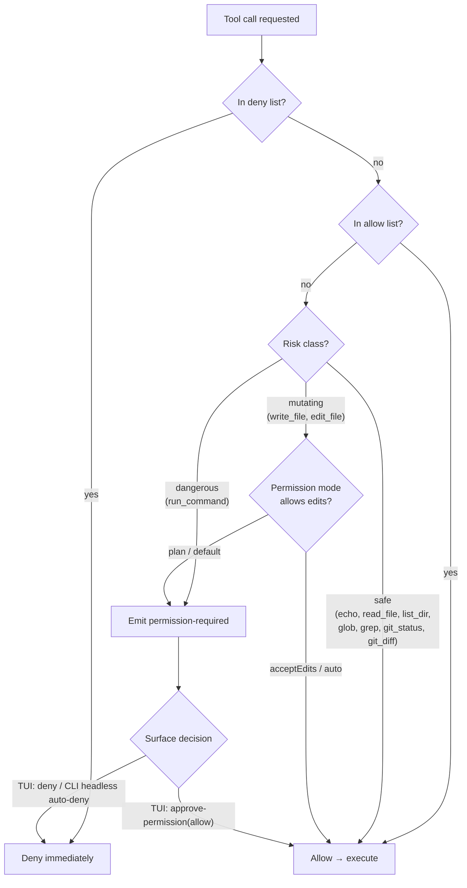

# Nightcore — Architecture & Flow Diagrams

Visual companion to [`architecture.md`](./architecture.md). These Mermaid
diagrams describe the project **in its current state**: the CLI surface is
working, the TUI is a stub, and the `skills` / `mcp` capability packages are
placeholders. They render natively on GitHub.

The one-sentence model: **the Claude Agent SDK is thick; Nightcore is thin.**
The SDK spawns and drives a bundled Claude Code CLI subprocess that owns the
agent loop, built-in tools, subagents, MCP, hooks, permission modes, and JSONL
session persistence. Nightcore is a **process supervisor + presentation shell**
over it — it adds session multiplexing, a permission policy layer, and a typed
event/command spine.

---

## A — Layered architecture

Dependencies point inward. Surfaces talk only to the `engine` façade and
`contracts`; only `sdk-adapter.ts` ever imports the Claude Agent SDK.



---

## B — Runtime flow, start to end

A single CLI prompt, from argument parsing to process exit. The SDK runs the
real agent loop in a subprocess; the runner translates each raw `SDKMessage`
into a typed `NightcoreEvent`.

```mermaid
sequenceDiagram
    autonumber
    actor User
    participant CLI as apps/cli
    participant SM as SessionManager
    participant SR as SessionRunner
    participant SDK as sdk-adapter / SDK
    participant PL as PermissionLayer
    participant Tools as Tools (in-process MCP)
    participant Store as SessionStore (JSONL)

    User->>CLI: nightcore "prompt" [-m model]
    CLI->>CLI: parse args + resolveConfig()<br/>(defaults → ~/.nightcore → ./.nightcore)
    CLI->>SM: dispatch(start-session)
    SM->>SM: assign monotonic id (never resets)
    SM->>Store: append SessionRecord
    SM-->>CLI: session-started event
    SM->>SR: run() (fire-and-forget, never rejects)
    SR->>SDK: query({ prompt: AsyncIterable, options })<br/>streaming-input mode

    loop per SDKMessage until terminal
        SDK-->>SR: SDKMessage
        SR->>SR: translateMessage() → NightcoreEvent(s)
        SR-->>CLI: session-ready / assistant-delta / task-updated
        CLI->>User: text → stdout, activity → stderr

        opt model requests a tool
            SDK->>PL: canUseTool(name, input)
            alt deny-list / dangerous & not allow-listed
                PL-->>CLI: permission-required event
                Note over CLI: headless CLI auto-denies;<br/>TUI prompts → approve-permission
                CLI-->>PL: decision (allow / deny)
            else safe or allow-listed
                PL-->>SDK: allow
            end
            SDK->>Tools: execute (read_file, run_command, …)
            Tools-->>SDK: tool_result
            SR-->>CLI: tool-use-requested + tool-result
        end
    end

    SDK-->>SR: result message
    SR-->>SM: session-completed | session-failed
    SM->>Store: update record (status, cost, usage)
    SM->>SM: retire(id)
    SM-->>CLI: terminal event
    CLI->>User: exit 0 (success) / 1 (failure)
```

---

## C — The event / command spine (`@nightcore/contracts`)

Two symmetric discriminated unions define the entire engine ↔ surface boundary.
Surfaces never see a raw `SDKMessage`; the engine is drivable by anything that
emits a `SurfaceCommand`.



---

## D — Tool risk tiers & permission decision

Each Nightcore tool carries a `risk` class that drives the permission tier.
`PermissionLayer.canUseTool` is consulted for every tool call before the SDK
executes it.



---

## Source of truth

| Concern | Files |
|---------|-------|
| CLI / TUI entry | `apps/cli/src/index.ts`, `apps/tui/src/index.ts` |
| Supervisor & runner | `packages/engine/src/{session-manager,session-runner}.ts` |
| SDK boundary | `packages/engine/src/sdk-adapter.ts` |
| Permission & tools | `packages/engine/src/{permission-layer,tool-registry}.ts` |
| Spine (unions) | `packages/contracts/src/{events,commands,config}.ts` |
| Tool catalog & risk | `packages/tools/src/index.ts` |
| Config / storage | `packages/{config,storage}/src/index.ts` |
