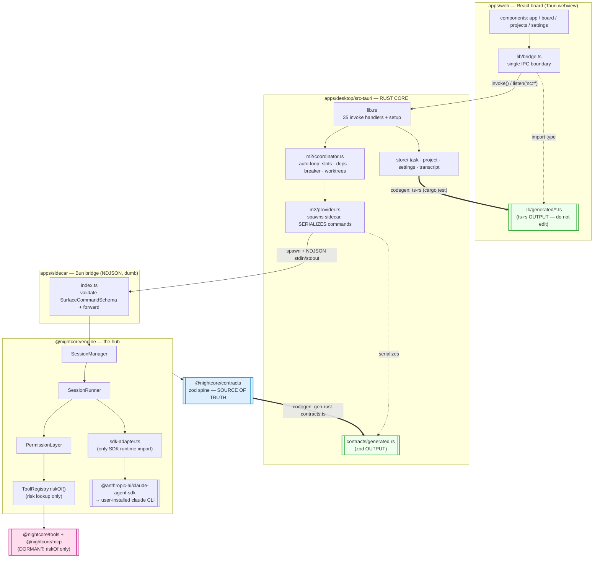
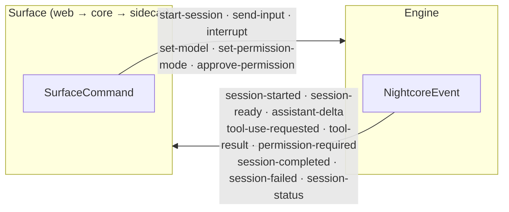
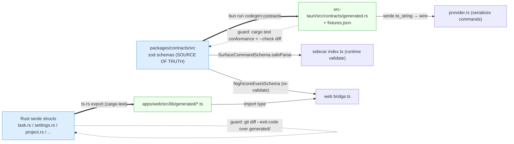
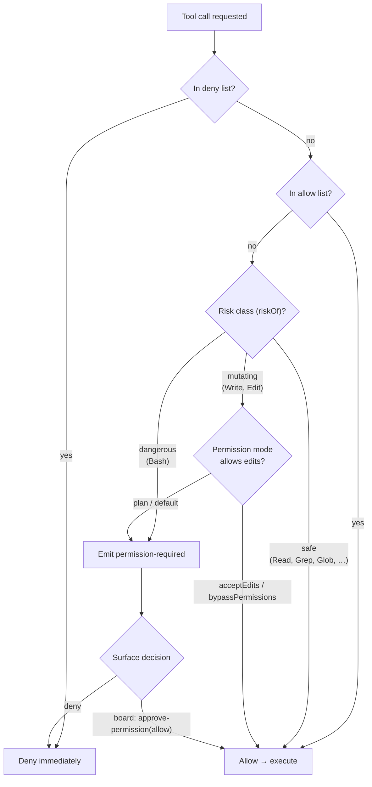

# Nightcore — Architecture & Flow Diagrams

Visual companion to [`architecture.md`](./architecture.md). These Mermaid
diagrams describe the **live desktop runtime**: the 3-tier path (React board ↔
Rust core ↔ Bun sidecar ↔ engine ↔ SDK), the run-a-task flow, the event/command
spine, and the bidirectional codegen contract boundaries. They render natively on
GitHub. The authoritative, file-level version lives in
[`arch/2026-06-24-asbuilt-integration-map.md`](./arch/2026-06-24-asbuilt-integration-map.md).

The one-sentence model: **the Claude Agent SDK is thick; Nightcore is thin.** The
SDK drives the user's installed `claude` CLI, which owns the agent loop, native
tools, subagents, MCP, hooks, permission modes, and session persistence.
Nightcore is a local-first desktop studio over it — a Rust/Tauri orchestration
core that multiplexes autonomous runs, behind a React board.

---

## A — The 3-tier architecture

Every web IPC funnels through `lib/bridge.ts`; only `sdk-adapter.ts` imports the
SDK runtime. `@nightcore/tools` / `@nightcore/mcp` are dormant (risk-lookup only).



---

## B — Runtime flow: run a task (web → SDK → web)

A manual `run_task` (the auto-loop drives the same path per tick). One persistent
sidecar multiplexes sessions; correlation is the pending-launch FIFO.

```mermaid
sequenceDiagram
    autonumber
    actor User
    participant Web as apps/web (bridge.ts)
    participant Core as Rust core (m2/*)
    participant Side as apps/sidecar
    participant Eng as SessionManager / SessionRunner
    participant SDK as sdk-adapter / SDK → claude CLI

    User->>Web: click Run
    Web->>Core: invoke('run_task', { id })
    Core->>Core: lease slot, resolve worktree, ensure reader
    Core->>Side: spawn (dev: bun run · release: externalBin)<br/>write SurfaceCommand::StartSession (NDJSON line)
    Side->>Side: validate SurfaceCommandSchema
    Side->>Eng: manager.dispatch(start-session)
    Eng->>Eng: assign monotonic id; launch SessionRunner
    Eng->>SDK: query({ prompt, options }) streaming-input

    loop per SDKMessage until terminal
        SDK-->>Eng: SDKMessage
        Eng->>Eng: translateMessage() → NightcoreEvent
        Eng-->>Side: event (NDJSON stdout line)
        Side-->>Core: reader.rs handle_event() (correlate session→task)
        Core-->>Web: emit nc:session
        Web->>Web: re-validate NightcoreEventSchema; fold into board
        opt model requests a tool
            SDK->>PL: canUseTool(name, input)
            PL-->>Core: permission-required → nc:permission (if gated)
            Web-->>Core: approve-permission (decision)
        end
    end

    SDK-->>Eng: result → session-completed | session-failed
    Core->>Core: route terminal event through verification gate
    Core-->>Web: nc:task (status, cost, usage)
```

---

## C — The event / command spine (`@nightcore/contracts`)

Two symmetric discriminated unions define the entire engine ↔ surface boundary.
The sidecar validates inbound `SurfaceCommand`s; the web re-validates inbound
`NightcoreEvent`s. zod is the source of truth for both codegen directions.



---

## D — The bidirectional codegen contract boundaries

Both directions are generated with regenerate-and-diff guards — never
hand-mirrored.



---

## E — Tool risk tiers & permission decision

The agent runs on **native SDK tools** (Read/Write/Edit/Bash/Grep/Glob). Each
maps to a static `risk` class via `ToolRegistry.riskOf`, which drives the
CLI-like permission tier checked before the SDK executes a call.



---

## Source of truth

| Concern | Files |
|---------|-------|
| Web IPC boundary | `apps/web/src/lib/bridge.ts` |
| Rust core / orchestration | `apps/desktop/src-tauri/src/{lib.rs, m2/*, store/*, workflow/*}` |
| Sidecar bridge | `apps/sidecar/src/index.ts` |
| Supervisor & runner | `packages/engine/src/{session-manager,session-runner}.ts` |
| SDK boundary | `packages/engine/src/sdk-adapter.ts` |
| Permission & risk | `packages/engine/src/{permission-layer,tool-registry}.ts` |
| Spine (unions) | `packages/contracts/src/{events,commands,config}.ts` |
| zod → Rust codegen | `tools/codegen/gen-rust-contracts.ts` → `src-tauri/src/contracts/generated.rs` |
| Rust → web codegen | ts-rs (`cargo test`) → `apps/web/src/lib/generated/` |
| Alt surfaces (retired v0) | `apps/cli/src/index.ts`, `apps/tui/src/index.ts` (tag `v0-ts-harness`) |
