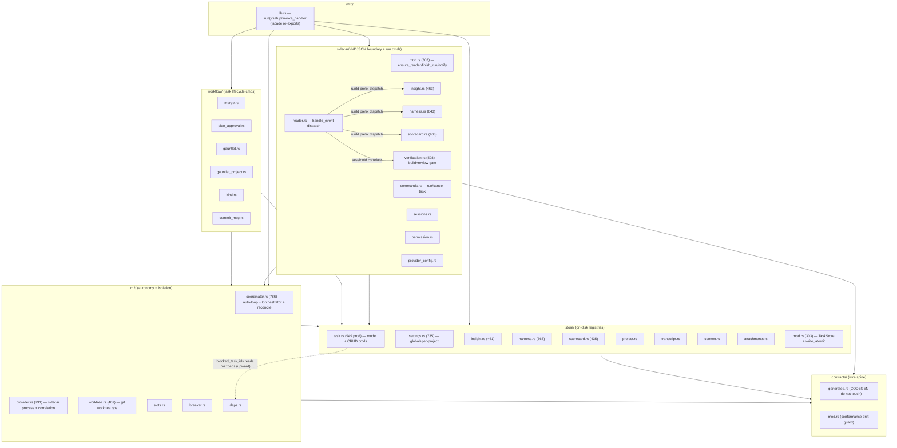

# Rust Core Architecture & God-File Decomposition

**Date:** 2026-06-27
**Agent:** kirei-arch (advisory only — no code changes)
**Scope:** `apps/desktop/src-tauri/src/` — the Rust core of the 3-tier architecture (Rust core ↔ Bun sidecar ↔ React board). 43 files, ~19.9K LOC.

---

## TL;DR

The module *layering* is healthy: dependencies flow downward (`sidecar`/`workflow`/`m2` → `store` → `task`/`contracts`), there are no circular module dependencies, and the `mod.rs` facade re-exports keep historical paths stable. The "god files" are **not** tangled balls of unrelated concerns — they are mostly **single-responsibility files that grew large**, and roughly **half of their LOC is in-file `#[cfg(test)]` modules**.

The one real *architectural* problem is **structural duplication across three near-identical feature families** — Insight, Harness, Scorecard — each of which carries a `store/` + `sidecar/` trio that is a copy-paste of the same "run lifecycle" shape (create → stream → finalize-by-fingerprint → list/get/delete → dismiss/restore finding → convert-to-task). This points to a missing generic **`RunStore<T>` + run-event-finalize** abstraction. That is the highest-leverage refactor; the rest is mechanical file-splitting.

A secondary, smaller issue: `store/task.rs` conflates the **domain model** (the `Task` struct + 6 enums + `TaskPatch`) with the **CRUD command surface** and **subtask-conversion logic** in one file — the cleanest pure-split win.

---

## Current Architecture

### Module Diagram



### Layering verdict (coupling audit)

Verified by grepping every `use crate::*` edge:

| Layer | Imports from | Direction |
|-------|--------------|-----------|
| `sidecar/` | `store`, `m2`, `contracts`, `task`, `settings` | downward ✅ |
| `workflow/` | `store`, `m2`, `task` | downward ✅ |
| `m2/` | `store`, `task`, `settings`, `contracts` | downward ✅ |
| `store/` | `contracts`, `task`, `sync` | downward ✅ |

- **No circular module dependencies.** No module imports a module that (transitively) imports it.
- **One wrong-direction edge:** `store/task.rs::blocked_task_ids` does `use crate::m2::deps::{index_by_id, is_blocked}` — a `store` command reaching *up* into `m2`. Minor; the dependency-graph helpers arguably belong below `store` (or `blocked_task_ids` belongs in `m2`/`workflow`, not `store/task.rs`).
- The `mod.rs` files are deliberate **facades** (glob re-exports so the `#[tauri::command]` macro siblings resolve and historical `crate::sidecar::*` / `crate::{gauntlet,kind,...}` paths keep working). This is a good pattern and should be preserved by any split.

### Production vs test LOC (the "god files" are smaller than they look)

Excluding the in-file `mod tests`:

| File | Total | Prod | Test |
|------|------:|-----:|-----:|
| `store/task.rs` | 1674 | **949** | 725 |
| `store/settings.rs` | 1291 | **735** | 556 |
| `contracts/generated.rs` | 1034 | (codegen — excluded) | — |
| `m2/coordinator.rs` | 1007 | **786** | 221 |
| `m2/provider.rs` | 976 | **791** | 185 |
| `store/harness.rs` | 893 | **665** | 228 |
| `m2/worktree.rs` | 837 | **407** | 430 |
| `sidecar/verification.rs` | 807 | **598** | 209 |
| `sidecar/harness.rs` | 785 | **643** | 142 |
| `store/mod.rs` | 705 | **303** | 402 |

Takeaway: the LOC headline overstates the problem. `worktree.rs` and `store/mod.rs` are *more than half tests* and are cohesive — they are **not** decomposition targets. Prioritise by tangled responsibilities and by duplication, not raw LOC.

---

## Issues Found

### 1. Missing abstraction: the Insight / Harness / Scorecard "run lifecycle" is copy-pasted 3× (HIGH impact)

These three features are structurally identical run-analysis pipelines. Evidence — the **stores** expose the same method set (verified by signature grep):

```
load_from · retarget · path_for · list · get · persist · upsert
prune_locked (cap-based eviction) · reap_running · remove · mutate
set_<finding>_status · link_<finding>_task · dismissed_fingerprints
read_runs_into_map (newest-first sort)
```

`store/insight.rs`, `store/scorecard.rs`, `store/harness.rs` differ only in the **item type** (`StoredFinding` / `StoredReading` / `StoredConventionFinding`+`StoredProposedArtifact`) and the run wrapper (`InsightRun`/`ScorecardRun`/`HarnessRun`). The body of `prune_locked`, `reap_running`, `mutate`, `read_runs_into_map`, `path_for`, `load_from`, `retarget` is the same code three times. Harness is the superset (it adds the artifact axis: `set_artifact_status` / `mark_artifact_applied` / `prior_artifact_states`).

The **sidecar command surfaces** are equally parallel:

```
start_<feature>        cancel_<feature>      list_<feature>_runs
get_<feature>_run      delete_<feature>_run  dismiss/restore_<finding>
convert_<finding>_to_task   handle_<feature>_event
```

The **`handle_*_event` finalizers** are the same algorithm: forward raw event on the feature's `nc:*` channel → extract `runId` → on `*-completed` pull `costUsd`/`durationMs`/`usage` → **carry forward prior non-`open` lifecycle by fingerprint** so the wholesale item-replace doesn't reset the user's dismiss/convert edits → set `status="completed"` (idempotent on re-delivery) → on `*-failed` set `status="failed"` + error. (Scorecard's even reuses `InsightUsage` directly — `store/scorecard.rs` imports `crate::store::insight::InsightUsage`, an accidental cross-feature coupling that proves the shared shape.)

**This is the one true architectural defect.** A new analysis feature today means cloning ~450 lines of store + ~450 lines of sidecar boilerplate (the memory notes confirm exactly this: scorecard and the production-harness features were built as "clones of Insight/Harness siblings"). The missing abstraction is a generic:

- `RunStore<R>` (or a `RunStore` trait + macro) owning load/retarget/path/list/get/persist/upsert/prune/reap/remove/mutate — parameterised by the run type.
- A `finalize_run_event` helper owning the forward → extract-usage → carry-forward-by-fingerprint → idempotent-complete pattern, parameterised by an item type implementing a small `LifecycleItem` trait (`fingerprint()`, `status`, `linked_task_id`, `from_wire`).
- A `LifecycleItem` trait unifying `StoredFinding`/`StoredReading`/`StoredConventionFinding` (all already have `id`, `fingerprint`, `status`, `linked_task_id`, `from_wire`).

### 2. `store/task.rs` mixes domain model + command surface + subtask conversion (MEDIUM, cleanest split)

949 prod LOC in one file holding three distinct responsibilities:
- **Domain model** (lines ~33–471): `TaskStatus`, `TaskKind`, `SubtaskStatus`, `ProposedSubtask`, `RunMode`, `PermissionMode`, `TaskAttachment`, `Task`, `TaskPatch`, `now_ms`. These are `#[derive(TS)]` types — the ts-rs codegen surface.
- **CRUD commands** (~537–793, 896–960): `list/create/update/delete/move_task`, `add/remove/read_task_attachment`, `blocked_task_ids`.
- **Subtask conversion** (~622–757): `convert_subtask` / `convert_all_subtasks` / `convert_one` — Decompose-feature logic that mirrors Insight's convert-to-task.

The model and the commands change for different reasons and have different blast radii (touching the model triggers ts-rs regen; touching commands doesn't).

### 3. `store/settings.rs` mixes the settings model, the resolver, and IO (MEDIUM)

735 prod LOC: the `Settings`/`SettingsOverride`/`SettingsPatch`/`McpServerEntry` model + `From` conversions into `contracts`, plus a **large resolver surface** (12 `default_*`/`sdk_permission_mode`/`enabled_mcp_servers`/`context_pack_enabled` accessors that walk global→override), plus file IO (`read_settings`/`write_settings`/`restrict_to_owner`) and the 3 commands. The resolver is the natural extraction (it is pure logic, heavily tested).

### 4. `m2/coordinator.rs` bundles four roles behind one file (MEDIUM)

786 prod LOC spanning: the `Orchestrator` aggregate (slots+breaker+provider+permissions+autoloop), the **auto-loop driver** (`run_loop`/`tick`/`launch`/`kick`), the **run submission path** (`submit_run`/`resolve_worktree`/`mark_task_in_progress`/`fail_run`), **boot reconciliation** (`reconcile_worktrees`/`reconcile_tasks`/`Recovery`), `PendingPermissions`, and the 5 Tauri commands. These are separable: reconciliation and the dispatch/submit path are each self-contained.

### 5. `sidecar/verification.rs` is two gates in one file (LOW–MEDIUM)

598 prod LOC: the **build gate** (`handle_build_completed` + auto-fix budget) and the **review gate** (`handle_review_completed`, `parse_verdict`, `parse_proposed_subtasks`, `merge_proposed_subtasks`, `dispatch_reviewer_for`). The verdict/subtask **parsers** are pure, well-tested, and independently reusable — a clean sub-extraction. Note: verification is *not* part of the run-lifecycle family (it correlates by `sessionId`, not `runId`); keep it separate.

### What is NOT a problem (leave alone)

- `m2/worktree.rs` — 407 prod / 430 test, cohesive (all git-worktree primitives). Cohesion is high; do not split.
- `store/mod.rs` — 303 prod / 402 test; `TaskStore` + `write_atomic` belong together.
- `contracts/generated.rs` — codegen; never hand-edit.
- The `mod.rs` facade re-export pattern — keep it; it is what makes splitting *safe* (call sites resolve through the facade unchanged).
- `m2/provider.rs` — 791 prod, large but cohesive (one `Provider` trait + one `SidecarProvider` impl + correlation state). Lower priority; only the bundle-path detection (`release_sidecar_path`/`running_as_bundle`/`exe_in_app_bundle`/`spawn_command`) is a candidate sub-extraction if it grows.

---

## Recommended Target Layout

```
store/
  task/
    model.rs        # Task + enums + TaskPatch + now_ms (the #[derive(TS)] surface)
    commands.rs     # list/create/update/delete/move/attachments/blocked_task_ids
    subtasks.rs     # convert_subtask/convert_all/convert_one
    mod.rs          # facade re-export (keeps crate::task::* paths)
  settings/
    model.rs        # Settings/Override/Patch/Mcp* + From<> into contracts
    resolver.rs     # the default_*/sdk_permission_mode/enabled_mcp_servers accessors
    io.rs           # read/write/restrict_to_owner + the 3 commands
    mod.rs
  run/              # NEW shared run-lifecycle abstraction
    mod.rs          # RunStore<R> + LifecycleItem trait + finalize_run_event helper
  insight.rs        # shrinks to: item types + RunStore<InsightRun> wiring
  scorecard.rs      # shrinks to: item types + RunStore<ScorecardRun> wiring
  harness.rs        # shrinks to: item types (+artifact axis) + RunStore wiring

sidecar/
  run/
    mod.rs          # generic start/cancel/list/get/delete command helpers + finalize dispatch
  insight.rs        # thin: feature wiring + convert_finding_to_task
  scorecard.rs      # thin: feature wiring + convert_reading_to_task
  harness.rs        # keeps artifact apply (safe_join/write_*) — its unique surface
  verification/
    build.rs        # handle_build_completed + auto-fix budget
    review.rs       # handle_review_completed + dispatch_reviewer_for
    parse.rs        # parse_verdict/parse_proposed_subtasks/merge_proposed_subtasks
    mod.rs

m2/
  coordinator/
    orchestrator.rs # Orchestrator + PendingPermissions + AutoLoop + commands
    loop.rs         # run_loop/tick/launch/kick
    submit.rs       # submit_run/resolve_worktree/mark_task_in_progress/fail_run
    reconcile.rs    # reconcile_worktrees/reconcile_tasks/Recovery
    mod.rs
```

---

## Decomposition — ordered, independently-shippable sub-tasks

Each is one small conventional commit, behavior-preserving, gated by `cargo test`. Ordered by dependency (what must land first) and ranked by impact/effort. **Serde/wire shapes and the ts-rs `#[derive(TS)]` surface must not change** — these are pure code-movement + an internal generic, so `generated.rs`, the `bindings/`, and `apps/web/src/lib/generated/` stay byte-identical (the conformance test + ts-rs drift guard enforce this).

### Phase A — pure file splits (low risk, no new abstraction, high readability ROI)

1. **`refactor(store): split task.rs into model/commands/subtasks`**
   Move `Task`+enums+`TaskPatch`+`now_ms` → `store/task/model.rs`; CRUD commands → `commands.rs`; convert_* → `subtasks.rs`; `store/task/mod.rs` re-exports so `crate::task::*` is unchanged. **Impact: High / Effort: M.** Best first move — biggest file, cleanest seams, zero behavior change. (While here, consider relocating `blocked_task_ids` to fix the `store→m2::deps` upward edge — optional, flag for discussion since it moves a command's home file.)

2. **`refactor(store): split settings.rs into model/resolver/io`**
   Extract the 12 `default_*`/resolver accessors → `resolver.rs`; file IO + commands → `io.rs`; model + `From` impls → `model.rs`. **Impact: Med / Effort: M.** Resolver is pure + heavily tested → moves cleanly with its tests.

3. **`refactor(sidecar): split verification.rs into build/review/parse`**
   Pull `parse_verdict`/`parse_proposed_subtasks`/`merge_proposed_subtasks` → `verification/parse.rs` (pure, take their tests); `handle_build_completed` → `build.rs`; review path → `review.rs`. **Impact: Med / Effort: M.**

4. **`refactor(m2): split coordinator.rs into orchestrator/loop/submit/reconcile`**
   Move the auto-loop, submit path, and reconciliation into sibling files under `coordinator/`; keep `Orchestrator` + commands in `orchestrator.rs`; `mod.rs` re-exports the command fns + `reconcile_*` for `lib.rs`'s `generate_handler!`/setup. **Impact: Med / Effort: M–L** (most cross-references; do after 1–3 to build confidence).

### Phase B — the real abstraction (highest architectural impact)

5. **`refactor(store): introduce LifecycleItem trait over the three stored item types`**
   Add `store/run/mod.rs` with `trait LifecycleItem { fn id; fn fingerprint; fn status; fn linked_task_id; fn from_wire }`; impl for `StoredFinding`, `StoredReading`, `StoredConventionFinding`. No behavior change — pure trait introduction. **Impact: High (enabler) / Effort: S.** Must land before 6–7.

6. **`refactor(store): extract generic RunStore<R> and adopt it in insight/scorecard`**
   Generic store owning load/retarget/path/list/get/persist/upsert/prune/reap/remove/mutate/`set_status`/`link_task`/`dismissed_fingerprints` over `R: Run<Item: LifecycleItem>`. Re-point `InsightStore`/`ScorecardStore` at it (the closer twins first; harness has the extra artifact axis). Delete the duplicated bodies. Also removes the accidental `scorecard → insight::InsightUsage` coupling by hoisting `RunUsage` into `run/`. **Impact: High / Effort: L.**

7. **`refactor(store): adopt RunStore<R> in harness (with artifact axis as an extension)`**
   Bring `HarnessStore` onto the generic core; keep `set_artifact_status`/`mark_artifact_applied`/`prior_artifact_states` as a harness-only extension trait/impl. **Impact: Med / Effort: M.** After 6 so the generic is proven on the simpler pair.

8. **`refactor(sidecar): extract generic finalize_run_event + run command helpers`**
   One helper for the forward→extract-usage→carry-forward-by-fingerprint→idempotent-complete/fail algorithm, and generic `start/cancel/list/get/delete` helpers; thin each of `sidecar/{insight,scorecard,harness}.rs` down to feature wiring + its unique convert/apply command. **Impact: High / Effort: L.** After 6–7.

### Effort/impact ranking (do in this order)

| # | Sub-task | Impact | Effort | Risk |
|---|----------|:------:|:------:|:----:|
| 1 | split `task.rs` | High | M | Low |
| 5 | `LifecycleItem` trait | High (enabler) | S | Low |
| 6 | generic `RunStore` (insight+scorecard) | High | L | Med |
| 8 | generic `finalize_run_event` + cmd helpers | High | L | Med |
| 7 | `RunStore` for harness | Med | M | Med |
| 2 | split `settings.rs` | Med | M | Low |
| 3 | split `verification.rs` | Med | M | Low |
| 4 | split `coordinator.rs` | Med | M–L | Med |

Phase A items (1–4) are independent of each other and of Phase B — ship them in any order to bank quick wins. Phase B is strictly ordered 5 → 6 → 7/8.

---

## Constraints any executor must honour

- **Behavior-preserving / wire-stable:** no serde rename/retype/enum change; `cargo test` regenerates ts-rs and must show **zero git diff** in `bindings/` and `apps/web/src/lib/generated/`. `generated.rs` is codegen — untouched.
- **Serde changes (if any) must be additive** (project convention).
- **Preserve the `mod.rs` facade re-exports** — they keep `crate::task::*`, `crate::sidecar::*`, `crate::{gauntlet,kind,merge,...}` resolving and let `generate_handler!` find the `#[tauri::command]` macro siblings.
- **Before any cargo build:** `bun run --filter @nightcore/sidecar compile` (externalBin prereq).
- **Move tests with their code** — most of these files are ~half tests; the test module must follow the functions it covers.
- Commit to `main`, small conventional commits, no AI/co-author attribution (project convention).
