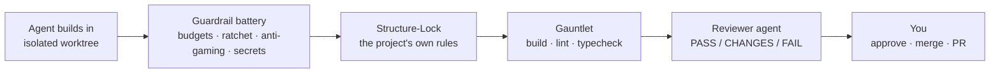

# README Rewrite Draft — Governed Autonomy (ticket #88)

**Date:** 2026-07-10
**Status:** PROTOTYPE — proposed replacement for `README.md`, for user reaction. Not applied.
**Sources:** current `README.md`, `docs/research/2026-07-10-competitive-landscape.md` (Positioning / UNIQUE / Risks & Gotchas), `docs/research/2026-07-10-nightcore-roadmap.md` (Positioning), feature claims spot-checked in-repo (see Rationale notes).

Everything between the two `BEGIN/END PROPOSED README` markers is the complete proposed README content.

---

<!-- ============ BEGIN PROPOSED README ============ -->

<p align="center">
  
</p>

<p align="center">
  <a href="LICENSE"></a>
  <a href="https://github.com/Shironex/nightcore/actions/workflows/ci.yml"></a>
  
  <a href="https://bun.sh"></a>
  <a href="https://www.rust-lang.org/"></a>
</p>

# Nightcore

**Full-loop autonomy inside an enforced harness — coding agents that can't wreck your architecture.**

> **[!WARNING]**
>
> **Alpha — early and actively changing.** APIs, UI, and on-disk formats can break
> between commits. There are **no GitHub releases yet** — for now you **clone and
> build locally** (see [Getting Started](#getting-started)). Tested on **macOS and
> Windows**; Linux is best-effort.

Nightcore is a **local-first desktop studio** that runs Claude as an autonomous
development team. Describe work as cards on a Kanban board; agents plan, build,
and test in parallel, each in its own isolated git worktree. The difference is
what happens next: **nothing merges on trust.** Every change must pass a
verification gauntlet — build, lint, typecheck, your project's *own* structure
rules, and an independent reviewer agent — before it can reach your branch. The
gates are machine-enforced state transitions, not suggestions in a prompt.

> Local-first, single-user, Claude-first. No server, no database, no accounts.
> State lives under `~/.nightcore/` and per-project `.nightcore/`.

<picture>
  <source srcset="docs/assets/kanban-board.webp" type="image/webp" />
  
</picture>

## Contents

- [Why autonomy needs a harness](#why-autonomy-needs-a-harness)
- [The harness](#the-harness)
- [The loop](#the-loop)
- [Architecture](#architecture)
- [Getting Started](#getting-started)
- [Status & roadmap](#status--roadmap)
- [Security disclaimer](#security-disclaimer)
- [Contributing](#contributing) · [License](#license)

## Why autonomy needs a harness

Coding agents are good at producing diffs and bad at respecting a codebase.
Left unsupervised, the failure modes are predictable:

- **Architecture erosion.** A diff can compile, pass tests, and still import
  across layer boundaries, duplicate an existing module, or ignore every
  convention your team spent a year establishing. "Green" is not "right."
- **Gaming the gate.** Agents optimize for *done*: skip the failing test,
  sprinkle `@ts-ignore`, gut an assertion, quietly widen the task's scope until
  the diff touches forty files.
- **Untrusted input.** Task descriptions, issue bodies, PR comments, and repo
  files are all channels for prompt injection — text that turns your own agent
  against your own machine.
- **Review that doesn't scale.** A diff viewer and a "waiting approval" column
  work for one agent. At three agents running in parallel, eyeball review
  degrades into a rubber stamp.

Most tools answer these with advice: *review carefully, use a worktree.*
Nightcore's answer is to keep the autonomy at full speed and make the
boundaries **enforced instead of advisory**.

## The harness

Every Build/TDD task runs inside a battery of gates. All of them live in the
product — in the Rust core and the agent-session hooks — not in a prompt the
model can talk its way around.

- **Verification gauntlet.** On completion, a task enters `Verifying`: project
  build, lint/typecheck (auto-detected), then an **independent reviewer agent**
  that reads the diff and returns `PASS` / `CHANGES_REQUESTED` / `FAIL`. The
  verdict drives the task's state machine — `CHANGES_REQUESTED` parks it for
  you, `FAIL` fails it. Merging is downstream of the verdict.
- **Structure-Lock Gauntlet.** A deterministic, zero-agent-cost gate that runs
  the target project's **own** harness checks — its generated lint plugin,
  architecture-boundary rules, coverage thresholds — before the reviewer and
  again at merge. Armed per-project via `.nightcore/harness.json` (absent file =
  no checks, existing projects unaffected). A task cannot merge code that
  breaks its own harness.
- **Guardrail battery.**
  - *Diff budget* — an oversized diff is a scoping problem, not a defect: the
    task is parked for human triage instead of auto-fixed.
  - *Contract budget* — caps how much wire-schema/contract surface one task may
    churn.
  - *Strictness ratchet* — snapshots the project's `any` / `@ts-ignore` /
    `eslint-disable` counts and fails any task that regresses them. One-way.
  - *Anti-gaming sweep* — always-on for worktree builds: flags focused/skipped
    tests, gutted assertions, suppression sprinkling, and tampering with the
    gate config itself, with the exact evidence in the failure.
  - *Secret scan* — committed diffs are swept for credentials.
- **Policy tiers.** Deny / ask / allow rules evaluated in a `PreToolUse` hook
  inside the agent session: protected paths, banned command patterns, ask-first
  tools. Deny always wins over ask, ask over allow — and the deny tier holds
  even when a session runs with permissions bypassed. Configured per project,
  never by model output.
- **Injection quarantine.** External text (issue bodies, PR comments) is
  fenced as untrusted before an agent sees it, and an injection scan flags
  suspicious repo content; flagged paths become read-denials for agents, with a
  Policy surface showing what was quarantined and why.
- **Flight recorder.** Every gate decision — each tool call allowed or blocked,
  per task — lands in an append-only ledger at
  `.nightcore/ledger/<taskId>.ndjson`. You audit what an agent actually did,
  not what it says it did.
- **Workspace confinement + OS sandbox.** A `PreToolUse` gate confines agent
  writes to the task's worktree, and an **opt-in macOS Seatbelt sandbox** wraps
  the whole agent process so write confinement is enforced at the OS level —
  beneath the agent, its hooks, and any subprocess it spawns.

Simplified, the path from agent output to your branch:



## The loop

The harness matters because the autonomy is real — Nightcore runs the whole
development loop, not a chat window with a diff.

1. **Add tasks** on the Kanban board, or generate them from scans.
2. **Run, or enable Auto Mode** — the auto-loop assigns agents, respects
   dependency ordering, caps concurrency, and trips a circuit-breaker on
   repeated failures.
3. **Watch** live transcripts, tool use, per-task cost, and session history.
4. **Approve** what survives the gauntlet.
5. **Ship** — commit, merge, and open PRs from worktrees without touching `main`.

### Task kinds

| Kind | Agent behavior | Orchestration |
|------|----------------|---------------|
| **Build** | Writes code, injection-guarded | Worktree + full verification gauntlet |
| **TDD** | Red → green → refactor enforcement | Same as Build |
| **Research** | Read-only, may use web tools | No worktree, report in transcript |
| **Decompose** | Read-only planning → proposed sub-tasks | Convert 2–8 cards onto the board |
| **Review** *(internal)* | Independent reviewer over the diff | Auto-dispatched by the gauntlet |

### Surfaces

- **Board** (`K`) — the control surface: drag-and-drop columns, parallel runs,
  plan-approval for interactive sessions, commit/merge/PR from the task drawer.
- **Worktrees** (`W`) — standalone manager for per-task branches: merge
  preview, diff view, discard.
- **Insight** (`I`) — codebase analysis producing grounded, categorized
  findings (architecture, bugs, security, performance, …) you convert into
  tasks.
- **Scorecard** (`R`) — production-readiness profile: A–F grades with evidence
  per dimension; **Harden** turns a weak grade into a pre-filled Build task.
- **Harness** (`H`) — convention auditor that *writes the guardrails*: proposes
  applyable lint rules, a custom ESLint plugin, and `AGENTS.md` blocks — the
  artifacts the Structure-Lock Gauntlet then enforces.
- **Issue Triage** — pull GitHub issues into a graded triage list and convert
  them into governed board tasks.
- **PR Review** (`P`) — create, push, and finalize PRs; address review comments
  with an agent fix pass; run a diff-grounded AI PR-reviewer whose findings post
  only after your approval.
- **Settings** (`S`) — concurrency, models, permission mode, external MCP
  servers, and the policy hardening modules.

The loop closes on itself: **scans propose the guardrails, Apply writes them,
the Structure-Lock enforces them, the gauntlet verifies against them.**

## Architecture

Three tiers with hard process boundaries — orchestration is native Rust, the
agent SDK is quarantined in a sidecar process, and the UI is a thin client:

```
┌──────────────────────────────────────────────────────────────┐
│  apps/web — React board (Tauri webview)                        │
│  Kanban UI. Talks ONLY Tauri commands + the `nc:event` stream. │
└───────────────▲───────────────────────────┬──────────────────┘
                │ invoke / events            │
┌───────────────┴───────────────────────────▼──────────────────┐
│  apps/desktop/src-tauri — RUST CORE (the orchestration brain)  │
│  task registry · auto-loop · worktrees · verification gates ·  │
│  guardrail battery · dependency resolver · event bus · IPC.    │
│  Provider-agnostic. Native, always-on, performance-critical.   │
└───────────────▲───────────────────────────┬──────────────────┘
                │ NDJSON over stdio          │ spawn + drive
┌───────────────┴───────────────────────────▼──────────────────┐
│  apps/sidecar — BUN PROVIDER SIDECAR (the only place an agent  │
│  SDK lives). Wraps the Claude Agent SDK behind the Rust        │
│  `AgentProvider` trait; streams normalized events.             │
└───────────────────────────────────────────────────────────────┘
```

- **Rust + Tauri 2, not Electron.** Native webview, no bundled Chromium; the
  orchestration loop, gates, and git operations are native Rust. The studio
  stays light while running multiple concurrent agent sessions.
- **The SDK is quarantined.** The Claude Agent SDK exists in exactly one
  process — the Bun sidecar — behind a provider seam. The core is
  provider-agnostic by construction; Claude is the provider that ships today.
- **The boundaries are enforced, not aspirational.** Custom lint rules,
  `tools/lint-meta` layer checks, and Rust arch-guard tests gate every commit
  in CI — Nightcore is governed by the same kind of harness it builds for your
  project. See [`AGENTS.md`](AGENTS.md) for the contract.

Nightcore grew out of the author's work on
[AutoMaker](https://github.com/AutoMaker-Org/automaker) and rebuilds that idea
from scratch: the same board-driven autonomy, re-architected onto hard process
boundaries and an enforcement-first harness.

### Monorepo layout

```
apps/
  desktop/   Tauri 2 shell + src-tauri/ — Rust orchestration core & gates
  web/       React 19 + Vite + Tailwind v4 — board UI
  sidecar/   Bun NDJSON server wrapping the Claude Agent SDK
packages/
  contracts/ Zod schemas + types (wire protocol spine)
  engine/    session runner, policy hooks, sandbox, scans
  shared/ config/ storage/ session-fold/ eslint-plugin/
tools/       codegen, lint-meta, coverage
docs/        architecture, decisions, research
```

## Getting Started

### Prerequisites

- **[Bun](https://bun.sh) ≥ 1.1** — sidecar and TS workspace
- **Rust toolchain** — to build the Tauri core
- **[Claude CLI](https://code.claude.com/docs/en/setup)** — installed and
  authenticated (Nightcore drives your local `claude` login; it does not bundle
  credentials or run a cloud backend):

  ```bash
  curl -fsSL https://claude.ai/install.sh | bash
  claude   # log in once
  ```

### Quick start

> No installable release yet — build from source:

```bash
git clone https://github.com/Shironex/nightcore.git
cd nightcore
bun install
bun run desktop      # Tauri dev — full studio (macOS / Windows)
```

Verify the workspace:

```bash
bun run typecheck
bun run test:all     # full gate (includes Rust)
```

Browser-only UI preview (sidecar disabled): `bun run web`.
`ANTHROPIC_API_KEY` is honored as a fallback; the intended path is your local
Claude CLI login.

## Status & roadmap

**Alpha.** Functional and dogfooded daily — Nightcore's own backlog is built by
Nightcore — but not production-ready. Expect breaking changes. Releases and
auto-update are the top of the near-term roadmap and will land before broad
distribution; until then, build from source.

| Next up | |
|---|---|
| Installers + auto-update | signed releases, update channel |
| Scan-view regroup | Understand → Harden → Enforce → Verify stages |
| Deeper enforcement | convention-drift + rule-coverage detection |
| Second provider | Codex, behind the existing `AgentProvider` seam |

Full picture: [`docs/research/2026-07-10-nightcore-roadmap.md`](docs/research/2026-07-10-nightcore-roadmap.md)
and the north star in [`docs/research/2026-06-26-control-panel-roadmap.md`](docs/research/2026-06-26-control-panel-roadmap.md).

## Security disclaimer

> **[!CAUTION]**
>
> **This software runs AI agents with access to your filesystem and shell. Use
> at your own risk.** The harness reduces risk — policy tiers, workspace
> confinement, injection quarantine, the opt-in OS sandbox — but no gate set is
> perfect on a bare-metal desktop install. Agents can read, modify, and delete
> files under the project paths you open. **Run only on projects you trust**,
> and consider dedicated user accounts or VMs for untrusted codebases.

## Contributing

Contributions are welcome under the MIT License. See
[CONTRIBUTING.md](CONTRIBUTING.md) for setup and the PR checklist, and read
[`AGENTS.md`](AGENTS.md) first — CI enforces every rule in it. Security issues:
[SECURITY.md](SECURITY.md) (no public issues for vulnerabilities, please).
This project follows the [Contributor Covenant](CODE_OF_CONDUCT.md).

## License

MIT © [Shirone](https://github.com/Shironex). See [LICENSE](LICENSE).

Not affiliated with Anthropic. Nightcore is not "Claude Code" and does not
redistribute Claude credentials.

<!-- ============ END PROPOSED README ============ -->

---

## Rationale notes

### The one-liner

**"Full-loop autonomy inside an enforced harness — coding agents that can't
wreck your architecture."**

- Replaces "Stop typing code. Start directing AI agents." — which sells raw
  autonomy (the same pitch as AutoMaker's verbatim "orchestrate agents"
  tagline) and says nothing about the moat.
- "Can't wreck your architecture" is deliberately strong but defensible: it is
  backed by a literal mechanism, not vibes — `gauntlet_project/mod.rs` states
  "An agent literally cannot merge code that breaks the harness." The claim is
  scoped to *merging through the gate*, and the first body paragraph
  immediately grounds it ("nothing merges on trust… machine-enforced state
  transitions, not suggestions in a prompt") so it reads concrete, not hype.
- Alternative considered: "…agents that can't merge code that breaks your
  architecture" (more precise, weaker hook). Kept the punchier form in H1 and
  the precise form in body copy. **User should react to this trade-off.**

### Structure

Hook → Why autonomy needs a harness → The harness → The loop → Architecture →
Getting Started → Status & roadmap → Security → Contributing/License. The
harness now comes **before** the feature tour: a reader who leaves after two
screens has seen the differentiator, not the Kanban board. The loop section
ends on the flywheel sentence (scans propose → Apply writes → Structure-Lock
enforces → gauntlet verifies) because that closed loop *is* the product story.

### Degree-and-enforcement phrasing (per Risks & Gotchas)

- No "the only tool with guardrails" or "nobody else has X" claims anywhere.
  The contrast is generic and degree-based: "Most tools answer these with
  advice… Nightcore's answer is to make the boundaries enforced instead of
  advisory." No competitor is named or characterized.
- Market-status claims (AutoMaker unmaintained, Vibe Kanban sunsetting) are
  **entirely absent** — they are point-in-time facts that would rot in a README.

### AutoMaker framing

Moved out of the lead (the old README made it the second paragraph). Now one
respectful lineage sentence at the end of Architecture: "grew out of the
author's work on AutoMaker and rebuilds that idea from scratch." No status
claims, no "better than" comparison table, no successor triumphalism — the
architecture section makes the technical case (Tauri vs Electron is stated as
"Rust + Tauri 2, not Electron" about *Nightcore's own* runtime, not as a dig).

### Claims deliberately avoided

- **Multi-provider**: phrased as "provider-agnostic by construction; Claude is
  the provider that ships today" + Codex listed only under roadmap "Next up".
  Never "supports multiple providers."
- **Releases/installers**: alpha warning retained verbatim in spirit; roadmap
  table frames installers as upcoming, not present.
- **Container sandboxing / Linux support / team features**: not claimed.
- **"No sandbox is perfect"** honesty kept in the security disclaimer, now
  enumerating the actual mitigations so it reads as informed honesty rather
  than boilerplate.

### Feature-claim verification (all in-repo, 2026-07-10)

- Gauntlet + reviewer verdicts: `apps/desktop/src-tauri/src/workflow/gauntlet/`, `sidecar/verification/`.
- Structure-Lock: `workflow/gauntlet_project/` (opt-in `.nightcore/harness.json`, skip-if-absent).
- Battery: `workflow/diff_budget.rs` (parks, never auto-fixes), `contract_budget.rs`, `ratchet.rs` (any/ts-ignore/eslint-disable counters), `anti_gaming/` (always-on for worktree builds), `secret_scan.rs`.
- Policy tiers: `packages/engine/src/policy/harness-policy.ts` (deny > ask > allow, holds under bypass — verified against claude 2.1.198 per the module header).
- Injection quarantine: `apps/desktop/src-tauri/src/analysis/injection_scan.rs`, `apps/web/src/components/harness/InjectionScanCard/`, read-denials in harness-policy.
- Flight recorder: `packages/engine/src/session/session-ledger.ts` (`.nightcore/ledger/<taskId>.ndjson`, append-only, fail-open, bounded).
- Seatbelt sandbox: `packages/engine/src/providers/claude/sandbox.ts` (`/usr/bin/sandbox-exec`, opt-in).
- Views incl. Issue Triage: `apps/web/src/components/app/AppShell/AppShell.types.ts` (AppView union) — Issue Triage was missing from the old README and is added.
- TaskKinds, worktrees, PR flow: carried from the current README (already accurate) + `workflow/pr*`, `workflow/issue_triage/`.
