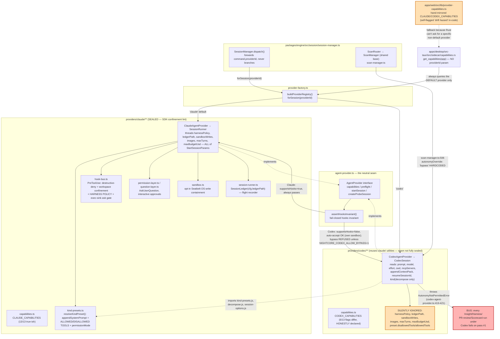

# Provider-Coupling Audit: Is Codex Fully Integrated?

**Date:** 2026-07-12
**Agent:** kirei-arch (read-only, advisory)
**Scope:** `packages/engine/src/providers/**`, `packages/contracts/src/provider*.ts`,
`packages/engine/src/scans/**`, `apps/desktop/src-tauri/src/provider/**`,
`apps/desktop/src-tauri/src/sidecar/{capabilities,provider_config}.rs`,
`apps/web/src/lib/provider-capabilities.ts` + capability-consuming UI.

## TL;DR

Codex is **not** a stub, and it is **not** simply "Claude-only under the hood." The
seam (`AgentProvider`) is real, the capability descriptor is honest, and the UI
correctly degrades from it for the things it was built to degrade (plan-gate,
effort row, autonomy picker, cost line, checkpoint affordance). The size gap
between `providers/claude/` (~8.7k lines incl. tests) and `providers/codex/`
(~2.2k lines) is mostly *explained*, not *suspicious* — Claude's SDK exposes far
more surface (hooks, permission layer, question layer, OS sandbox wrapper,
resolve-binary probing) that Codex's SDK has no equivalent for.

However, there is **one confirmed, high-severity, currently-shippable bug**: every
scan family (Insight, Harness, PR-review, Scorecard) hardcodes an autonomy request
that Codex's own provider unconditionally refuses, so **picking a Codex model for
any scan run fails on the very first pass, every time**, in current production
code, from a UI path that already exists. Beyond that, there is a consistent
pattern of **silent, undeclared capability loss**: several `StartSessionParams`
fields the Claude path consumes are accepted by the interface but never read by
`CodexSession` — no error, no capability flag, no UI notice, just quietly inert.

Corrections to prior memory are called out inline and summarized at the end.

---

## 1. The seam

`packages/engine/src/providers/agent-provider.ts` defines `AgentProvider` /
`AgentSession` — the ONE surface `SessionManager` drives. Every method is
provider-neutral (`NightcoreEvent` / contract types only; no SDK type crosses it).

`AgentProvider`:
- `capabilities(): ProviderCapabilities` — static descriptor (`agent-provider.ts:145`)
- `preflight(request): void` — fail-closed hooks-invariant guard (`:150`)
- `startSession(params, emit, logger): AgentSession` (`:154`)
- `createProbeSession(logger?): AgentSession` (`:161`)

`AgentSession`: `run()`, `streamInput()`, `interrupt()`, `setModel()`,
`setAutonomy()`, `approvePermission()`, `answerQuestion()`, `listModels()`,
`probeConfig()` (`agent-provider.ts:110-135`).

The fail-closed invariant lives in `assertHooksInvariant` (`agent-provider.ts:204-225`):
a provider with `supportsHooks: false` may not run at `bypass`/`auto-accept`
unless it either supplies its own OS containment (`osSandboxed`) or the caller
explicitly opts into the uncontained posture. This is the ONE mechanism that is
genuinely, correctly provider-neutral and enforced identically for both providers.

## 2. Diagram — the seam, who implements what, and where it silently breaks



## 3. Capability matrix (declared descriptor)

Source: `packages/engine/src/providers/claude/capabilities.ts:31-47` vs.
`packages/engine/src/providers/codex/capabilities.ts:36-52`. Every flag is
`required` in the `ProviderCapabilitiesSchema` (`packages/contracts/src/provider.ts:86-117`)
— this table is a faithful copy of both descriptors, not an inference.

| Capability | Claude | Codex | Notes |
|---|---|---|---|
| `autonomyLevels` | `bypass, auto-accept, ask, plan` | `auto-accept, plan` | `ask` omitted: codex-sdk has no approval channel (deadlock risk, `codex/capabilities.ts:12-17`). `bypass` omitted from the advertised set but reachable via `NIGHTCORE_CODEX_ALLOW_BYPASS=1` opt-in. |
| `supportsHooks` | `true` | `false` | No PreToolUse-equivalent in codex-sdk. |
| `providesOwnWriteContainment` | `false` | `true` | Codex's kernel sandbox (`read-only`/`workspace-write`/`danger-full-access`) compensates for missing hooks — this is the ONLY compensating control Codex has. |
| `supportsMcp` | `true` | `true` | **Real** for both — see §4.1. |
| `supportsPlanMode` | `true` | `true` | Real for both (Claude: `plan` permission mode; Codex: `read-only` sandbox). |
| `supportsStructuredOutput` | `true` | `true` | Real for both, but only wired for the `decompose` kind on either path. |
| `supportsSessionResume` | `true` | `true` | Real for both (`resumeSessionId` → `codex.resumeThread`). |
| `supportsFileCheckpointing` | `true` | `false` | Honestly declared; UI hides the affordance. |
| `supportsAskUserQuestion` | `true` | `false` | Honestly declared; codex-sdk closes stdin after the prompt — no interactive channel at all. |
| `supportsSettingSources` | `true` | `true` | Declared true for both; not independently verified in this pass. |
| `supportsSessionStore` | `true` | `true` | Declared true for both. |
| `supportsEffort` | `true` | `true` | Real for both (`effortToCodexEffort`, `codex/options.ts:137-142`). |
| `costTelemetry` | `full` | `tokens-only` | Real for both — see §4.6 (usage meter), which is fully wired for Codex too. |

**Correction to prior memory:** `packages/contracts/src/provider.ts:14` still says
*"no consumer is wired to it yet"* and `provider-factory.ts:50` / `codex/capabilities.ts:3`
still call Codex *"the second-provider spike."* Both comments are **stale**. The
descriptor IS consumed end-to-end: `session-manager.ts:305,359` emits it on
`session-ready`/`session-started`, the Rust `get_capabilities` command
(`sidecar/capabilities.rs`) serves it to the web, and `apps/web` gates the plan-gate
toggle, the effort row, the autonomy picker, and the cost line on it
(`NewTaskForm.hooks.ts:145-199`, `ModelSelectField.hooks.ts:62-63`). This part of
the #18 seam is **done**, not a spike.

## 4. Capability-by-capability: full / stub / degraded / absent

### 4.1 MCP servers — FULL for both
Claude: `session-options.ts` → SDK `Options.mcpServers`. Codex:
`codex-agent-provider.ts:139-146` passes `params.mcpServers` into
`buildCodexOptions()` → `config.mcp_servers` (`codex/options.ts:155-172`, reusing
`toSdkMcpServers` from `../claude/session-options.js`). Real, not stubbed.

### 4.2 Sessions / streaming / resume — FULL for both
Codex's `CodexSession.run()` (`codex-agent-provider.ts:126-233`) drives a proper
turn loop with an idle watchdog (`CODEX_IDLE_TIMEOUT_MS`, mirrors the Claude
runner's), translates `ThreadEvent`s to `NightcoreEvent`s
(`codex/sdk-adapter.ts:60-`), and resumes via `codex.resumeThread(resumeSessionId)`.
Mid-run `streamInput()` degrades honestly: a Codex turn is one-shot `codex exec`
with stdin closed, so a follow-up message is queued and delivered as the *next*
turn (`codex-agent-provider.ts:286-294`) rather than injected live — a real,
documented, unavoidable SDK constraint, not an oversight.

### 4.3 Model listing — FULL for both
`codex/model-catalog.ts` talks JSON-RPC to `codex app-server` (`listCodexModels`,
`probeCodexCli`), independently of the Claude path. The web's `ModelSelectField`
and `ModelSelect` render a merged catalog with no Codex-specific branching —
correctly provider-neutral.

### 4.4 Structured output (scans / decompose) — FULL for both
`decompose`'s `DECOMPOSE_OUTPUT_FORMAT.schema` is threaded into Codex's
`TurnOptions.outputSchema` (`codex-agent-provider.ts:161-163`), and
`translateCodexEvent`/`subtasksFromStructuredOutput` parse it
(`codex/sdk-adapter.ts:9-12`, reusing `../claude/decompose.js`). Real.

### 4.5 Permission/tool-deny governance (deny/ask/allow tiers, Harness policy, flight recorder) — **ABSENT for Codex, silently**
This is the single biggest gap and it is **not declared anywhere**. All of it lives
in `packages/engine/src/providers/claude/hook-bus.ts` (`HookBus`, `:33-193`):
the destructive-command deny list, workspace confinement, the **Harness runtime
policy** (protected paths + Bash deny patterns, `:88-176`), and the exec-sink ask
gate (`:181-193`) — all enforced via the Claude SDK's `PreToolUse` hook, which is
the ONE mechanism `supportsHooks: false` declares Codex doesn't have.

`CodexSession.run()` never reads `this.params.harnessPolicy` or
`this.params.ledgerPath` at all (confirmed by grep — zero occurrences in
`codex-agent-provider.ts`, vs. `claude-agent-provider.ts:118-123` and
`session-runner.ts:163-174` which thread both into the SDK options / construct a
`SessionLedger`). Concretely, for a Codex-backed task:
- A project's `.nightcore/harness.json` protected-paths / Bash-deny-pattern policy
  is **not enforced** — no refusal, no warning, just silently doesn't apply.
- The per-task flight-recorder ledger (the audit trail hardening module) is
  **never written** — a Codex run leaves no `PreToolUse`-gate audit record at all.

Codex's OS sandbox (`read-only` / `workspace-write` / `danger-full-access`) is a
real, coarse compensating control for the *hooks invariant* (elevated autonomy
without confinement), and `assertHooksInvariant` correctly treats it as sufficient
for that narrow purpose. But it is **not** equivalent to, and does not substitute
for, Nightcore's project-specific governance layer (protected paths, Bash deny
patterns, the audit ledger) — that layer is 100% Claude-only today, and nothing in
the `ProviderCapabilities` schema declares this (there is no
`supportsHarnessPolicy` / `supportsLedger` flag), so neither the UI nor a caller
can detect the gap short of reading this code.

### 4.6 Usage/cost telemetry — FULL for both (corrects a plausible-but-wrong assumption)
`apps/desktop/src-tauri/src/usage/cost.rs` has **separate, real** scan functions
for both providers: `claude_dirs()`/`scan_claude_files()` (`~/.claude/projects`)
and `codex_dirs()`/`scan_codex_files()` (`~/.codex/sessions` +
`archived_sessions`), dispatched by provider id (`cost.rs:118-124, 197-199`). The
live usage-% poller (`usage/poller.rs:115`) also calls `codex::fetch()`
independently of `claude::fetch()`, with its own auth/cooldown/error handling
(`usage/registry.rs:26,319-331`). **This area is well-integrated — not a gap.**

### 4.7 Tool-surface enforcement per task KIND — DEGRADED for Codex (narrower than §4.5 but same root cause)
`resolveKindPreset()` (`kind-presets.ts:160-208`) is the Claude-SDK
`allowedTools`/`disallowedTools`/`permissionMode` mechanism the `review`, `tdd`,
`decompose`, and default `build` kinds rely on (e.g. `decompose` denies
`WRITE_TOOLS` + `NETWORK_EGRESS_TOOLS` so a "read-only planning" run can't mutate
the repo, `:182-192`). `CodexAgentProvider.run()` calls `resolveKindPreset()` too
(`codex-agent-provider.ts:24,138`) but **only reads `preset.appendSystemPrompt`**
(confirmed — `preset\.` appears exactly once in the file, at `:176`); `allowedTools`
/ `disallowedTools` / `permissionMode` are computed and thrown away.

The only kind Codex protects at the kernel level is `review`, via a hardcoded
allowlist-of-one, `CODEX_READ_ONLY_KINDS = new Set(['review'])`
(`codex/options.ts:114`), pinned to the `plan` (read-only) sandbox regardless of
resolved autonomy. Every *other* kind — most notably `decompose`, whose entire
contract is "investigates read-only, never mutates" — has **no enforcement** under
Codex; it relies solely on the system-prompt instruction being followed, which is
a soft guarantee, not the hard one Claude gives via `disallowedTools`. This is a
real, if narrower, instance of the same "kind-presets.ts is Claude-only in
practice" gap as §4.5.

### 4.8 Turn/budget ceilings — SILENTLY UNENFORCED for Codex (partially an SDK limitation, but undocumented)
`StartSessionParams.maxTurns` / `.maxBudgetUsd` are threaded into Claude's SDK
`Options` (`claude-agent-provider.ts:93-96`) but never read by
`CodexAgentProvider`/`CodexSession` at all. This is partly a real SDK constraint —
`@openai/codex-sdk`'s `TurnOptions` type has exactly two fields, `outputSchema` and
`signal` (`node_modules/@openai/codex-sdk/dist/index.d.ts:167-172`; verified
directly, no `maxTurns`/budget concept exists at the SDK layer) — but Nightcore
never surfaces this as a declared absence. A user who sets a max-turns/max-budget
ceiling on a Codex task gets no error and no UI hint that the ceiling does nothing;
the only real bound left is the 30-minute idle watchdog
(`CODEX_IDLE_TIMEOUT_MS`), which caps *stalls*, not *runaway cost*.

### 4.9 Image attachments — ABSENT for Codex, and this one IS fixable
`StartSessionParams.images` (`agent-provider.ts:57`) is accepted by the interface
and used by Claude (`claude-agent-provider.ts:84`), but `CodexSession.run()`
never references `this.params.images` at all — confirmed by grep, zero hits.
Unlike §4.8, this is **not** an SDK limitation: `@openai/codex-sdk`'s `Input` type
is `string | UserInput[]` where `UserInput` includes
`{ type: 'local_image'; path: string }` (`index.d.ts:189-196`) — Codex genuinely
supports image input, just by file path rather than inline base64 the way
`WireImage` carries it. A user who attaches an image to a Codex task today has it
silently dropped with no error.

### 4.10 Plan-approval gate, effort row, cost line, checkpoint affordance — CORRECTLY DEGRADED (keep as-is)
`NewTaskForm.hooks.ts:145-165` gates the "Plan first" toggle on
`capabilitiesForProvider(providerId, capabilities)?.supportsHooks`, defaulting it
OFF (and rendering it non-interactive) for Codex specifically because a Codex
plan-mode run would otherwise surface no plan and silently no-op — this is a
genuinely well-designed, already-shipped fail-safe (`NewTaskForm.hooks.ts:39-46`
documents the exact "Fix 3" reasoning). `ModelSelectField.hooks.ts:62-63` gates the
cost line on `costTelemetry`. This is the pattern the rest of the codebase should
follow for §4.5/§4.7/§4.8/§4.9.

## 5. THE confirmed bug: scans hardcode an autonomy Codex refuses

`packages/engine/src/scans/shared/scan-manager.ts` is the shared base class behind
Insight, Harness, PR-review, and Scorecard (`ScanManager.runOneSession`,
`:424-547`). For any `providerId !== 'claude'` with a registry present
(`isCodexProvider`, `:442-444`), it routes through the real provider:

```ts
// scan-manager.ts:490-511
const session = provider.startSession(
  {
    sessionId: -1,
    prompt: fullPrompt,
    model: command.model ?? this.deps.config.model,
    ...(effort ? { effort } : {}),
    cwd: command.projectPath,
    // Scans are trusted internal read-only analysis; give the model the
    // tools the persona says it can use.
    autonomyOverride: 'bypass',
    maxTurns: parts.maxTurns,
    ...
  },
  ...
);
```

`autonomyOverride: 'bypass'` is **hardcoded, unconditional**, for every scan family
routed to a non-Claude provider. `CodexAgentProvider.startSession`
(`codex-agent-provider.ts:394-430`) computes the effective autonomy
(`codexEffectiveAutonomy('bypass', kind)` → stays `'bypass'`, since no scan passes
a `kind` and `codexKindForcesReadOnly(undefined)` is `false`), then:

```ts
// codex-agent-provider.ts:412-421
this.preflight({ autonomy, osSandboxed: posture.contained && autonomy !== 'bypass', ... });
if (autonomy === 'bypass' && !codexBypassOptedIn()) {
  throw new AutonomyNotPermittedError(CODEX_PROVIDER_ID, autonomy);
}
```

`codexBypassOptedIn()` (`codex/options.ts:29-33`) reads
`process.env.NIGHTCORE_CODEX_ALLOW_BYPASS === '1'` — **an env var that is never
set anywhere in the app** (confirmed by repo-wide grep: it appears only in its own
definition and its own test). So this throws, every time, for every scan.

**This is exercised by the test suite refusing it, not catching the caller bug**:
`codex-agent-provider.test.ts:119-134` (`'startSession refuses bypass before
constructing a session'`) explicitly asserts `AutonomyNotPermittedError` for this
exact input shape. The only scan-family test that exercises the Codex routing
branch at all is `harness/manager.test.ts:331-388`
(`'HarnessManager — provider routing (supports codex and other providers)'`), and
it uses a **fully stubbed** `AgentProvider` whose `startSession` ignores its params
entirely (`(_params: unknown, emit) => { ... }`, `:347`) — so it never exercises
the real `CodexAgentProvider` and cannot catch this. Insight, PR-review, and
Scorecard have **zero** Codex-path test coverage at all (confirmed by grep — no
`codex`/`providerId` string anywhere in their `.test.ts` files).

**This is live and reachable from the UI today**, not dead code: the scan
config screens (`insight/RunControls`, `harness/RunControls`,
`scorecard/RunControls`, PR-review's `ReviewSection`) all thread a `providerId`
through to their `start-*` commands via a model picker that includes Codex
models. **Picking a Codex model for any Insight/Harness/PR-review/Scorecard run
fails immediately on the first item pass**, surfacing as a `*-failed` event with
`reason: 'runner-crash'` and the `AutonomyNotPermittedError` message.

The comment at `scan-manager.ts:504-506` ("Scans are trusted internal read-only
analysis") argues for the *intent* — but the resolved autonomy (`bypass`) is not
even in Codex's *advertised* `autonomyLevels` (`['auto-accept', 'plan']`,
`codex/capabilities.ts:39`), and scans are explicitly read-only by design, which
maps naturally onto Codex's `plan` sandbox (kernel-enforced read-only) — the
posture `review` already uses. **Fix (advisory, for kirei-loom):** scans should
request `'plan'` (matching their actual read-only intent, and giving them the
kernel-level guarantee kind-presets can't provide under Codex per §4.7) rather
than `'bypass'`.

## 6. Provider selection: is it first-class end-to-end?

**Session-level dispatch: yes, and this part is well-built.** A `Task` persists
its own `provider_id` (`store/task/model.rs:212`, set at creation in
`store/task/create.rs:107`); it rides the wire on every `start-session` /
`start-analysis` / etc. command (`SurfaceCommand::StartSession { provider_id, .. }`,
`provider/imp.rs:132`); the engine's `SessionManager`/`ScanManager` dispatch
per-command via `ProviderRegistry.forSession(command.providerId)`
(`session-manager.ts:299,383,391`; `scan-manager.ts:495`), never branching on
provider identity. `NIGHTCORE_PROVIDER` (set at sidecar spawn,
`provider/spawn.rs:82`) is only the registry's *default* fallback when a
command omits `providerId` — multiple tasks with different providers genuinely
run concurrently through the ONE sidecar process. This is a correctly-generalized
design, not a Claude-first-with-Codex-bolted-on one.

**Capability/config *inspection* is default-provider-only — this is the real gap
behind the "hand-mirrored capabilities" drift hazard.** The engine's
`get-capabilities`/`get-provider-config` query handlers DO honor a `providerId`
argument when supplied (`session-manager.ts:283-285,299`) — the plumbing exists.
But neither Rust command ever supplies one:
- `sidecar/capabilities.rs::get_capabilities(app: AppHandle)` — **no `provider_id`
  parameter at all**; always sends `provider_id: None` (`:33`).
- `sidecar/provider_config.rs::get_provider_config(app, dir)` — same; always
  `provider_id: None` (`:179`).
- The web bridge command mirrors this: `getCapabilities()` invokes `get_capabilities`
  with an empty payload (`bridge/commands/models.ts:26-27`) — there is no code path
  from the web that can ask "what can the *Codex* provider specifically do" through
  Tauri.

This is why `apps/web/src/lib/provider-capabilities.ts` exists: it **hand-mirrors**
both `CLAUDE_CAPABILITIES` and `CODEX_CAPABILITIES` as TypeScript constants
(`:3-41`) so the UI can answer "capabilities for provider X" locally, with an
explicit self-flagged comment: *"hand-mirrored from
packages/engine/src/providers/codex/capabilities.ts (the drift hazard flagged for
the capabilities-over-wire cleanup)"* (`:21-24`). The workaround is honest about
being a workaround; the underlying gap (Rust commands can't query a non-default
provider) is real and is the root cause.

## 7. Ranked findings

### INTEGRATION GAPS (accidental coupling — should be fixed)

| # | Finding | Severity | Where a fix goes |
|---|---|---|---|
| 1 | Every scan family requests `autonomyOverride: 'bypass'` for a non-Claude provider; Codex refuses `bypass` by design, so **every Insight/Harness/PR-review/Scorecard run under Codex fails immediately**, reachable today from the scan config UI's model picker. | **Critical** | `packages/engine/src/scans/shared/scan-manager.ts:506` — request `'plan'` instead (matches the "read-only analysis" comment's actual intent, and Codex enforces it at the kernel level). Add a real (non-stubbed) `CodexAgentProvider`-backed test to `insight/`, `pr-review/`, `scorecard/` manager tests, and fix the `harness/manager.test.ts:331` stub to exercise the real provider. |
| 2 | Harness runtime policy (protected paths + Bash deny patterns) and the flight-recorder audit ledger are **silently** not enforced/recorded for Codex — no capability flag, no refusal, no UI notice. | **High** | `packages/engine/src/providers/codex/codex-agent-provider.ts` (`CodexSession.run()`) needs to at minimum surface this (a `providerConfigSection`-style `unsupported` status, or a UI banner) — and ideally a coarse equivalent (e.g. mapping harness-policy-protected-paths onto Codex's writable-roots config, if the codex-sdk exposes one). Also add `supportsHarnessPolicy`/`supportsLedger`-style flags to `ProviderCapabilities` (`packages/contracts/src/provider.ts`) so this stops being invisible. |
| 3 | `resolveKindPreset()`'s `disallowedTools`/`allowedTools`/`permissionMode` are computed for Codex but discarded — only the `review` kind is kernel-pinned read-only (`CODEX_READ_ONLY_KINDS`). `decompose`'s "never mutates" guarantee is a soft (prompt-only) promise under Codex, not the hard one Claude gives. | **Medium-High** | `packages/engine/src/providers/codex/options.ts:114` — extend `CODEX_READ_ONLY_KINDS` to include `decompose` (mirroring `review`'s treatment), or derive the Codex sandbox mode generically from `preset.disallowedTools` containing `WRITE_TOOLS`. |
| 4 | `StartSessionParams.images` is silently dropped for Codex despite the SDK supporting `local_image` input by path. | **Medium** | `packages/engine/src/providers/codex/codex-agent-provider.ts` `run()` — write `params.images` to temp files and build a `UserInput[]` instead of a plain string when images are present. |
| 5 | `maxTurns`/`maxBudgetUsd` ceilings are silently unenforced for Codex (partly a real `@openai/codex-sdk` `TurnOptions` limitation, but wholly undeclared — no capability flag, no UI hint). | **Medium** | Either surface via a capability flag (`supportsBudgetCeiling: false`) so the UI can hide/disable those fields for a Codex task, or investigate whether `codex exec`'s own CLI config offers an equivalent ceiling to wire through `CodexOptions.config`. |
| 6 | Rust `get_capabilities`/`get_provider_config` commands have no `provider_id` parameter, so they can only ever describe the *default* provider — forcing the web to hand-mirror both descriptors as a self-flagged "drift hazard." | **Medium** | `apps/desktop/src-tauri/src/sidecar/capabilities.rs` + `provider_config.rs` — add an optional `provider_id: Option<String>` parameter threaded to the existing `SurfaceQuery::GetCapabilities { provider_id }` field (the engine already honors it, `session-manager.ts:299`); then delete the hand-mirrored constants in `apps/web/src/lib/provider-capabilities.ts` in favor of a real per-provider query. |
| 7 | Stale "spike"/"no consumer wired yet" framing in code comments (`provider.ts:14`, `provider-factory.ts:50`, `codex/capabilities.ts:3`, `provider/factory.rs:77` test name `builds_the_codex_provider_spike`) undersells how complete the seam actually is and may be actively misleading future contributors (and was part of what prompted this audit). | **Low** (docs only) | Update those four comments/test names now that #79/#80 shipped the real Codex provider. |

### INTENTIONAL CAPABILITY-GATES (fail-closed by design — keep)

| # | Gate | Where |
|---|---|---|
| A | `ask` autonomy omitted from Codex's advertised levels (codex-sdk has no approval channel → would deadlock). | `codex/capabilities.ts:12-17` |
| B | Plan-approval gate ("Plan first" toggle) forced off + non-interactive for a `supportsHooks: false` provider, so a plan-mode run can't silently no-op. | `NewTaskForm.hooks.ts:39-46,145-165` |
| C | `bypass` refused for Codex without the explicit `NIGHTCORE_CODEX_ALLOW_BYPASS=1` process-level opt-in (the deadlock-avoidance + fail-closed hooks invariant). | `agent-provider.ts:204-225`, `codex-agent-provider.ts:419-421` |
| D | AskUserQuestion / file checkpointing hidden for Codex — honestly declared `false` capability flags, UI degrades correctly. | `codex/capabilities.ts:46-47` |
| E | `review` kind pinned to Codex's `plan` (kernel read-only) sandbox regardless of resolved autonomy, since Codex has no tool-denylist equivalent to Claude's `disallowedTools`. | `codex/options.ts:100-120` |

## 8. Corrections to prior memory

- **`project_structure_provider_issues.md`** ("#18 done... codex degradation stub")
  and the roadmap memory's "Codex provider REAL" correction were both *directionally*
  right but incomplete: Codex is real (genuine SDK integration, real MCP, real
  model listing, real usage/cost telemetry, real structured output), but it is
  **not fully integrated** — the scan-family bug (§5) is a hard, reproducible
  failure in current code, and §4.5/§4.7/§4.8/§4.9 are silent, undeclared capability
  losses that the "REAL" framing glosses over.
- The `providers/codex/` vs `providers/claude/` file-count/line-count gap the user
  flagged is **mostly explained, not a red flag by itself**: Claude's own surface
  (`hook-bus.ts` 290 lines, `sandbox.ts` 372 lines, `session-options.ts` 519 lines,
  `resolve-claude-binary.ts` 395 lines) has no Codex analog because the *SDKs
  themselves* are asymmetric (hooks, hard tool-denylist enforcement, OS sandbox
  wrapper, CLI binary resolution heuristics are Claude-CLI-specific concerns).
  The user's underlying instinct — "something is probably still Claude-only" — was
  correct, just not for the reason file-count implies; the real gaps are the ones
  in §7, not raw surface area.
- `packages/contracts/src/provider.ts:14`'s "no consumer is wired to it yet" is
  **stale** — corrected in §3.

## What to keep (well-structured, no changes needed)

- The `AgentProvider`/`AgentSession` seam itself and `assertHooksInvariant` — clean,
  well-tested, genuinely provider-neutral.
- Per-session `providerId` dispatch through `ProviderRegistry` — real concurrent
  multi-provider support through one sidecar, not a config-time-only selection.
- The capability-driven UI degradation pattern (`capabilitiesForProvider`, the
  plan-gate/effort-row/cost-line gates) — this is the RIGHT pattern; it just needs
  to be extended to cover §4.5/§4.7/§4.8/§4.9 instead of stopping at the UI-visible
  affordances.
- The usage/cost meter (§4.6) — fully, independently implemented for both
  providers, no coupling issue found.
- MCP, model listing, session resume, structured output — all genuinely
  provider-neutral, not stubbed.

## Addendum (2026-07-12): correction from the #296 governance-feasibility research

`docs/research/2026-07-12-codex-governance-feasibility.md` (kirei-research, same
day) refines §4.5 / §7 finding #2's framing of "no PreToolUse-equivalent in
codex-sdk":

- That statement is **correct for the npm package** (`@openai/codex-sdk`, what
  `CodexAgentProvider` actually drives) — it wraps non-interactive `codex exec`
  with stdin closed immediately after the prompt; there is no callback and no
  approval event anywhere in its surface. Nightcore's own
  `codex/options.ts:35-48` docblock ("THE DEADLOCK INVARIANT") already documents
  this precisely.
- It is **not correct for the underlying Codex CLI protocol as a whole**: `codex
  app-server --stdio` (a JSON-RPC surface Nightcore already speaks a narrow slice
  of, for `model/list` in `codex/model-catalog.ts`) exposes genuine synchronous,
  pre-execution `execCommandApproval` / `applyPatchApproval` request/response
  events — a real analog to `PreToolUse`, just reachable only by replacing the
  npm SDK's turn-driving with a hand-rolled client against an explicitly
  "experimental" protocol, and with narrower coverage than Claude's hook even
  then (a CLI-internal "trusted command" bypass, and no approval event for MCP
  tool calls at all).
- Finding #2's parenthetical suggestion — "ideally a coarse equivalent... if the
  codex-sdk exposes one" — is answered: it does not, at the SDK layer; the
  answer moves one layer down to `app-server`. §7 finding #2's recommended fix
  (declare the gap via a capability flag / UI notice) still stands as the
  near-term action; treat any actual enforcement port as a separate, larger
  initiative per the feasibility doc's Option B, not a follow-on to this audit's
  advisory fix.

This doc's other findings (the scan-autonomy bug, the discarded kind-preset
tool-surface, the silently-dropped images/budget ceilings, the Rust
`get_capabilities` provider-id gap) are unaffected by this correction.
